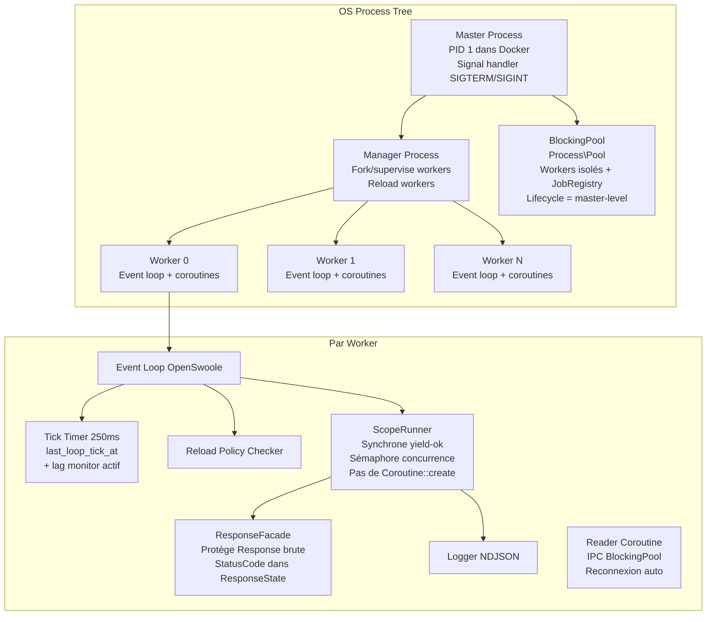
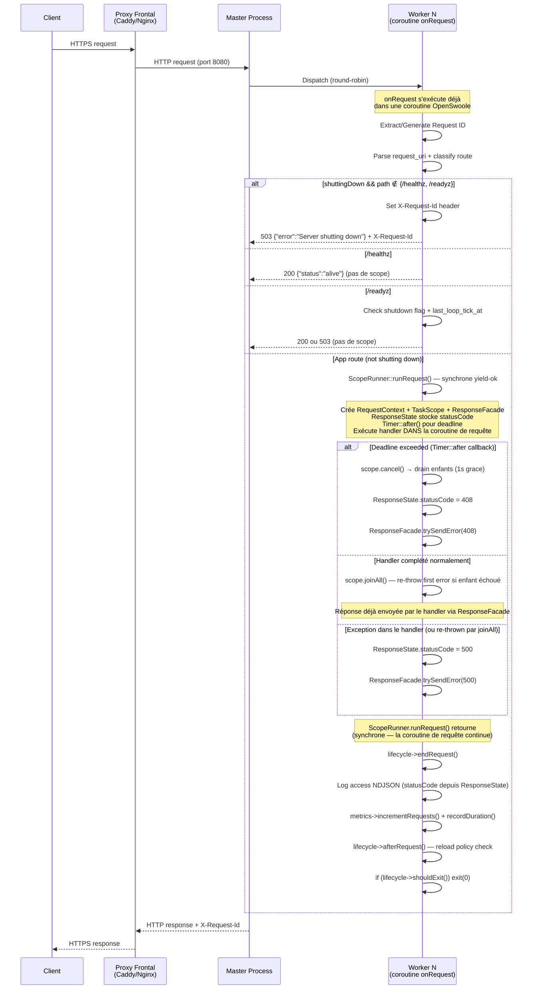
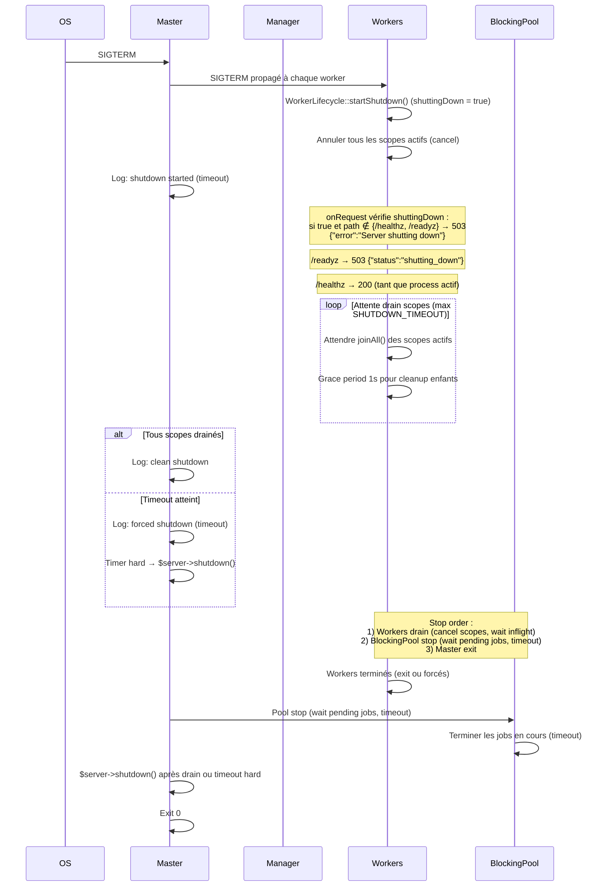
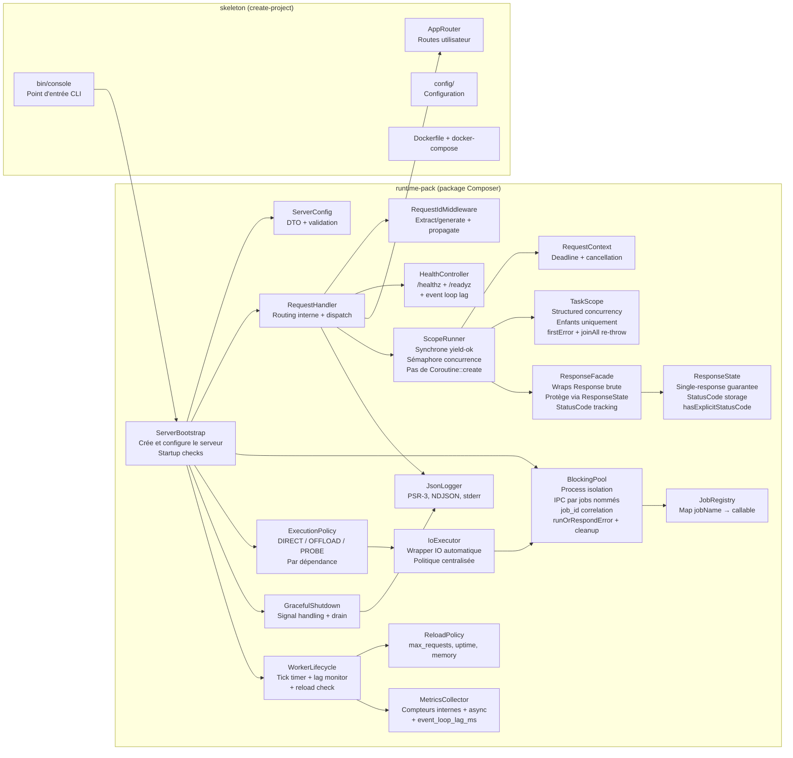

# Design Technique — Runtime Pack OpenSwoole + Skeleton

## Vue d'ensemble

Ce document décrit l'architecture technique du Runtime Pack OpenSwoole et du Skeleton associé. Le Runtime Pack est un package Composer (`async-platform/runtime-pack`) qui fournit le bootstrap d'un serveur HTTP OpenSwoole long-running **véritablement asynchrone** : chaque requête s'exécute dans la coroutine dédiée fournie par OpenSwoole (`onRequest` est déjà exécuté dans un contexte coroutine), les I/O sont non-bloquantes grâce aux hooks OpenSwoole (`SWOOLE_HOOK_ALL`), et la concurrence intra-requête est encadrée par un modèle de structured concurrency (TaskScope/RequestContext) avec deadlines, cancellation coopérative et isolation des opérations bloquantes via un BlockingPool borné à protocole IPC par jobs nommés avec corrélation par `job_id`.

Les politiques opérationnelles prod-safe sont intégrées dès V1 : healthchecks, graceful shutdown, reload policy, logging NDJSON, request ID, et sécurité de base.

Le Skeleton (`async-platform/skeleton`) est un template `create-project` qui génère une application minimale fonctionnelle utilisant le Runtime Pack.

### Compatibility Matrix (V1)

| Composant | Version cible |
| --- | --- |
| PHP | 8.3+ |
| OpenSwoole | 22.x (dernière stable via pecl) |
| OS container | Linux (Debian bookworm) |
| Architecture | amd64, arm64 |
| RSS monitoring | Linux only (`/proc/self/statm`) |

### Décisions architecturales clés

| Décision | Choix | Justification |
|---|---|---|
| Image Docker base | Debian slim (bookworm) | Meilleure compatibilité OpenSwoole, glibc native, moins de surprises en prod que musl/Alpine |
| Request ID format | UUIDv4 | Universellement supporté, pas de dépendance externe, `random_bytes(16)` suffit |
| Modèle async | Coroutine-per-request (coroutine fournie par OpenSwoole) + SWOOLE_HOOK_ALL | `onRequest` s'exécute déjà dans une coroutine — le handler tourne directement dedans, pas de `Coroutine::create()` wrapper |
| Structured concurrency | TaskScope + RequestContext | TaskScope gère uniquement les coroutines enfants (spawn). Le handler principal tourne dans la coroutine de requête OpenSwoole. Pas de coroutine orpheline, deadline obligatoire, cancellation fail-fast |
| Blocking isolation | BlockingPool (Process\Pool) + JobRegistry + job_id correlation | Isolation process pour code bloquant/CPU-bound, protocole IPC par jobs nommés (pas de sérialisation de closures), queue bornée, timeout, corrélation par job_id |
| Handler timeout | RequestContext.deadline + ScopeRunner (synchrone yield-ok) | ScopeRunner.runRequest() s'exécute dans la coroutine de requête, Timer::after() pour la deadline, ResponseFacade protège contre double-send |
| Single-response | ResponseFacade wrappant OpenSwoole\Http\Response | Le handler ne reçoit jamais la Response brute. ResponseFacade protège end()/write()/status()/header() via ResponseState. ResponseState stocke le statusCode pour le log d'accès |
| BlockingPool IPC | Jobs nommés via JobRegistry + job_id correlation via Channel + protocole framé (uint32 length prefix + JSON) | Pas de sérialisation de closures (fragile + risque sécurité). Framing explicite pour éviter la fragmentation. Payloads binaires via encoding base64 ou frame séparée. Le worker du pool résout le callable par nom via le registre. Chaque job a un job_id unique pour corréler requête/réponse |
| BlockingPool lifecycle | Master-level, survit aux reloads de workers | Pool créé une fois au boot, les workers se reconnectent après reload. Stop après drain des workers au shutdown |
| MAX_CONNECTIONS mapping | `max_connection` (nom canonique OpenSwoole >= 4.7) | Vérifié dans la doc OpenSwoole, `max_conn` est un alias déprécié |
| Healthchecks | Servis directement par le worker (pas de scope/coroutine) | O(1), pas d'overhead async pour des checks triviaux |
| Reload MAX_UPTIME | Flag `shouldExitAfterCurrentRequest` dans le worker, puis `exit(0)`. Le manager fork un nouveau worker. | Mécanisme natif du manager OpenSwoole |
| Logging | PSR-3 compatible, NDJSON sur stderr | Standard PHP, compatible ELK/Loki/CloudWatch |
| Event-loop lag | Mesure active du drift entre tick attendu et tick réel | Plus fiable que le tick stale passif — détecte la starvation avant qu'elle ne devienne critique |
| Sémaphore concurrence | Channel borné pré-rempli de tokens (pop=acquire, push=release) | Pattern sémaphore classique, non-bloquant, O(1), natif OpenSwoole |
| ExecutionPolicy | Configuration statique par dépendance (DIRECT/OFFLOAD/PROBE) | Réduit le risque d'erreur humaine, centralisé, extensible (auto-probe V1.5) |
| runOrRespondError | Méthode standardisée de conversion erreur BlockingPool → HTTP (503/504/502/500) | Évite la réimplémentation dans chaque handler, mapping cohérent, nom explicite |

### Périmètre et limites

Le Runtime Pack V1 inclut :
- Bootstrap serveur HTTP OpenSwoole (coroutine-per-request, coroutine fournie par OpenSwoole)
- Hooks async activés au boot (`SWOOLE_HOOK_ALL`) avec vérification startup
- Structured concurrency : RequestContext + TaskScope + ScopeRunner (synchrone yield-ok)
- Sémaphore de concurrence par worker (maxConcurrentScopes, Channel borné)
- ResponseFacade pour garantie single-response (le handler ne touche jamais la Response brute)
- ResponseState avec suivi du statusCode pour le log d'accès + hasExplicitStatusCode()
- BlockingPool pour isolation des opérations bloquantes/CPU-bound, avec protocole IPC par jobs nommés (JobRegistry) et corrélation par job_id
- BlockingPool production hardening : reader coroutine avec reconnexion, cleanup orphelins, runOrRespondError(), métriques réelles (queueDepth, inflightCount, busyWorkers)
- ExecutionPolicy centralisée (DIRECT_COROUTINE_OK / MUST_OFFLOAD / PROBE_REQUIRED) + IoExecutor
- Cancellation coopérative avec deadlines
- Healthchecks (/healthz, /readyz) avec event-loop lag monitor actif
- Graceful shutdown avec drain des scopes actifs
- Reload policy (max_requests, max_uptime, max_memory_rss)
- Logging NDJSON, Request ID, sécurité de base
- Métriques internes (compteurs, histogramme, gauges async, event_loop_lag_ms, scope_rejected)
- Startup checks (hooks, Xdebug, flags, curl hook status)

Le Runtime Pack ne contient PAS :
- D'OTEL exporter ni d'endpoint /metrics — spec Observability V1
- De framework CLI avancé — `async:serve` et `async:run` sont des commandes de bootstrap minimal

## Contrat Async (V1)

Cette section définit les règles et invariants du modèle asynchrone. Ils constituent le contrat fondamental de la plateforme.

### Règles

1. **Coroutine-per-request (fournie par OpenSwoole)** : Le callback `onRequest` d'OpenSwoole s'exécute déjà dans une coroutine dédiée. Le handler applicatif tourne directement dans cette coroutine — **pas de `Coroutine::create()` wrapper**. ScopeRunner.runRequest() est synchrone (yield-ok) et retourne après la complétion du handler ou l'expiration de la deadline.
2. **Hooks runtime activés au boot** : `\OpenSwoole\Runtime::enableCoroutine(SWOOLE_HOOK_ALL)` est appelé **avant toute I/O et avant `$server->start()`**, dans `ServerBootstrap::run()`. Cela hooke : TCP, UDP, Unix, SSL/TLS, HTTP client, PDO (MySQL/PostgreSQL), Redis, file I/O. Un startup check vérifie les flags activés et log explicitement le statut de `SWOOLE_HOOK_CURL`.
3. **Yield automatique** : Tout I/O dans une coroutine yield à l'event loop — aucune requête ne bloque la loop.
4. **Structured concurrency** : Toute coroutine spawnée DOIT être attachée à un TaskScope (pas de coroutine orpheline). TaskScope gère uniquement les coroutines enfants (via `$scope->spawn()`), pas la coroutine du handler principal.
5. **Deadline obligatoire** : Chaque TaskScope a une deadline (héritée du RequestContext ou explicite).
6. **Cancellation coopérative** : Vérifiée aux points de yield (frontières I/O). Les handlers longs doivent appeler `$context->throwIfCancelled()`.
7. **Blocking isolation par jobs nommés** : Les opérations bloquantes/CPU-bound DOIVENT être déchargées vers le BlockingPool via `$blockingPool->run('jobName', $payload)`. Pas de sérialisation de closures.
8. **Single-response via ResponseFacade** : Le handler reçoit un `ResponseFacade` (jamais la Response brute OpenSwoole). Toute écriture (end/write/status/header) est protégée par ResponseState. ResponseState stocke le statusCode pour le log d'accès.
9. **PDO est traité comme coroutine-safe uniquement si une preuve d'intégration passe sur l'image prod. Sinon : fallback obligatoire via BlockingPool pour DB.** Les hooks PDO (`SWOOLE_HOOK_PDO_PGSQL`, `SWOOLE_HOOK_PDO_MYSQL`) sont activés par `SWOOLE_HOOK_ALL`, mais le comportement en long-running (pooling implicite, reconnect, transactions, prepared statements, état interne de connexion) présente des zones grises. La preuve d'intégration valide que 2 requêtes PDO parallèles via TaskScope complètent plus vite que séquentiellement sur l'image prod.

### Invariants

- **Pas de spawn global** : toute coroutine a un scope parent (TaskScope)
- **Pas de coroutine sans deadline** : héritée du RequestContext
- **Cancellation propagée fail-fast** : par défaut, l'annulation d'un scope annule tous ses enfants
- **Erreur propagée fail-fast** : la première erreur d'un enfant est stockée dans le scope, `joinAll()` la re-throw après join de tous les enfants (pattern errgroup)
- **BlockingPool borné** : queue outbound bornée (Channel) + timeout (pas de croissance illimitée)
- **BlockingPool IPC framé** : protocole uint32 length prefix + JSON payload, reconstitution complète avant décodage
- **BlockingPool IPC corrélé** : chaque job a un `job_id` unique pour corréler requête/réponse, évitant les lectures croisées
- **BlockingPool queue vs inflight** : queueDepth() = longueur du channel outbound (backlog), inflightCount() = count(pendingJobs) (en vol)
- **BlockingPool lifecycle = master-level** : créé une fois au boot, survit aux reloads de workers, stop après drain des workers au shutdown
- **BlockingPool reader coroutine** : une par worker HTTP, reconnexion automatique, cleanup des jobs orphelins
- **Pas de Coroutine::create() dans ScopeRunner** : le handler tourne dans la coroutine de requête OpenSwoole
- **Pas de sérialisation de closures** : le BlockingPool utilise un protocole IPC par jobs nommés
- **Tout travail CPU-bound > 10ms dans un handler DOIT être offload vers BlockingPool. Violation = event loop starvation.** Le seuil de 10ms est un guide, pas enforced au runtime en V1. `async:doctor` (V2) pourrait détecter cela via monitoring de la latence de l'event loop.
- **Concurrence bornée par worker** : si `maxConcurrentScopes > 0`, un sémaphore (Channel borné) limite le nombre de scopes actifs. Requêtes excédentaires → 503 immédiat (pas de blocage).
- **Politique d'exécution centralisée** : chaque dépendance IO a une stratégie (DIRECT_COROUTINE_OK / MUST_OFFLOAD / PROBE_REQUIRED). Par défaut = MUST_OFFLOAD (safe).
- **Event-loop lag monitoré** : le drift entre tick attendu et tick réel est mesuré activement et exposé comme métrique. Lag > seuil → /readyz 503.

### Non-goals V1

- Channel&lt;T&gt; pour backpressure (V2)
- Limites de concurrence par route/tenant (V2)
- Propagation de traces distribuées inter-services (V2, spec OTEL)
- SSE/WebSocket streaming (V2)
- Politiques de supervision custom (V1 = fail-fast uniquement)
- ResponsePayload (pattern où le handler retourne un DTO et ScopeRunner envoie — V2, plus propre mais trop restrictif pour streaming)
- Détection automatique de starvation event loop (V2, `async:doctor`) — V1 fournit le lag monitor passif, V2 ajoutera la détection active + actions automatiques
- Auto-probe des dépendances au boot (V1.5) — V1 utilise la configuration statique via ExecutionPolicy
- Helpers typés `io()->db()->query()` (V2) — V1 fournit `IoExecutor::run()` générique
- Mode strict event-loop lag (V1.5) — refus de certaines routes si lag élevé

## Matrice de compatibilité — Sécurité Async

| Library/API | Coroutine-safe avec hooks ? | Stratégie V1 |
|---|---|---|
| OpenSwoole HTTP Client | Oui (natif) | Utilisation directe en coroutine |
| PDO MySQL/PostgreSQL | Conditionnel — validé par preuve d'intégration | Coroutine-safe uniquement si preuve d'intégration passe sur l'image prod. Sinon : fallback BlockingPool pour DB. |
| Redis (phpredis) | Oui (SWOOLE_HOOK_ALL) | Utilisation directe |
| file_get_contents / fopen | Oui (SWOOLE_HOOK_FILE) | Utilisation directe pour petits fichiers |
| Guzzle HTTP | Conditionnel — DirectCoroutineOk si SWOOLE_HOOK_CURL actif, sinon ProbeRequired | Si SWOOLE_HOOK_CURL actif : utilisation directe. Sinon : vérifier que Guzzle utilise le stream handler PHP (hooké via SWOOLE_HOOK_FILE) ou offload. ExecutionPolicy::defaults($hookFlags) gère automatiquement. |
| curl (ext-curl) | Conditionnel — vérifié au boot via startup check (hookFlags) | Vérifier le build Docker — voir section Dockerfile. Le startup check log explicitement `SWOOLE_HOOK_CURL active: yes/no` |
| Doctrine DBAL | Conditionnel — validé par preuve d'intégration | Utiliser avec précaution. Preuve d'intégration obligatoire. Documenter le pattern reset/reconnect. |
| Calcul CPU-bound | Non (bloque l'event loop) | `BlockingPool::run('jobName', $payload)` — invariant : tout CPU-bound > 10ms doit être offload |
| FFI / extensions C | Non | `BlockingPool::run('jobName', $payload)` |
| Libs legacy (inconnues) | Inconnu | `BlockingPool::run('jobName', $payload)` comme filet de sécurité |
| Xdebug | **Incompatible** avec le scheduling coroutine | **DOIT être OFF en production**. Startup check en mode prod |

## Architecture

### Modèle de processus OpenSwoole



**Master Process** : Reçoit les signaux OS (SIGTERM, SIGINT). Délègue la gestion des workers au Manager. Crée et possède le BlockingPool (lifecycle master-level). En Docker, c'est le PID 1.

**Manager Process** : Fork et supervise les workers. Gère le reload des workers (via `max_request` natif ou signal du worker).

**Workers** : Chaque worker a sa propre event loop. Les requêtes HTTP sont distribuées par le master aux workers. Le callback `onRequest` d'OpenSwoole s'exécute déjà dans une coroutine dédiée — le ScopeRunner tourne directement dans cette coroutine (synchrone, yield-ok). Les I/O dans les coroutines yield automatiquement à l'event loop grâce aux hooks.

**BlockingPool** : Pool de processus isolés (`OpenSwoole\Process\Pool`) pour exécuter du code bloquant/CPU-bound sans bloquer l'event loop des workers. Protocole IPC par jobs nommés (JobRegistry) avec corrélation par `job_id`. Queue bornée, timeout par tâche. **Lifecycle = master-level** : créé une fois au boot, survit aux reloads de workers, stop après drain des workers au shutdown.

### Flux de requête HTTP



> **Point clé** : ScopeRunner.runRequest() est synchrone (yield-ok). Il s'exécute dans la coroutine de requête fournie par OpenSwoole. Il n'y a **pas** de `Coroutine::create()` wrapper. Le handler tourne directement dans la coroutine de requête. Les opérations post-réponse (log, métriques, reload check) s'exécutent **après** le retour de ScopeRunner, donc **après** que la réponse ait été envoyée au client. C'est garanti par la nature synchrone (yield-ok) de ScopeRunner. Le statusCode pour le log d'accès est lu depuis `ResponseState.getStatusCode()`.

### Flux de graceful shutdown



**Règles de lifecycle du BlockingPool :**

- **Pool lifecycle = master-level.** Créé une fois au boot, survit aux reloads de workers.
- **On worker reload : le pool ne redémarre PAS.** Les workers se reconnectent au pool existant après reload.
- **On shutdown : le pool stop APRÈS les workers.** Stop order : 1) Workers drain (cancel scopes, wait inflight) → 2) Pool stop (wait pending jobs, timeout) → 3) Master exit.
- Le pool a son propre timeout de shutdown (configurable, défaut = `BLOCKING_POOL_TIMEOUT`). Les jobs en cours au-delà du timeout sont abandonnés.

> **Note OpenSwoole** : Le serveur HTTP OpenSwoole ne permet pas de "stop accept" au niveau socket de manière propre. L'effet opérationnel est obtenu via le refus applicatif (503) + `/readyz` 503, ce qui permet au LB/orchestrateur de retirer le pod du pool. `$server->shutdown()` n'est appelé qu'après le drain ou le timeout hard.


## Composants et Interfaces

### Vue d'ensemble des composants



### Interfaces PHP — Contrat Async

```php
<?php
// --- RequestContext ---

/**
 * Contexte de requête portant la deadline et la cancellation.
 * Créé par ScopeRunner pour chaque requête applicative.
 * Immutable sauf pour l'état de cancellation (write-once).
 */
final class RequestContext
{
    private bool $cancelled = false;

    public function __construct(
        public readonly string $requestId,
        public readonly float $deadline,      // timestamp absolu (microtime)
        public readonly JsonLogger $logger,   // scopé avec request_id + component
    ) {}

    /** Marque le contexte comme annulé. Idempotent. */
    public function cancel(): void
    {
        $this->cancelled = true;
    }

    /** Le contexte est-il annulé (explicitement ou deadline dépassée) ? */
    public function isCancelled(): bool
    {
        return $this->cancelled || microtime(true) >= $this->deadline;
    }

    /** Millisecondes restantes avant la deadline. 0.0 si expirée. */
    public function remainingMs(): float
    {
        return max(0.0, ($this->deadline - microtime(true)) * 1000);
    }

    /**
     * Lance CancelledException si le contexte est annulé ou la deadline dépassée.
     * À appeler dans les boucles longues et aux points de contrôle.
     */
    public function throwIfCancelled(): void
    {
        if ($this->isCancelled()) {
            throw new CancelledException(
                $this->requestId,
                $this->cancelled ? 'cancelled' : 'deadline_exceeded',
            );
        }
    }

    /** Factory depuis les paramètres de requête. */
    public static function fromRequest(
        string $requestId,
        float $timeoutSeconds,
        JsonLogger $baseLogger,
    ): self {
        return new self(
            $requestId,
            microtime(true) + $timeoutSeconds,
            $baseLogger->withRequestId($requestId)->withComponent('app'),
        );
    }
}
```

```php
<?php
// --- CancelledException ---

final class CancelledException extends \RuntimeException
{
    public function __construct(
        public readonly string $requestId,
        public readonly string $reason = 'deadline_exceeded',
    ) {
        parent::__construct("Request {$requestId} cancelled: {$reason}");
    }
}
```

```php
<?php
// --- TaskScope ---

/**
 * Scope de structured concurrency. Gère UNIQUEMENT les coroutines enfants
 * spawnées via $scope->spawn(). Le handler principal tourne dans la coroutine
 * de requête OpenSwoole — il n'est PAS géré par TaskScope.
 *
 * Le scope hérite de la deadline du RequestContext.
 * Politique V1 : fail-fast (cancel all on first failure).
 *
 * Pattern errgroup : la première erreur d'un enfant est stockée dans $firstError.
 * joinAll() re-throw cette erreur après avoir join tous les enfants.
 * Cela évite les "silent failures" où le handler continue avec des données partielles.
 */
final class TaskScope
{
    /** @var int[] Coroutine IDs des enfants */
    private array $children = [];
    private bool $cancelled = false;
    private ?\Throwable $firstError = null;

    public function __construct(
        private readonly RequestContext $context,
        private readonly MetricsCollector $metrics,
    ) {}

    /**
     * Spawn une coroutine enfant attachée à ce scope.
     * L'enfant hérite du RequestContext (et de sa deadline/cancellation).
     * Retourne le coroutine ID.
     * Lance CancelledException si le scope est annulé ou la deadline dépassée.
     */
    public function spawn(callable $task): int
    {
        $this->context->throwIfCancelled();
        if ($this->cancelled) {
            throw new CancelledException($this->context->requestId, 'scope_cancelled');
        }

        $cid = \OpenSwoole\Coroutine::create(function () use ($task) {
            try {
                $task($this->context);
            } catch (CancelledException) {
                // Cancellation normale — pas d'erreur
            } catch (\Throwable $e) {
                $this->context->logger->error('Child coroutine failed', [
                    'error' => $e->getMessage(),
                    'coroutine_id' => \OpenSwoole\Coroutine::getCid(),
                ]);
                // Stocker la première erreur PUIS cancel le scope (errgroup pattern)
                if ($this->firstError === null) {
                    $this->firstError = $e;
                }
                // Fail-fast : annuler le scope entier
                $this->cancel();
            }
        });

        $this->children[] = $cid;
        $this->metrics->recordScopeChild();
        return $cid;
    }

    /**
     * Attend la fin de tous les enfants (join).
     * Si la deadline est dépassée, annule tous les enfants et attend max 1s pour le cleanup.
     * Retourne après que tous les enfants soient terminés ou après le grace period.
     *
     * Utilise Coroutine::join() en batch sur tous les CIDs restants pour bénéficier
     * du join natif. Le timeout passé à join() est calculé dynamiquement :
     * - Si pas de deadline dépassée : pas de timeout (join bloquant)
     * - Si deadline dépassée : grace period 1s, avec calcul du temps restant
     *   pour chaque appel à join() ($timeoutRemaining = graceDeadline - now).
     *
     * Re-throw la première erreur d'un enfant après avoir join tous les enfants
     * (pattern errgroup). Cela garantit que le handler ne continue pas avec des
     * données partielles après un échec d'enfant.
     */
    public function joinAll(): void
    {
        // Filtrer les CIDs encore actifs
        $activeCids = array_filter($this->children, fn(int $cid) => \OpenSwoole\Coroutine::exists($cid));

        if (empty($activeCids)) {
            $this->children = [];
            if ($this->firstError !== null) {
                throw $this->firstError;
            }
            return;
        }

        // Vérifier si la deadline est dépassée → cancel + grace period
        if ($this->context->isCancelled() && !$this->cancelled) {
            $this->cancel();
        }

        if ($this->cancelled) {
            // Grace period : join batch avec timeout restant
            $graceDeadline = microtime(true) + 1.0; // 1s grace
            $timeoutRemaining = max(0.001, $graceDeadline - microtime(true));
            \OpenSwoole\Coroutine::join($activeCids, $timeoutRemaining);
        } else {
            // Pas de deadline dépassée : join batch sans timeout
            \OpenSwoole\Coroutine::join($activeCids);
        }

        $this->children = [];

        // Re-throw la première erreur d'un enfant (errgroup pattern)
        if ($this->firstError !== null) {
            throw $this->firstError;
        }
    }

    /** Annule tous les enfants (coopératif). Les enfants vérifient au prochain yield point. */
    public function cancel(): void
    {
        $this->cancelled = true;
        $this->context->cancel();
    }

    public function isCancelled(): bool
    {
        return $this->cancelled;
    }

    public function childCount(): int
    {
        return count($this->children);
    }

    /** Retourne la première erreur d'un enfant, ou null. */
    public function getFirstError(): ?\Throwable
    {
        return $this->firstError;
    }
}
```

```php
<?php
// --- ResponseState ---

/**
 * Garantit qu'une seule réponse HTTP est envoyée par requête.
 * Remplace le pattern &$responded (non coroutine-safe).
 * Safe pour les interleavings de coroutines au sein d'un même worker
 * (single-threaded, pas de race condition mémoire, mais les yields
 * peuvent causer des interleavings logiques).
 *
 * Stocke également le statusCode HTTP pour le log d'accès.
 * Le statusCode est mis à jour par ResponseFacade::status() et ResponseFacade::end(),
 * ainsi que par le timer deadline (408) et le error handler (500) dans ScopeRunner.
 */
final class ResponseState
{
    private bool $sent = false;
    private ?int $statusCode = null;

    /**
     * Atomiquement check-and-set : retourne true si cet appel "gagne" le droit d'envoyer.
     * Les appels suivants retournent false.
     * Safe pour les interleavings de coroutines dans un même worker.
     */
    public function trySend(): bool
    {
        if ($this->sent) {
            return false;
        }
        $this->sent = true;
        return true;
    }

    public function isSent(): bool
    {
        return $this->sent;
    }

    /**
     * Positionne le statusCode HTTP.
     * Appelé par ResponseFacade::status(), le timer deadline (408),
     * et le error handler (500).
     */
    public function setStatusCode(int $code): void
    {
        $this->statusCode = $code;
    }

    /**
     * Retourne le statusCode HTTP stocké.
     * Si aucun statusCode n'a été explicitement positionné, retourne 200 (défaut HTTP).
     */
    public function getStatusCode(): int
    {
        return $this->statusCode ?? 200;
    }

    /**
     * Indique si un statusCode a été explicitement positionné via setStatusCode().
     * Utilisé par ResponseFacade::end() pour savoir s'il faut committer le défaut 200.
     */
    public function hasExplicitStatusCode(): bool
    {
        return $this->statusCode !== null;
    }
}
```

```php
<?php
// --- ResponseFacade ---

/**
 * Wrapper autour de OpenSwoole\Http\Response qui protège toutes les opérations
 * d'écriture via ResponseState. Le handler applicatif reçoit UNIQUEMENT cette facade,
 * jamais la Response brute OpenSwoole.
 *
 * Garanties :
 * - end() ne peut être appelé qu'une seule fois (via ResponseState.trySend())
 * - status() et header() sont ignorés silencieusement après end()
 * - write() est ignoré silencieusement après end()
 * - Le timer deadline et le handler partagent le même ResponseState
 * - status() met à jour ResponseState.statusCode pour le log d'accès
 * - end() positionne statusCode à 200 si aucun status n'a été explicitement défini
 *
 * Évolution V2 : ResponsePayload (le handler retourne un DTO status+headers+body,
 * ScopeRunner envoie). Plus propre mais trop restrictif pour streaming en V1.
 */
final class ResponseFacade
{
    public function __construct(
        private readonly \OpenSwoole\Http\Response $rawResponse,
        private readonly ResponseState $state,
        private readonly JsonLogger $logger,
    ) {}

    /**
     * Positionne le status code HTTP. Ignoré si la réponse a déjà été envoyée.
     * Met à jour ResponseState.statusCode pour le log d'accès.
     * Retourne $this pour chaînage.
     */
    public function status(int $statusCode, string $reason = ''): self
    {
        if ($this->state->isSent()) {
            return $this;
        }
        $this->state->setStatusCode($statusCode);
        $this->rawResponse->status($statusCode, $reason);
        return $this;
    }

    /**
     * Ajoute un header HTTP. Ignoré si la réponse a déjà été envoyée.
     * Retourne $this pour chaînage.
     */
    public function header(string $key, string $value): self
    {
        if ($this->state->isSent()) {
            return $this;
        }
        $this->rawResponse->header($key, $value);
        return $this;
    }

    /**
     * Envoie le corps de la réponse et termine la réponse HTTP.
     * Ne peut être appelé qu'une seule fois. Les appels suivants sont ignorés
     * et un warning est loggé.
     * Positionne statusCode à 200 dans ResponseState si aucun status n'a été
     * explicitement défini (défaut HTTP).
     * Retourne true si la réponse a été envoyée, false sinon.
     */
    public function end(string $content = ''): bool
    {
        if (!$this->state->trySend()) {
            $this->logger->warning('ResponseFacade::end() called after response already sent');
            return false;
        }
        // Bug fix : si aucun status n'a été explicitement positionné via status(),
        // on appelle setStatusCode(200) pour "committer" la valeur dans ResponseState.
        // Avant ce fix, un `if` tautologique ne faisait rien et le statusCode restait null
        // dans ResponseState (getStatusCode() retournait 200 par défaut, mais la valeur
        // n'était jamais écrite — risque de confusion pour les consommateurs de ResponseState).
        if (!$this->state->hasExplicitStatusCode()) {
            $this->state->setStatusCode(200);
        }
        try {
            $this->rawResponse->end($content);
            return true;
        } catch (\Throwable) {
            // Connexion déjà fermée côté client
            return false;
        }
    }

    /**
     * Écrit des données dans la réponse (streaming partiel).
     * Ignoré si la réponse a déjà été terminée via end().
     */
    public function write(string $content): bool
    {
        if ($this->state->isSent()) {
            return false;
        }
        try {
            return $this->rawResponse->write($content);
        } catch (\Throwable) {
            return false;
        }
    }

    /** La réponse a-t-elle déjà été envoyée ? */
    public function isSent(): bool
    {
        return $this->state->isSent();
    }
}
```

```php
<?php
// --- ScopeRunner ---

/**
 * Orchestre l'exécution d'un handler de requête dans un scope managé.
 * 
 * POINT CLÉ : ScopeRunner.runRequest() est SYNCHRONE (yield-ok).
 * Il s'exécute dans la coroutine de requête fournie par OpenSwoole (onRequest).
 * Il ne crée PAS de coroutine via Coroutine::create().
 * 
 * Le handler tourne directement dans la coroutine de requête.
 * Timer::after() est utilisé pour la deadline — le callback du timer s'exécute
 * dans la même event loop du worker (pas dans une coroutine séparée du handler).
 * ResponseState protège contre le double-send entre le timer callback et le handler.
 * ResponseState stocke le statusCode pour le log d'accès.
 *
 * Sémaphore de concurrence (V1) :
 * Si maxConcurrentScopes > 0, un sémaphore (Channel borné) limite le nombre
 * de scopes actifs simultanément dans ce worker. Cela prévient le self-DDoS
 * quand trop de requêtes concurrentes spawnent des scopes.
 * Si le sémaphore est plein, la requête reçoit un 503 immédiat (pas de blocage).
 *
 * Séquence :
 * 1. Acquérir le sémaphore (si maxConcurrentScopes > 0) — 503 si plein
 * 2. Crée RequestContext avec deadline
 * 3. Crée TaskScope attaché au contexte
 * 4. Crée ResponseState + ResponseFacade
 * 5. Arme le timer deadline via Timer::after()
 * 6. Exécute le handler DANS la coroutine de requête (pas de Coroutine::create)
 * 7. Sur complétion : scope.joinAll() → re-throw first error si enfant échoué (errgroup)
 * 8. Sur deadline (timer callback) : scope.cancel() → ResponseState.statusCode=408 (AVANT trySend) → trySendError(408) + Content-Type:application/json
 * 9. Sur exception (handler ou joinAll re-throw) : ResponseState.statusCode=500 (AVANT trySend) → trySendError(500) + Content-Type:application/json
 * 10. Finally : clear timer, décrémenter métriques, relâcher sémaphore
 * 11. Retourne — les opérations post-réponse s'exécutent après dans RequestHandler
 */
final class ScopeRunner
{
    /**
     * Sémaphore de concurrence par worker.
     * Implémenté via un Channel borné (capacity = maxConcurrentScopes)
     * pré-rempli de N tokens.
     * pop() = acquérir un token (non-bloquant avec timeout 0).
     * push() = relâcher un token après usage.
     * Si le Channel est vide (tous les tokens acquis), pop() retourne false → 503 immédiat.
     * null si maxConcurrentScopes = 0 (illimité).
     */
    private ?\OpenSwoole\Coroutine\Channel $concurrencySemaphore = null;

    public function __construct(
        private readonly MetricsCollector $metrics,
        private readonly JsonLogger $logger,
        private readonly int $maxConcurrentScopes = 0,
    ) {
        if ($maxConcurrentScopes > 0) {
            // Channel borné utilisé comme sémaphore :
            // On pré-remplit le channel avec N tokens.
            // pop() = acquérir un token (non-bloquant avec timeout 0).
            // push() = relâcher un token.
            $this->concurrencySemaphore = new \OpenSwoole\Coroutine\Channel($maxConcurrentScopes);
            for ($i = 0; $i < $maxConcurrentScopes; $i++) {
                $this->concurrencySemaphore->push(true);
            }
        }
    }

    /**
     * Exécute un handler de requête dans un scope managé.
     * SYNCHRONE (yield-ok) — s'exécute dans la coroutine de requête OpenSwoole.
     * Retourne après la complétion du handler ou l'expiration de la deadline.
     */
    public function runRequest(
        callable $handler,
        \OpenSwoole\Http\Request $request,
        \OpenSwoole\Http\Response $rawResponse,
        string $requestId,
        float $timeoutSeconds,
    ): ResponseState {
        // Sémaphore de concurrence : acquérir un slot (non-bloquant)
        $semaphoreAcquired = false;
        if ($this->concurrencySemaphore !== null) {
            // pop() avec timeout 0 = non-bloquant. Retourne false si le channel est vide.
            $token = $this->concurrencySemaphore->pop(0.0);
            if ($token === false) {
                // Sémaphore plein → 503 immédiat (pas de blocage, pas de scope créé)
                $responseState = new ResponseState();
                $responseState->setStatusCode(503);
                if ($responseState->trySend()) {
                    try {
                        $rawResponse->status(503);
                        $rawResponse->header('Content-Type', 'application/json');
                        $rawResponse->header('Retry-After', '1');
                        $rawResponse->end('{"error":"Too many concurrent requests (scope limit reached)"}');
                    } catch (\Throwable) {}
                }
                $this->metrics->incrementScopeRejected();
                $this->logger->warning('ScopeRunner: scope rejected (semaphore full)', [
                    'request_id' => $requestId,
                    'max_concurrent_scopes' => $this->maxConcurrentScopes,
                ]);
                return $responseState;
            }
            $semaphoreAcquired = true;
        }

        $context = RequestContext::fromRequest($requestId, $timeoutSeconds, $this->logger);
        $scope = new TaskScope($context, $this->metrics);
        $responseState = new ResponseState();
        $responseFacade = new ResponseFacade($rawResponse, $responseState, $context->logger);

        $this->metrics->incrementInflightScopes();

        // Capturer explicitement les variables nécessaires pour le timer callback.
        // PAS de $this dans le use() — on capture $metrics et $logger directement.
        $metrics = $this->metrics;
        $logger = $context->logger;

        // Timer deadline — s'exécute dans l'event loop du même worker
        $timerId = \OpenSwoole\Timer::after(
            (int) ($timeoutSeconds * 1000),
            function () use ($scope, $rawResponse, $responseState, $logger, $metrics, $timeoutSeconds) {
                $scope->cancel();
                // Positionner le statusCode AVANT trySend() pour cohérence log/métriques
                // (évite un état transitoire où trySend=true mais statusCode pas encore positionné)
                $responseState->setStatusCode(408);
                // Envoyer 408 si personne n'a encore répondu
                if ($responseState->trySend()) {
                    try {
                        $rawResponse->status(408);
                        $rawResponse->header('Content-Type', 'application/json');
                        $rawResponse->end('{"error":"Request Timeout"}');
                    } catch (\Throwable) {
                        // Connexion déjà fermée
                    }
                    $metrics->incrementCancelledRequests();
                    $logger->warning('Request cancelled: deadline exceeded', [
                        'timeout_seconds' => $timeoutSeconds,
                    ]);
                }
            },
        );

        try {
            // Le handler s'exécute DANS la coroutine de requête (pas de Coroutine::create)
            $handler($request, $responseFacade, $context, $scope);

            // Attendre les coroutines enfants spawnées par le handler.
            // joinAll() re-throw la première erreur d'un enfant (errgroup pattern).
            $scope->joinAll();

        } catch (CancelledException) {
            // Deadline ou cancellation — le timer callback gère la réponse 408
        } catch (\Throwable $e) {
            // Exception non catchée dans le handler OU re-thrown par joinAll() → 500
            // Positionner le statusCode AVANT trySend() pour cohérence log/métriques
            $responseState->setStatusCode(500);
            if ($responseState->trySend()) {
                try {
                    $rawResponse->status(500);
                    $rawResponse->header('Content-Type', 'application/json');
                    $rawResponse->end('{"error":"Internal Server Error"}');
                } catch (\Throwable) {}
            }
            $context->logger->error('Handler exception', [
                'error' => $e->getMessage(),
                'trace' => $e->getTraceAsString(),
            ]);
        } finally {
            try {
                \OpenSwoole\Timer::clear($timerId);
            } catch (\Throwable) {}
            $this->metrics->decrementInflightScopes();
            // Relâcher le sémaphore si acquis
            if ($semaphoreAcquired && $this->concurrencySemaphore !== null) {
                $this->concurrencySemaphore->push(true);
            }
        }
        // Retourne le ResponseState pour que RequestHandler puisse lire le statusCode
        return $responseState;
    }
}
```

> **Note sur Timer::after et la coroutine de requête** : `Timer::after()` enregistre un callback dans l'event loop du worker. Si la deadline expire pendant que le handler est en attente d'I/O (yield), le callback du timer s'exécute. Le handler et le timer partagent le même `ResponseState` — seul le premier à appeler `trySend()` envoie la réponse. Si le handler complète avant la deadline, le timer est annulé dans le `finally`. Il n'y a pas de race condition mémoire (single-threaded), mais les interleavings logiques sont possibles aux points de yield.

> **Note sur les captures du timer callback** : Le callback du timer capture explicitement `$metrics`, `$logger`, `$scope`, `$rawResponse`, `$responseState`, et `$timeoutSeconds` dans la clause `use(...)`. Il n'y a **aucune** référence implicite à `$this` dans le callback. Cela garantit un comportement prévisible indépendamment du binding de closure PHP.

> **Note sur joinAll() et la propagation d'erreur** : `joinAll()` re-throw la première erreur d'un enfant après avoir join tous les enfants (pattern errgroup). Cela garantit que le handler ne continue pas silencieusement avec des données partielles. L'erreur re-thrown est catchée par le `catch (\Throwable $e)` de ScopeRunner, qui envoie un 500 si aucune réponse n'a encore été envoyée.

```php
<?php
// --- JobRegistry ---

/**
 * Registre de jobs pour le BlockingPool.
 * Mappe des noms de jobs (string) vers des callables.
 * Peuplé au boot (dans onWorkerStart des workers du pool).
 * 
 * Le protocole IPC envoie {job_id, job_name, payload} via UnixSocket.
 * Le worker du pool résout le callable par nom dans le registre,
 * l'exécute avec le payload, et retourne le résultat avec le job_id.
 * 
 * Pas de sérialisation de closures — le callable est résolu côté pool worker.
 */
final class JobRegistry
{
    /** @var array<string, callable(array): mixed> */
    private array $jobs = [];

    /**
     * Enregistre un job handler.
     * @param string $name Nom unique du job (ex: 'pdf.generate', 'legacy.doctrine_query')
     * @param callable(array): mixed $handler Callable qui reçoit le payload et retourne le résultat
     * @throws \LogicException si le nom est déjà enregistré
     */
    public function register(string $name, callable $handler): void
    {
        if (isset($this->jobs[$name])) {
            throw new \LogicException("Job '{$name}' already registered");
        }
        $this->jobs[$name] = $handler;
    }

    /**
     * Résout un job par nom.
     * @throws \InvalidArgumentException si le job n'existe pas
     */
    public function resolve(string $name): callable
    {
        if (!isset($this->jobs[$name])) {
            throw new \InvalidArgumentException("Unknown job: '{$name}'");
        }
        return $this->jobs[$name];
    }

    /** Le job existe-t-il dans le registre ? */
    public function has(string $name): bool
    {
        return isset($this->jobs[$name]);
    }

    /** Liste des noms de jobs enregistrés. */
    public function names(): array
    {
        return array_keys($this->jobs);
    }
}
```

```php
<?php
// --- BlockingPool ---

/**
 * Pool de processus isolés pour exécuter du code bloquant/CPU-bound.
 * Implémentation V1 : OpenSwoole\Process\Pool avec IPC via UnixSocket.
 * 
 * Lifecycle = master-level :
 * - Créé une fois au boot par le master process
 * - Survit aux reloads de workers (les workers se reconnectent)
 * - Stop APRÈS les workers au shutdown (stop order: workers → pool → master)
 * 
 * Architecture interne (V1 hardened) :
 * - Un Channel borné "outbound" (capacity = maxQueueSize) par worker HTTP sert de vraie queue.
 *   run() fait un push non-bloquant sur ce channel → BlockingPoolFullException si plein.
 * - Une coroutine "dispatcher" par worker HTTP consomme le channel outbound et appelle sendToPool().
 * - pendingJobs (map job_id → Channel) sert uniquement à la corrélation requête/réponse.
 * - queueDepth() = longueur du channel outbound (vraie queue/backlog).
 * - inflightCount() = count(pendingJobs) (jobs envoyés, en attente de réponse).
 * 
 * Protocole IPC par jobs nommés avec corrélation par job_id :
 * - L'appelant envoie {job_id: string, job_name: string, payload: array} sérialisé via protocole framé
 * - Framing : uint32 length prefix (big-endian) + bytes (JSON payload)
 * - Le worker du pool résout le callable via JobRegistry, l'exécute, retourne {job_id: string, ok: bool, result: mixed|null, error: string|null}
 * - Pour les payloads binaires : champ "encoding":"base64" + données encodées, ou type "binary" + frame séparée
 * - Le reader côté réception reconstitue le message complet avant json_decode
 * - Pas de sérialisation de closures (fragile + risque sécurité)
 * 
 * Choix : isolation process garantit zéro state leak du code bloquant,
 * plus simple que les task workers pour V1, API native OpenSwoole.
 */
final class BlockingPool
{
    /** @var array<string, \OpenSwoole\Coroutine\Channel> Map job_id => Channel pour corrélation réponse */
    private array $pendingJobs = [];

    /** Channel borné outbound — vraie queue de backpressure. Initialisé dans initWorker(). */
    private ?\OpenSwoole\Coroutine\Channel $outboundQueue = null;

    public function __construct(
        private readonly JobRegistry $registry,
        private readonly int $maxWorkers = 4,
        private readonly int $maxQueueSize = 64,
        private readonly float $defaultTimeoutSeconds = 30.0,
        private readonly MetricsCollector $metrics,
        private readonly JsonLogger $logger,
    ) {}

    /**
     * Initialise le channel outbound et la coroutine dispatcher pour ce worker HTTP.
     * Appelé dans onWorkerStart de chaque worker HTTP.
     */
    public function initWorker(): void
    {
        // Channel borné = vraie queue de backpressure
        $this->outboundQueue = new \OpenSwoole\Coroutine\Channel($this->maxQueueSize);

        // Coroutine dispatcher : consomme le channel outbound et envoie au pool
        \OpenSwoole\Coroutine::create(function () {
            while (true) {
                $item = $this->outboundQueue->pop();
                if ($item === false) {
                    break; // Channel fermé (shutdown)
                }

                $jobId = $item['job_id'];
                $message = $item['message'];

                try {
                    $this->sendToPool($message);
                } catch (\Throwable $e) {
                    // Échec d'envoi → nettoyer le pendingJob, incrémenter métrique
                    if (isset($this->pendingJobs[$jobId])) {
                        $this->pendingJobs[$jobId]->push([
                            'job_id' => $jobId,
                            'ok' => false,
                            'result' => null,
                            'error' => 'Pool send failed: ' . $e->getMessage(),
                        ]);
                    }
                    $this->metrics->incrementBlockingPoolSendFailed();
                    $this->logger->error('BlockingPool: sendToPool failed', [
                        'job_id' => $jobId,
                        'error' => $e->getMessage(),
                    ]);
                }
            }
        });
    }

    /**
     * Décharge un job nommé vers un worker du pool.
     * Retourne le résultat du job.
     *
     * Protocole avec corrélation par job_id et queue outbound bornée :
     * 1. Génère un job_id unique (uniqid + random)
     * 2. Crée un Channel(1) pour recevoir la réponse
     * 3. Enregistre job_id => Channel dans pendingJobs
     * 4. Sérialise {job_id, job_name, payload} en JSON avec framing (uint32 length prefix)
     * 5. Push non-bloquant sur le channel outbound → BlockingPoolFullException si plein
     * 6. La coroutine dispatcher consomme le channel et appelle sendToPool()
     * 7. Attend sur le Channel réponse avec timeout
     * 8. Supprime job_id de pendingJobs
     * 9. Retourne le résultat ou lance l'exception appropriée
     *
     * @param string $jobName Nom du job (doit être enregistré dans le JobRegistry)
     * @param array $payload Données sérialisables en JSON pour le job
     * @param float|null $timeout Timeout en secondes (null = défaut)
     * @return mixed Résultat du job
     *
     * @throws BlockingPoolTimeoutException si le timeout est dépassé
     * @throws BlockingPoolFullException si la queue outbound est pleine (backpressure)
     * @throws BlockingPoolSendException si l'envoi au pool échoue (pool down/broken socket)
     * @throws \InvalidArgumentException si le jobName n'est pas enregistré
     */
    public function run(string $jobName, array $payload = [], ?float $timeout = null): mixed
    {
        // Vérifier que le job existe dans le registre (fail-fast côté appelant)
        if (!$this->registry->has($jobName)) {
            throw new \InvalidArgumentException(
                "Unknown job: '{$jobName}'. Registered jobs: " . implode(', ', $this->registry->names())
            );
        }

        $timeoutSeconds = $timeout ?? $this->defaultTimeoutSeconds;
        $this->metrics->incrementBlockingTasks();

        // Générer un job_id unique pour la corrélation
        $jobId = uniqid('job_', true) . '_' . bin2hex(random_bytes(4));

        // Créer un Channel pour recevoir la réponse
        $responseChannel = new \OpenSwoole\Coroutine\Channel(1);
        $this->pendingJobs[$jobId] = $responseChannel;

        try {
            // Sérialiser le message IPC avec framing
            $jsonPayload = json_encode([
                'job_id' => $jobId,
                'job_name' => $jobName,
                'payload' => $payload,
            ], JSON_THROW_ON_ERROR);

            // Framing : uint32 length prefix (big-endian) + JSON bytes
            $message = pack('N', strlen($jsonPayload)) . $jsonPayload;

            // Push non-bloquant sur le channel outbound (vraie queue bornée)
            $pushed = $this->outboundQueue->push(['job_id' => $jobId, 'message' => $message], 0.0);
            if ($pushed === false) {
                $this->metrics->incrementBlockingPoolRejected();
                throw new BlockingPoolFullException(
                    "BlockingPool queue full ({$this->maxQueueSize})"
                );
            }

            // Attendre la réponse sur le Channel avec timeout
            $result = $responseChannel->pop($timeoutSeconds);

            if ($result === false) {
                // Timeout — le Channel a expiré
                throw new BlockingPoolTimeoutException(
                    "BlockingPool job '{$jobName}' (id: {$jobId}) timed out after {$timeoutSeconds}s"
                );
            }

            // Vérifier le résultat (peut être une erreur de sendToPool via dispatcher)
            if (!$result['ok']) {
                throw new \RuntimeException(
                    "BlockingPool job '{$jobName}' failed: " . ($result['error'] ?? 'unknown error')
                );
            }

            return $result['result'];
        } finally {
            // Toujours nettoyer le pending job
            unset($this->pendingJobs[$jobId]);
        }
    }

    /**
     * Route une réponse IPC vers le Channel correspondant.
     * Appelé par la reader coroutine qui écoute les messages du pool.
     *
     * Reader coroutine (V1 — production hardening) :
     * - UNE reader coroutine par worker HTTP, créée dans onWorkerStart
     * - Écoute en boucle les messages IPC du pool via UnixSocket
     * - Framing : lit uint32 length prefix, puis lit exactement N bytes, reconstitue le message complet avant json_decode
     * - Reconnexion automatique en cas d'erreur IPC (backoff exponentiel, max 5 retries)
     * - Si reconnexion échoue : log critical + marquer le pool comme dégradé
     * - Chaque message reçu est routé vers le Channel correspondant via job_id
     *
     * Cleanup des pendingJobs orphelins :
     * - Quand un timeout expire dans run(), le job_id est supprimé de pendingJobs (finally)
     * - Si une réponse IPC arrive APRÈS le timeout (job_id déjà supprimé) :
     *   → warning log "late response for expired job" (pas de Channel correspondant)
     *   → la réponse est ignorée proprement (pas de leak mémoire)
     * - Garde-fou : un timer périodique (60s) nettoie les pendingJobs dont le Channel
     *   est fermé (cas pathologique de leak si le finally n'a pas exécuté)
     */
    public function routeResponse(array $response): void
    {
        $jobId = $response['job_id'] ?? null;
        if ($jobId !== null && isset($this->pendingJobs[$jobId])) {
            $this->pendingJobs[$jobId]->push($response);
        } else {
            $this->logger->warning('BlockingPool: received response for unknown/expired job_id (late response after timeout?)', [
                'job_id' => $jobId,
            ]);
        }
    }

    /**
     * Exécute un job et convertit les erreurs BlockingPool en réponse HTTP standardisée.
     * Évite que chaque handler réimplémente la gestion d'erreur BlockingPool.
     *
     * Mapping d'erreurs :
     * - BlockingPoolFullException → HTTP 503 Service Unavailable (backpressure)
     * - BlockingPoolTimeoutException → HTTP 504 Gateway Timeout (job trop lent)
     * - BlockingPoolSendException → HTTP 502 Bad Gateway (pool down)
     * - \RuntimeException (job failed) → HTTP 500 Internal Server Error
     * - \InvalidArgumentException (job inconnu) → HTTP 500 Internal Server Error
     *
     * @param string $jobName Nom du job
     * @param array $payload Données pour le job
     * @param ResponseFacade $response ResponseFacade pour envoyer l'erreur HTTP
     * @param float|null $timeout Timeout en secondes
     * @return mixed Résultat du job si succès
     * @throws BlockingPoolHttpException si le job échoue (contient le HTTP status code)
     */
    public function runOrRespondError(
        string $jobName,
        array $payload,
        ResponseFacade $response,
        ?float $timeout = null,
    ): mixed {
        try {
            return $this->run($jobName, $payload, $timeout);
        } catch (BlockingPoolFullException $e) {
            $response->status(503)->header('Content-Type', 'application/json')->header('Retry-After', '5')->end('{"error":"Service temporarily unavailable (pool saturated)"}');
            throw new BlockingPoolHttpException(503, $e->getMessage(), $e);
        } catch (BlockingPoolTimeoutException $e) {
            $response->status(504)->header('Content-Type', 'application/json')->end('{"error":"Gateway Timeout (blocking job too slow)"}');
            throw new BlockingPoolHttpException(504, $e->getMessage(), $e);
        } catch (BlockingPoolSendException $e) {
            $response->status(502)->header('Content-Type', 'application/json')->end('{"error":"Bad Gateway (blocking pool unavailable)"}');
            throw new BlockingPoolHttpException(502, $e->getMessage(), $e);
        } catch (\RuntimeException $e) {
            $response->status(500)->header('Content-Type', 'application/json')->end('{"error":"Internal Server Error (blocking job failed)"}');
            throw new BlockingPoolHttpException(500, $e->getMessage(), $e);
        }
    }

    /**
     * Profondeur actuelle de la queue outbound (nombre de jobs en attente de dispatch).
     * C'est la vraie mesure de backpressure : combien de jobs attendent d'être envoyés au pool.
     */
    public function queueDepth(): int
    {
        return $this->outboundQueue !== null ? $this->outboundQueue->length() : 0;
    }

    /**
     * Nombre de jobs en vol (envoyés au pool, en attente de réponse).
     * Distinct de queueDepth() qui mesure le backlog non encore dispatché.
     */
    public function inflightCount(): int
    {
        return count($this->pendingJobs);
    }

    /**
     * Nombre de workers du pool actuellement occupés.
     * Implémentation V1 : compteur incrémenté à l'envoi, décrémenté à la réception.
     * Exposé comme métrique `blocking_pool_busy_workers`.
     */
    public function busyWorkers(): int { /* compteur atomique incr/decr */ }

    /** Envoie un message au pool via UnixSocket. */
    private function sendToPool(string $message): void { /* ... */ }

    /**
     * Nettoie les pendingJobs orphelins (garde-fou).
     * Appelé par un timer périodique (60s) dans chaque worker HTTP.
     * Supprime les entrées dont le Channel est fermé (cas pathologique).
     */
    public function cleanupOrphanedJobs(): void
    {
        foreach ($this->pendingJobs as $jobId => $channel) {
            if ($channel->errCode !== 0) {
                unset($this->pendingJobs[$jobId]);
                $this->logger->warning('BlockingPool: cleaned up orphaned pending job', [
                    'job_id' => $jobId,
                ]);
            }
        }
    }

    /**
     * Arrête le pool proprement.
     * Attend la fin des jobs en cours (avec timeout), puis termine les workers du pool.
     * Appelé par le master process APRÈS le drain des workers HTTP.
     */
    public function stop(): void { /* ... */ }
}
```

```php
<?php
// --- BlockingPoolTimeoutException ---

final class BlockingPoolTimeoutException extends \RuntimeException {}
```

```php
<?php
// --- BlockingPoolHttpException ---

/**
 * Exception levée par BlockingPool::runOrRespondError() après avoir envoyé la réponse HTTP.
 * Contient le HTTP status code pour que ScopeRunner/RequestHandler puisse
 * logger le bon status code sans re-envoyer de réponse.
 */
final class BlockingPoolHttpException extends \RuntimeException
{
    public function __construct(
        public readonly int $httpStatusCode,
        string $message = '',
        ?\Throwable $previous = null,
    ) {
        parent::__construct($message, $httpStatusCode, $previous);
    }
}
```

```php
<?php
// --- BlockingPoolFullException ---

final class BlockingPoolFullException extends \RuntimeException {}
```

```php
<?php
// --- BlockingPoolSendException ---

/**
 * Exception levée quand l'envoi d'un job au pool échoue
 * (pool down, broken socket, process mort).
 */
final class BlockingPoolSendException extends \RuntimeException {}
```

```php
<?php
// --- ExecutionPolicy (V1) ---

/**
 * Politique d'exécution centralisée : détermine si une dépendance/lib
 * peut être appelée directement en coroutine ou doit être offloadée vers BlockingPool.
 *
 * Réduit le risque d'erreur humaine : le développeur n'a pas besoin de savoir
 * quelles libs sont coroutine-safe. La politique est configurée une fois au boot.
 *
 * Trois stratégies possibles par dépendance :
 * - DIRECT_COROUTINE_OK : appel direct dans la coroutine (hooké par OpenSwoole)
 * - MUST_OFFLOAD : doit être offloadé vers BlockingPool (bloquant/CPU-bound)
 * - PROBE_REQUIRED : nécessite une preuve d'intégration avant utilisation directe.
 *   En attendant la preuve : fallback vers BlockingPool.
 *
 * V1.5 : auto-probe au boot (exécuter un test rapide pour valider la stratégie).
 */
enum ExecutionStrategy: string
{
    case DirectCoroutineOk = 'DIRECT_COROUTINE_OK';
    case MustOffload = 'MUST_OFFLOAD';
    case ProbeRequired = 'PROBE_REQUIRED';
}

final class ExecutionPolicy
{
    /**
     * @var array<string, ExecutionStrategy> Map dependency_name => strategy
     * Peuplé au boot via configuration ou convention.
     */
    private array $policies = [];

    /** Stratégie par défaut pour les dépendances non enregistrées. */
    private ExecutionStrategy $defaultStrategy = ExecutionStrategy::MustOffload;

    /**
     * Enregistre la politique d'exécution pour une dépendance.
     * @param string $dependency Nom de la dépendance (ex: 'pdo_mysql', 'redis', 'guzzle', 'ffi')
     */
    public function register(string $dependency, ExecutionStrategy $strategy): void
    {
        $this->policies[$dependency] = $strategy;
    }

    /**
     * Résout la stratégie pour une dépendance.
     * Si non enregistrée : retourne la stratégie par défaut (MUST_OFFLOAD = safe).
     */
    public function resolve(string $dependency): ExecutionStrategy
    {
        return $this->policies[$dependency] ?? $this->defaultStrategy;
    }

    /**
     * La dépendance peut-elle être appelée directement en coroutine ?
     * Retourne true uniquement pour DIRECT_COROUTINE_OK.
     * PROBE_REQUIRED retourne false (fallback BlockingPool jusqu'à preuve).
     */
    public function canRunDirect(string $dependency): bool
    {
        return $this->resolve($dependency) === ExecutionStrategy::DirectCoroutineOk;
    }

    /** Liste des dépendances enregistrées avec leur stratégie. */
    public function all(): array
    {
        return $this->policies;
    }

    /**
     * Configuration par défaut V1 (appelée au boot).
     * Basée sur la matrice de compatibilité async.
     *
     * @param int $hookFlags Flags de hooks actifs (résultat de Runtime::getHookFlags()).
     *                       Nécessaire pour déterminer si guzzle/curl peut être appelé directement.
     */
    public static function defaults(int $hookFlags = 0): self
    {
        $policy = new self();
        $policy->register('openswoole_http', ExecutionStrategy::DirectCoroutineOk);
        $policy->register('redis', ExecutionStrategy::DirectCoroutineOk);
        $policy->register('file_io', ExecutionStrategy::DirectCoroutineOk);

        // Guzzle est DirectCoroutineOk UNIQUEMENT si SWOOLE_HOOK_CURL est actif.
        // Sinon : ProbeRequired (le transport Guzzle peut utiliser les stream wrappers PHP
        // hookés via SWOOLE_HOOK_FILE, mais ce n'est pas garanti sans configuration explicite).
        $curlHookActive = ($hookFlags & SWOOLE_HOOK_CURL) === SWOOLE_HOOK_CURL;
        $policy->register('guzzle', $curlHookActive
            ? ExecutionStrategy::DirectCoroutineOk
            : ExecutionStrategy::ProbeRequired
        );

        $policy->register('pdo_mysql', ExecutionStrategy::ProbeRequired);
        $policy->register('pdo_pgsql', ExecutionStrategy::ProbeRequired);
        $policy->register('doctrine_dbal', ExecutionStrategy::ProbeRequired);
        $policy->register('ffi', ExecutionStrategy::MustOffload);
        $policy->register('cpu_bound', ExecutionStrategy::MustOffload);
        return $policy;
    }
}
```

```php
<?php
// --- IoExecutor (V1) — Helper d'exécution IO avec politique automatique ---

/**
 * Wrapper d'exécution IO qui choisit automatiquement la stratégie
 * (coroutine directe ou offload BlockingPool) selon la ExecutionPolicy.
 *
 * Usage :
 *   $io = new IoExecutor($executionPolicy, $blockingPool);
 *   $result = $io->run('pdo_mysql', 'db.query', ['sql' => 'SELECT ...']);
 *
 * Si la dépendance est DIRECT_COROUTINE_OK : exécute le callable directement.
 * Si MUST_OFFLOAD ou PROBE_REQUIRED : offload vers BlockingPool via job nommé.
 *
 * Le développeur n'a pas besoin de savoir si la lib est coroutine-safe.
 * La politique est centralisée et configurable.
 *
 * V2 : helpers typés io()->db()->query(), io()->http()->get(), etc.
 */
final class IoExecutor
{
    public function __construct(
        private readonly ExecutionPolicy $policy,
        private readonly BlockingPool $blockingPool,
        private readonly JsonLogger $logger,
    ) {}

    /**
     * Exécute une opération IO selon la politique de la dépendance.
     *
     * @param string $dependency Nom de la dépendance (ex: 'pdo_mysql', 'redis')
     * @param string $jobName Nom du job BlockingPool (utilisé si offload)
     * @param array $payload Données pour le job
     * @param callable|null $directCallable Callable à exécuter si coroutine-safe (null = toujours offload)
     * @param float|null $timeout Timeout en secondes (null = défaut BlockingPool)
     * @return mixed Résultat de l'opération
     */
    public function run(
        string $dependency,
        string $jobName,
        array $payload = [],
        ?callable $directCallable = null,
        ?float $timeout = null,
    ): mixed {
        $strategy = $this->policy->resolve($dependency);

        if ($strategy === ExecutionStrategy::DirectCoroutineOk && $directCallable !== null) {
            // Exécution directe dans la coroutine — hooké par OpenSwoole
            return $directCallable($payload);
        }

        // Offload vers BlockingPool (MUST_OFFLOAD, PROBE_REQUIRED, ou pas de directCallable)
        if ($strategy === ExecutionStrategy::ProbeRequired) {
            $this->logger->debug('IoExecutor: offloading to BlockingPool (probe required)', [
                'dependency' => $dependency,
                'job_name' => $jobName,
            ]);
        }

        return $this->blockingPool->run($jobName, $payload, $timeout);
    }
}
```

### Interfaces PHP — Composants existants (mis à jour)

```php
<?php
// --- ServerConfig (DTO immuable, validé au boot) ---

final readonly class ServerConfig
{
    public function __construct(
        public string $host = '0.0.0.0',
        public int $port = 8080,
        public int $workers = 0,           // 0 = auto-detect
        public bool $production = false,
        public int $maxRequestBodySize = 2_097_152,  // 2 Mo
        public int $maxConnections = 1024,
        public int $requestHandlerTimeout = 60,    // secondes — deadline du scope
        public int $shutdownTimeout = 30,             // secondes
        public int $maxRequests = 10_000,             // 0 = désactivé
        public int $maxUptime = 3_600,                // 0 = désactivé
        public int $maxMemoryRss = 134_217_728,       // 128 Mo, 0 = désactivé
        public int $workerRestartMinInterval = 5,     // secondes, garde-fou anti crash-loop
        // --- Async V1 ---
        public int $blockingPoolWorkers = 4,          // 0 = désactivé
        public int $blockingPoolQueueSize = 64,
        public int $blockingPoolTimeout = 30,         // secondes
        public int $maxConcurrentScopes = 0,          // 0 = illimité, > 0 = sémaphore par worker (V1)
        // --- Event-loop lag monitor (V1) ---
        public float $eventLoopLagThresholdMs = 500.0, // 0 = désactivé, > 0 = seuil en ms pour /readyz 503
    ) {}
}
```

```php
<?php
// --- ServerConfigFactory ---

final class ServerConfigFactory
{
    /**
     * Crée un ServerConfig à partir des variables d'environnement.
     * Lance ConfigValidationException si une valeur est invalide.
     *
     * Variables d'environnement ajoutées pour l'async :
     * - BLOCKING_POOL_WORKERS (int, défaut: 4, 0 = désactivé)
     * - BLOCKING_POOL_QUEUE_SIZE (int, défaut: 64)
     * - BLOCKING_POOL_TIMEOUT (int, défaut: 30)
     * - MAX_CONCURRENT_SCOPES (int, défaut: 0 = illimité, > 0 = sémaphore par worker)
     * - EVENT_LOOP_LAG_THRESHOLD_MS (float, défaut: 500.0, 0 = désactivé)
     *
     * @throws ConfigValidationException
     */
    public static function fromEnvironment(): ServerConfig { /* ... */ }

    /**
     * Résout le nombre de workers selon le mode.
     * Production : swoole_cpu_num(), Dev : 2
     */
    private static function resolveWorkers(bool $production, int $configured): int { /* ... */ }
}
```

```php
<?php
// --- ConfigValidationException ---

final class ConfigValidationException extends \RuntimeException
{
    /** @param array<string, string> $errors Variable => message d'erreur */
    public function __construct(
        public readonly array $errors,
        string $message = 'Configuration invalide',
    ) {
        parent::__construct($message . ': ' . implode(', ', $errors));
    }
}
```

```php
<?php
// --- LoggerInterface (PSR-3 compatible) ---

use Psr\Log\LoggerInterface;

/**
 * Immutabilité par clone : chaque méthode with*() retourne un clone avec la valeur modifiée.
 * L'instance originale n'est jamais mutée.
 */
final class JsonLogger implements LoggerInterface
{
    private string $component = 'runtime';
    private ?string $requestId = null;

    public function __construct(
        private readonly bool $production = false,
    ) {}

    /**
     * Écrit un log NDJSON sur stderr.
     * Format : {"timestamp":"RFC3339","level":"info","message":"...","component":"runtime","request_id":"...","extra":{}}
     * Si $context est vide, extra = {} (jamais null, jamais omis — stabilité d'ingestion).
     * Le champ `component` est un champ top-level (pas dans extra). Il est défini via withComponent().
     * Le champ `request_id` est un champ top-level. Il est défini via withRequestId().
     *
     * Guard : si $context contient les clés `component` ou `request_id`, elles sont silencieusement
     * ignorées (supprimées de $context avant sérialisation). En mode dev (`$this->production === false`),
     * un warning est loggé via stderr via `fwrite(STDERR, ...)` pour éviter toute récursion.
     */
    public function log(mixed $level, string|\Stringable $message, array $context = []): void;

    /** Retourne un clone avec le component spécifié. */
    public function withComponent(string $component): self;

    /** Retourne un clone avec le request_id spécifié. */
    public function withRequestId(?string $requestId): self;
    
    // ... autres méthodes PSR-3 déléguées à log()
}
```

```php
<?php
// --- RequestHandler ---

/**
 * Point d'entrée pour chaque requête HTTP.
 * Utilise ScopeRunner pour les routes applicatives.
 * Les healthchecks sont servis directement (pas de scope, pas de coroutine overhead).
 *
 * SÉQUENCE POST-RÉPONSE GARANTIE :
 * ScopeRunner.runRequest() est synchrone (yield-ok) et retourne APRÈS que le handler
 * ait complété (ou que la deadline ait expiré et la réponse 408 envoyée).
 * Les opérations post-réponse s'exécutent donc APRÈS l'envoi de la réponse au client.
 *
 * Le statusCode pour le log d'accès est lu depuis ResponseState.getStatusCode(),
 * pas depuis une variable locale. ResponseState est mis à jour par :
 * - ResponseFacade::status() (handler normal)
 * - Le timer deadline (408) dans ScopeRunner
 * - Le error handler (500) dans ScopeRunner
 */
final class RequestHandler
{
    public function __construct(
        private readonly HealthController $health,
        private readonly RequestIdMiddleware $requestId,
        private readonly JsonLogger $logger,
        private readonly MetricsCollector $metrics,
        private readonly ScopeRunner $scopeRunner,
        private readonly BlockingPool $blockingPool,
        private readonly ServerConfig $config,
        private readonly WorkerLifecycle $lifecycle,
        private readonly callable $appHandler,
    ) {}

    /**
     * Point d'entrée pour chaque requête HTTP.
     * 
     * Séquence :
     * 1. Extract/generate request ID (toujours, même en shutdown — Property 11)
     * 2. Set X-Request-Id header sur la réponse
     * 3. Si lifecycle->isShuttingDown() et request_uri ∉ {/healthz, /readyz} → 503 + X-Request-Id
     * 4. /healthz, /readyz → réponse directe (pas de scope, O(1))
     * 5. Route applicative → ScopeRunner::runRequest() (synchrone yield-ok, dans la coroutine de requête)
     *    ScopeRunner retourne le ResponseState contenant le statusCode
     * 6. APRÈS retour de ScopeRunner (réponse envoyée) :
     *    a. lifecycle->endRequest()
     *    b. Log access NDJSON (method, path, status depuis ResponseState, duration_ms, request_id)
     *    c. metrics->incrementRequests() + metrics->recordDuration()
     *    d. lifecycle->afterRequest() — reload policy check
     *    e. if (lifecycle->shouldExit()) exit(0)
     */
    public function handle(\OpenSwoole\Http\Request $request, \OpenSwoole\Http\Response $response): void
    {
        $startTime = microtime(true);
        $rid = $this->requestId->resolve($request);
        $response->header('X-Request-Id', $rid);

        $path = $request->server['request_uri'] ?? '/';

        // Shutdown check (avant toute logique applicative)
        if ($this->lifecycle->isShuttingDown() && !in_array($path, ['/healthz', '/readyz'], true)) {
            $response->status(503);
            $response->end('{"error":"Server shutting down"}');
            return;
        }

        // Healthchecks — pas de scope, O(1)
        if ($path === '/healthz') {
            $this->health->healthz($response);
            return;
        }
        if ($path === '/readyz') {
            $this->health->readyz($response);
            return;
        }

        // Route applicative — ScopeRunner synchrone (yield-ok)
        $this->lifecycle->beginRequest();
        $responseState = null;

        try {
            // ScopeRunner retourne le ResponseState contenant le statusCode
            $responseState = $this->scopeRunner->runRequest(
                $this->appHandler,
                $request,
                $response,
                $rid,
                (float) $this->config->requestHandlerTimeout,
            );
        } finally {
            // POST-RÉPONSE : garanti après l'envoi de la réponse
            // car ScopeRunner.runRequest() est synchrone (yield-ok)
            $this->lifecycle->endRequest();

            $durationMs = (microtime(true) - $startTime) * 1000;

            // StatusCode depuis ResponseState (pas une variable locale hardcodée)
            $statusCode = $responseState !== null ? $responseState->getStatusCode() : 500;

            // Log access NDJSON
            $this->logger->withComponent('http')->withRequestId($rid)->info('HTTP request', [
                'method' => $request->server['request_method'] ?? 'UNKNOWN',
                'path' => $path,
                'status_code' => $statusCode,
                'duration_ms' => round($durationMs, 2),
            ]);

            // Métriques
            $this->metrics->incrementRequests();
            $this->metrics->recordDuration($durationMs);

            // Reload policy check
            $reloadReason = $this->lifecycle->afterRequest();
            if ($this->lifecycle->shouldExit()) {
                exit(0);
            }
        }
    }
}
```

> **Séquence post-réponse dans `handle()`** — L'ordre exact des opérations après l'envoi de la réponse :
> ```
> // Post-response sequence (garanti car ScopeRunner est synchrone yield-ok) :
> // 1. ScopeRunner.runRequest() retourne ResponseState (handler complété ou deadline expirée, réponse envoyée)
> // 2. lifecycle->endRequest()    — décrémente inflightScopes (dans finally)
> // 3. Log access NDJSON          — statusCode depuis ResponseState.getStatusCode()
> // 4. metrics->incrementRequests() + metrics->recordDuration()
> // 5. lifecycle->afterRequest()  — reload policy check
> // 6. if (lifecycle->shouldExit()) exit(0)  — worker se termine, manager fork un nouveau
> ```

```php
<?php
// --- HealthController ---

/**
 * Note : le header X-Request-Id est déjà positionné par RequestHandler avant le dispatch
 * vers HealthController. HealthController n'a pas à gérer le request ID.
 * Les healthchecks ne créent PAS de scope/coroutine — O(1), pas d'overhead async.
 */
final class HealthController
{
    public function __construct(
        private readonly WorkerLifecycle $lifecycle,
    ) {}

    /** GET /healthz — toujours 200 tant que le process est actif.
     * Headers obligatoires : Content-Type: application/json, Cache-Control: no-store.
     */
    public function healthz(\OpenSwoole\Http\Response $response): void;

    /**
     * GET /readyz — 200 si ready, 503 si shutdown, event loop stale, ou lag excessif.
     * Headers obligatoires : Content-Type: application/json, Cache-Control: no-store.
     *
     * Logique :
     * - shuttingDown → 503 {"status":"shutting_down"}
     * - tick stale (> 2s) → 503 {"status":"event_loop_stale"}
     * - lag > seuil configurable → 503 {"status":"event_loop_lagging","lag_ms":...}
     * - sinon → 200 {"status":"ready","event_loop_lag_ms":...}
     *
     * Le lag_ms est toujours inclus dans la réponse 200 pour monitoring proactif.
     */
    public function readyz(\OpenSwoole\Http\Response $response): void;
}
```

```php
<?php
// --- ReloadPolicy ---

final class ReloadPolicy
{
    public function __construct(
        private readonly ServerConfig $config,
        private readonly JsonLogger $logger,
    ) {}

    /**
     * Vérifie si le worker doit être redémarré.
     * Appelé après chaque requête.
     * Retourne la raison du reload ou null.
     *
     * Note : le paramètre memoryRssBytes est null si le check RSS est throttlé.
     */
    public function shouldReload(int $requestCount, float $uptimeSeconds, ?int $memoryRssBytes): ?ReloadReason;

    /** Lit la mémoire RSS via /proc/self/statm. Retourne null si non disponible. */
    public function readMemoryRss(): ?int;
}
```

```php
<?php
// --- ReloadReason (enum) ---

enum ReloadReason: string
{
    case MaxRequests = 'max_requests';
    case MaxUptime = 'max_uptime';
    case MaxMemoryRss = 'max_memory_rss';
}
```

```php
<?php
// --- WorkerLifecycle ---

final class WorkerLifecycle
{
    private float $lastLoopTickAt;
    private float $workerStartedAt;
    private int $requestCount = 0;
    private bool $shuttingDown = false;
    private bool $shouldExitAfterCurrentRequest = false;
    private int $inflightScopes = 0;
    private int $workerId;

    // Event-loop lag monitor (V1)
    private float $lastExpectedTickAt;
    private float $eventLoopLagMs = 0.0;
    private float $eventLoopLagThresholdMs;
    private const TICK_INTERVAL_MS = 250;

    // RSS check throttling
    private int $requestsSinceLastRssCheck = 0;
    private float $lastRssCheckAt = 0.0;
    private const RSS_CHECK_EVERY_N_REQUESTS = 100;
    private const RSS_CHECK_INTERVAL_SECONDS = 5.0;

    public function __construct(
        private readonly ServerConfig $config,
        private readonly ReloadPolicy $reloadPolicy,
        private readonly MetricsCollector $metrics,
        private readonly JsonLogger $logger,
        int $workerId = 0,
    ) {
        $this->workerId = $workerId;
        $this->eventLoopLagThresholdMs = (float) $config->eventLoopLagThresholdMs;
    }

    /**
     * Appelé par le tick timer (250ms). Met à jour last_loop_tick_at.
     * Mesure activement le lag de l'event loop : drift entre le moment attendu
     * du tick et le moment réel. Si lag > seuil, l'event loop est starved.
     *
     * Le lag est calculé comme : actual_tick_time - expected_tick_time.
     * Un lag de 0ms = event loop parfaitement saine.
     * Un lag de 500ms = l'event loop a été bloquée pendant 500ms (starvation).
     *
     * Heuristique CPU-bound (V1, pragmatique) :
     * Si eventLoopLagMs dépasse un seuil élevé (ex: 2x lagThresholdMs),
     * log warning "probable CPU-bound in handler" avec request_id de la requête
     * en cours (si disponible) et route. Ce n'est pas une détection exacte,
     * mais un signal utile pour le debugging en prod.
     */
    public function tick(): void
    {
        $now = microtime(true);
        $this->lastLoopTickAt = $now;

        // Mesure active du lag : drift entre tick attendu et tick réel
        if (isset($this->lastExpectedTickAt)) {
            $expectedNow = $this->lastExpectedTickAt + (self::TICK_INTERVAL_MS / 1000);
            $this->eventLoopLagMs = max(0.0, ($now - $expectedNow) * 1000);
            $this->metrics->setEventLoopLagMs($this->eventLoopLagMs);

            // Heuristique CPU-bound : si lag > 2x seuil, probable CPU-bound dans un handler
            if ($this->eventLoopLagThresholdMs > 0
                && $this->eventLoopLagMs > ($this->eventLoopLagThresholdMs * 2)
                && $this->inflightScopes > 0
            ) {
                $this->logger->warning('Probable CPU-bound in handler (event loop lag excessive)', [
                    'event_loop_lag_ms' => round($this->eventLoopLagMs, 2),
                    'threshold_ms' => $this->eventLoopLagThresholdMs,
                    'inflight_scopes' => $this->inflightScopes,
                    'worker_id' => $this->workerId,
                ]);
            }
        }
        $this->lastExpectedTickAt = $now;
    }

    /**
     * Appelé au début d'une requête acceptée. Incrémente inflightScopes.
     */
    public function beginRequest(): void { $this->inflightScopes++; }

    /**
     * Appelé dans le finally de handle(). Décrémente inflightScopes.
     * Garde-fou : si inflightScopes < 0, reset à 0 + log warning.
     */
    public function endRequest(): void {
        $this->inflightScopes--;
        if ($this->inflightScopes < 0) {
            $this->inflightScopes = 0;
            $this->logger->warning('inflightScopes went negative, reset to 0 (possible double endRequest)');
        }
    }

    /**
     * Appelé après chaque requête (après response->end()).
     * Incrémente le compteur de requêtes et vérifie la reload policy.
     * Si isShuttingDown() === true, ne PAS déclencher de reload.
     * Garde-fou anti crash-loop : ignore le reload si worker démarré il y a < workerRestartMinInterval.
     */
    public function afterRequest(): ?ReloadReason;

    /** L'event loop est-elle opérationnelle ? Combine tick stale + lag actif. */
    public function isEventLoopHealthy(): bool
    {
        // Check passif : tick stale (> 2s sans tick)
        if (microtime(true) - $this->lastLoopTickAt > 2.0) {
            return false;
        }
        // Check actif : lag de l'event loop au-dessus du seuil configurable
        if ($this->eventLoopLagThresholdMs > 0 && $this->eventLoopLagMs > $this->eventLoopLagThresholdMs) {
            return false;
        }
        return true;
    }

    /** Retourne le lag actuel de l'event loop en millisecondes. */
    public function getEventLoopLagMs(): float
    {
        return $this->eventLoopLagMs;
    }

    /** Le worker est-il en shutdown ? */
    public function isShuttingDown(): bool;

    /** Marque le worker comme en shutdown. Annule tous les scopes actifs. */
    public function startShutdown(): void;

    /** Le worker doit-il exit(0) après la requête courante ? */
    public function shouldExit(): bool;

    /** Nombre de scopes actifs dans ce worker. */
    public function getInflightScopes(): int { return $this->inflightScopes; }

    /** Retourne le worker_id. */
    public function getWorkerId(): int { return $this->workerId; }
}
```

```php
<?php
// --- GracefulShutdown ---

final class GracefulShutdown
{
    public function __construct(
        private readonly ServerConfig $config,
        private readonly JsonLogger $logger,
    ) {}

    /**
     * Enregistre les handlers SIGTERM/SIGINT sur le serveur OpenSwoole.
     * SIGTERM : graceful shutdown avec drain des scopes + timeout hard.
     *   - Handler SIGTERM dans chaque worker (onWorkerStart) : startShutdown() annule les scopes actifs
     *   - Handler master-side (onStart) : $server->shutdown() après timeout hard (filet de sécurité)
     *   - Le drain attend que tous les scopes actifs soient terminés (joinAll)
     *   - Grace period de 1s pour le cleanup des coroutines enfants
     *   - APRÈS drain des workers : BlockingPool.stop() (wait pending jobs, timeout)
     * SIGINT (dev) : arrêt immédiat propre.
     * Double SIGTERM : arrêt forcé immédiat.
     *
     * Stop order au shutdown :
     * 1) Workers drain (cancel scopes, wait inflight)
     * 2) BlockingPool stop (wait pending jobs, timeout)
     * 3) Master exit
     */
    public function register(\OpenSwoole\Http\Server $server): void;
}
```

> **Règle critique** : Le handler SIGTERM côté master déclenche uniquement un timer hard (`Timer::after(shutdownTimeout, fn() => $server->shutdown())`), jamais un `$server->shutdown()` immédiat. Un shutdown immédiat côté master court-circuiterait le drain des scopes dans les workers.

> **Stop order** : Le BlockingPool est stoppé APRÈS les workers HTTP. Cela garantit que les jobs en cours dans le pool peuvent terminer pendant que les workers drainent leurs scopes. Le pool a son propre timeout de shutdown.

```php
<?php
// --- RequestIdMiddleware ---

final class RequestIdMiddleware
{
    /**
     * Extrait le X-Request-Id du header entrant ou en génère un (UUIDv4).
     * Validation : max 128 chars, ASCII only. Sinon : génère un nouveau + log warning.
     */
    public function resolve(\OpenSwoole\Http\Request $request): string;

    /** Génère un UUIDv4 via random_bytes(16). */
    private function generateUuidV4(): string;

    /** Valide un request_id entrant (longueur <= 128, ASCII). */
    private function isValid(string $value): bool;
}
```

```php
<?php
// --- MetricsCollector ---

final class MetricsCollector
{
    private int $requestsTotal = 0;
    private int $workersConfigured = 0;
    private int $memoryRssBytes = 0;

    // Async V1 metrics
    private int $inflightScopes = 0;
    private int $cancelledRequestsTotal = 0;
    private int $blockingTasksTotal = 0;
    private int $blockingQueueDepth = 0;
    private int $blockingPoolRejected = 0;
    private int $blockingPoolBusyWorkers = 0;
    private int $blockingPoolSendFailed = 0;  // échecs d'envoi au pool (pool down/broken socket)
    private int $taskScopeChildrenMax = 0;  // high watermark
    private float $eventLoopLagMs = 0.0;
    private int $scopeRejectedTotal = 0;    // rejeté par sémaphore de concurrence

    // Histogram bucketisé
    private const HISTOGRAM_BUCKETS_MS = [5, 10, 25, 50, 100, 250, 500, 1000, 2500, 5000, 10000];
    /** @var array<int, int> bucket_upper_bound_ms => count */
    private array $bucketCounts = [];
    private float $durationSumMs = 0.0;
    private int $durationCount = 0;
    private float $durationMinMs = PHP_FLOAT_MAX;
    private float $durationMaxMs = 0.0;

    public function __construct()
    {
        foreach (self::HISTOGRAM_BUCKETS_MS as $bucket) {
            $this->bucketCounts[$bucket] = 0;
        }
        $this->bucketCounts[PHP_INT_MAX] = 0; // +Inf bucket
    }

    /** Incrémente le compteur de requêtes. */
    public function incrementRequests(): void;

    /** Enregistre une durée de requête (ms). */
    public function recordDuration(float $durationMs): void;

    /** Met à jour le gauge workers configurés. */
    public function setWorkersConfigured(int $count): void;

    /** Met à jour le gauge mémoire RSS. */
    public function setMemoryRss(int $bytes): void;

    // --- Async V1 metrics ---

    /** Incrémente le gauge inflight_scopes. */
    public function incrementInflightScopes(): void;

    /** Décrémente le gauge inflight_scopes. */
    public function decrementInflightScopes(): void;

    /** Incrémente le compteur de requêtes annulées. */
    public function incrementCancelledRequests(): void;

    /** Incrémente le compteur de tâches blocking. */
    public function incrementBlockingTasks(): void;

    /** Met à jour le gauge de profondeur de queue blocking. */
    public function setBlockingQueueDepth(int $depth): void;

    /** Incrémente le compteur de rejets BlockingPool (queue pleine). */
    public function incrementBlockingPoolRejected(): void;

    /** Incrémente le compteur d'échecs d'envoi au pool (pool down/broken socket). */
    public function incrementBlockingPoolSendFailed(): void;

    /** Enregistre un enfant de scope (met à jour le high watermark). */
    public function recordScopeChild(): void;

    /** Met à jour le gauge event_loop_lag_ms. */
    public function setEventLoopLagMs(float $lagMs): void;

    /** Incrémente le compteur de scopes rejetés par le sémaphore de concurrence. */
    public function incrementScopeRejected(): void;

    /** Met à jour le gauge blocking_pool_busy_workers. */
    public function setBlockingPoolBusyWorkers(int $count): void;

    /**
     * Retourne un snapshot des métriques.
     * Contient : requests_total, histogram, workers_configured, memory_rss_bytes,
     * inflight_scopes, cancelled_requests_total, blocking_tasks_total,
     * blocking_queue_depth, blocking_inflight_count, blocking_pool_busy_workers,
     * blocking_pool_rejected, blocking_pool_send_failed,
     * taskscope_children_max, event_loop_lag_ms, scope_rejected_total.
     */
    public function snapshot(): array;
}
```

### Startup Checks — ServerBootstrap

```php
<?php
// --- ServerBootstrap ---

final class ServerBootstrap
{
    /**
     * Point d'entrée principal.
     * 
     * Séquence de boot :
     * 1. Charge et valide la config (ServerConfigFactory::fromEnvironment())
     * 2. STARTUP CHECKS (avant toute I/O, avant $server->start()) :
     *    a. Active les hooks coroutine : \OpenSwoole\Runtime::enableCoroutine(SWOOLE_HOOK_ALL)
     *    b. Vérifie les flags activés via getHookFlags() — log le résultat
     *    c. Log explicitement le statut de SWOOLE_HOOK_CURL : "SWOOLE_HOOK_CURL active: yes/no"
     *    d. En mode prod : fail-fast si les flags requis sont manquants
     *    e. En mode prod : vérifie que Xdebug est OFF (extension_loaded('xdebug'))
     *       → fail-fast si Xdebug est chargé en prod (casse le scheduling coroutine)
     *    f. Log les hooks activés et les dépendances détectées
     * 3. Crée le serveur OpenSwoole
     * 4. Configure les settings (workers, limits, timeouts)
     * 5. Crée le JobRegistry et le BlockingPool (si blockingPoolWorkers > 0)
     *    - BlockingPool lifecycle = master-level (créé une fois, survit aux reloads)
     * 6. Enregistre les event handlers (onWorkerStart, onRequest, onShutdown)
     *    - onWorkerStart : peuple le JobRegistry avec les jobs applicatifs,
     *      appelle BlockingPool::initWorker() (channel outbound + dispatcher coroutine),
     *      crée la reader coroutine IPC, crée ExecutionPolicy::defaults($hookFlags)
     *    - onRequest : RequestHandler::handle() (dans la coroutine de requête OpenSwoole)
     * 7. Enregistre le graceful shutdown (stop order: workers → pool → master)
     * 8. Démarre le serveur ($server->start())
     */
    public static function run(
        callable $appHandler,
        bool $production = false,
        ?callable $jobRegistrar = null,  // fn(JobRegistry): void — enregistre les jobs applicatifs
    ): void {
        $config = ServerConfigFactory::fromEnvironment();
        $logger = new JsonLogger($production);

        // === STARTUP CHECKS ===

        // 1. Activer les hooks coroutine AVANT toute I/O
        \OpenSwoole\Runtime::enableCoroutine(SWOOLE_HOOK_ALL);

        // 2. Vérifier les flags activés
        $hookFlags = \OpenSwoole\Runtime::getHookFlags();
        $logger->info('Coroutine hooks enabled', [
            'flags' => $hookFlags,
            'SWOOLE_HOOK_ALL' => SWOOLE_HOOK_ALL,
            'match' => ($hookFlags & SWOOLE_HOOK_ALL) === SWOOLE_HOOK_ALL,
        ]);

        // 3. Log explicite du statut SWOOLE_HOOK_CURL
        $curlHookActive = ($hookFlags & SWOOLE_HOOK_CURL) === SWOOLE_HOOK_CURL;
        $logger->info('SWOOLE_HOOK_CURL active: ' . ($curlHookActive ? 'yes' : 'no'), [
            'curl_extension_loaded' => extension_loaded('curl'),
            'hook_curl_flag' => $curlHookActive,
        ]);

        // 4. En prod : fail-fast si flags requis manquants
        if ($production) {
            $requiredFlags = SWOOLE_HOOK_ALL;
            if (($hookFlags & $requiredFlags) !== $requiredFlags) {
                $logger->critical('Required coroutine hook flags missing in production', [
                    'expected' => $requiredFlags,
                    'actual' => $hookFlags,
                    'missing' => $requiredFlags & ~$hookFlags,
                ]);
                exit(1);
            }
        }

        // 5. En prod : Xdebug DOIT être OFF
        if ($production && extension_loaded('xdebug')) {
            $logger->critical('Xdebug is loaded in production mode — incompatible with coroutine scheduling', [
                'action' => 'Remove Xdebug from production PHP configuration',
                'hint' => 'Use the prod Docker stage which does not include Xdebug',
            ]);
            exit(1);
        }

        // 6. Vérifier les dépendances de hooks spécifiques
        $hookDeps = [];
        if (extension_loaded('curl') && $curlHookActive) {
            $hookDeps['curl'] = 'available (SWOOLE_HOOK_CURL active: yes)';
        } elseif (extension_loaded('curl') && !$curlHookActive) {
            $hookDeps['curl'] = 'ext-curl loaded but SWOOLE_HOOK_CURL inactive — curl calls may block';
            if ($production) {
                $logger->warning('ext-curl loaded but SWOOLE_HOOK_CURL inactive', [
                    'impact' => 'curl calls may block the event loop. Use stream wrappers or rebuild OpenSwoole with curl support.',
                ]);
            }
        } else {
            $hookDeps['curl'] = 'not available (ext-curl not loaded, SWOOLE_HOOK_CURL inactive — use stream wrappers instead)';
            if ($production) {
                $logger->warning('ext-curl not loaded — SWOOLE_HOOK_CURL inactive', [
                    'impact' => 'Guzzle/curl will use stream wrappers (still async via SWOOLE_HOOK_FILE)',
                ]);
            }
        }
        $logger->info('Hook dependencies check', ['deps' => $hookDeps]);

        // === FIN STARTUP CHECKS ===

        $server = new \OpenSwoole\Http\Server($config->host, $config->port);
        // ... configuration settings, event handlers, etc.
        // Voir séquence complète dans la doc ServerBootstrap ci-dessus

        // BlockingPool — lifecycle master-level (créé une fois, survit aux reloads)
        // Stop order au shutdown : workers → pool → master
        // Voir GracefulShutdown pour le stop order

        $server->start();
    }
}
```

> **Placement de `enableCoroutine(SWOOLE_HOOK_ALL)`** : Appelé dans `ServerBootstrap::run()`, **avant** `$server->start()` et **avant** toute I/O. C'est le premier appel après le chargement de la config. Les hooks doivent être activés avant que le serveur ne fork les workers — les workers héritent des hooks du process parent.

> **Xdebug et coroutines** : Xdebug intercepte l'exécution PHP à un niveau qui casse le scheduling des coroutines OpenSwoole. En mode dev, Xdebug est toléré (debugging > performance). En mode prod, c'est un fail-fast immédiat. Le stage `prod` du Dockerfile n'inclut pas Xdebug.

> **Dépendances de hooks** : Le hook `SWOOLE_HOOK_CURL` nécessite que `ext-curl` soit chargé ET que OpenSwoole ait été compilé avec le support curl natif. Le Dockerfile inclut `libcurl4-openssl-dev` pour fournir les dépendances nécessaires. Le startup check log explicitement `SWOOLE_HOOK_CURL active: yes/no`. Si `ext-curl` n'est pas disponible, les stream wrappers PHP (hookés via `SWOOLE_HOOK_FILE`) prennent le relais pour Guzzle et `file_get_contents('http://...')`.

### Mapping Settings OpenSwoole

| Variable d'environnement | Setting OpenSwoole | Notes |
|---|---|---|
| `APP_HOST` | Paramètre `$host` de `Server::__construct()` | Pas un setting, argument du constructeur |
| `APP_PORT` | Paramètre `$port` de `Server::__construct()` | Pas un setting, argument du constructeur |
| `APP_WORKERS` | `worker_num` | Entier >= 1 |
| `MAX_REQUEST_BODY_SIZE` | `package_max_length` | En bytes |
| `MAX_CONNECTIONS` | `max_connection` | Nom canonique depuis OpenSwoole 4.7+ |
| `REQUEST_HANDLER_TIMEOUT` | N/A — deadline du RequestContext via ScopeRunner | Timer applicatif coroutine-safe |
| `MAX_REQUESTS` | `max_request` | Setting natif OpenSwoole |
| `SHUTDOWN_TIMEOUT` | N/A — géré applicativement | Timer dans le handler SIGTERM |
| `MAX_UPTIME` | N/A — géré applicativement | Flag shouldExitAfterCurrentRequest |
| `MAX_MEMORY_RSS` | N/A — check applicatif | `/proc/self/statm`, throttlé |
| `WORKER_RESTART_MIN_INTERVAL` | N/A — géré applicativement | Garde-fou anti crash-loop |
| `BLOCKING_POOL_WORKERS` | N/A — `Process\Pool` séparé | 0 = désactivé |
| `BLOCKING_POOL_QUEUE_SIZE` | N/A — géré applicativement | Limite de backpressure |
| `BLOCKING_POOL_TIMEOUT` | N/A — géré applicativement | Timeout par tâche |
| `MAX_CONCURRENT_SCOPES` | N/A — géré applicativement | Sémaphore Channel borné par worker. 0 = illimité |
| `EVENT_LOOP_LAG_THRESHOLD_MS` | N/A — géré applicativement | Seuil en ms pour /readyz 503. 0 = désactivé |

> **Validation** : Le mapping des settings est validé via un test d'intégration qui démarre un serveur OpenSwoole et vérifie que chaque setting est accepté sans exception. **Note V1** : ce test valide la compatibilité des noms de settings, PAS que le setting a pris effet (test comportemental).

### Deadline + Cancellation du Scope

Le pattern `Timer::after + &$responded` de la version synchrone est remplacé par un mécanisme coroutine-safe :

**Composants impliqués :**
- `RequestContext` porte la deadline (timestamp absolu)
- `ScopeRunner` monitore la deadline via un timer OpenSwoole (`Timer::after()`)
- `ResponseState` remplace le flag `&$responded` (coroutine-safe, check-and-set atomique) et stocke le statusCode
- `ResponseFacade` wraps la Response brute et protège toutes les opérations d'écriture via ResponseState
- `TaskScope` propage la cancellation aux coroutines enfants (uniquement les enfants, pas le handler principal) et stocke la première erreur pour re-throw dans `joinAll()` (pattern errgroup)

**Séquence sur expiration de la deadline :**
1. Le timer `Timer::after()` dans `ScopeRunner::runRequest()` expire
2. Le callback du timer s'exécute dans l'event loop du worker (pendant que le handler est en yield sur I/O)
3. `scope.cancel()` est appelé → positionne le flag cancelled sur le RequestContext
4. Les coroutines enfants vérifient `$context->isCancelled()` au prochain yield point (I/O boundary)
5. `ResponseState.setStatusCode(408)` puis `ResponseState.trySend()` → si true, envoie 408 `{"error":"Request Timeout"}` avec `Content-Type: application/json` via la Response brute
6. Le handler, au retour de son yield, reçoit `CancelledException` via `throwIfCancelled()` ou constate `isCancelled()`
7. ScopeRunner catch `CancelledException`, le timer est clear dans le `finally`

**Séquence sur erreur d'un enfant (errgroup pattern) :**
1. Un enfant spawné via `$scope->spawn()` lance une exception (non-CancelledException)
2. L'exception est stockée dans `$scope->firstError` (si c'est la première)
3. `$scope->cancel()` est appelé (fail-fast) → annule tous les autres enfants
4. Le handler continue jusqu'à `$scope->joinAll()`
5. `joinAll()` attend la fin de tous les enfants, puis re-throw `$scope->firstError`
6. L'exception re-thrown est catchée par le `catch (\Throwable $e)` de ScopeRunner
7. ScopeRunner envoie un 500 via `ResponseState.setStatusCode(500)` (AVANT trySend) + `trySend()` + `Content-Type: application/json`

**Pourquoi ResponseFacade plutôt que Response brute :**
Le handler ne doit jamais toucher la Response brute OpenSwoole. Sans protection, le handler pourrait :
- Appeler `end()` après que le timer ait déjà envoyé un 408
- Appeler `end()` plusieurs fois
- Appeler `status()` ou `header()` après `end()`

ResponseFacade encapsule la Response brute et délègue toutes les opérations via ResponseState. Le timer deadline utilise directement la Response brute (via le même ResponseState) pour envoyer le 408 — c'est le seul chemin qui bypasse la facade, et il est protégé par `trySend()`. ResponseFacade::status() met à jour `ResponseState.statusCode` pour que le log d'accès dans RequestHandler reflète le vrai status code.

**Évolution V2 — ResponsePayload** : Pattern où le handler retourne un DTO `ResponsePayload(status, headers, body)` et ScopeRunner envoie la réponse. Plus propre (le handler ne touche jamais la réponse), mais trop restrictif pour le streaming en V1. La ResponseFacade est le compromis V1.

> **Priorité shutdown vs deadline** : Si le worker est en shutdown au moment où la requête arrive, elle est refusée avec 503 *avant* la création du scope. Pour une requête déjà acceptée, si la deadline expire : 408 via le mécanisme ci-dessus.

> **Note design : choix du code 408 vs 504** — Le code 408 (Request Timeout) est choisi pour le timeout applicatif. Le choix de 408 distingue un timeout interne au runtime (handler/scope trop lent) d'un timeout proxy (504). Le `requestHandlerTimeout` du runtime DOIT être inférieur au timeout upstream du proxy frontal.

**Limitation V1** : Si le handler utilisateur effectue des opérations CPU-bound sans appeler `$context->throwIfCancelled()`, la cancellation ne prendra effet qu'au prochain I/O (yield point). **Invariant V1** : tout travail CPU-bound > 10ms dans un handler DOIT être offload vers `BlockingPool::run('jobName', $payload)`. Le seuil de 10ms est un guide, pas enforced au runtime en V1. **Heuristique V1** : quand `eventLoopLagMs` dépasse 2× le seuil configurable et qu'un scope est actif, un warning "probable CPU-bound in handler" est loggé avec le `worker_id` et le nombre de scopes actifs. Ce n'est pas une détection exacte, mais un signal utile pour le debugging. `async:doctor` (V2) ajoutera la détection active + actions automatiques.

## Modèles de données

### ServerConfig DTO

```
ServerConfig {
    host: string              // "0.0.0.0"
    port: int                 // 8080
    workers: int              // 0 = auto
    production: bool          // false
    maxRequestBodySize: int   // 2_097_152 (bytes)
    maxConnections: int       // 1024
    requestHandlerTimeout: int // 60 (seconds) — deadline du scope
    shutdownTimeout: int      // 30 (seconds)
    maxRequests: int          // 10_000 (0 = disabled)
    maxUptime: int            // 3_600 (0 = disabled)
    maxMemoryRss: int         // 134_217_728 (bytes, 0 = disabled)
    workerRestartMinInterval: int // 5 (seconds, anti crash-loop guard)
    blockingPoolWorkers: int  // 4 (0 = disabled)
    blockingPoolQueueSize: int // 64
    blockingPoolTimeout: int  // 30 (seconds)
    maxConcurrentScopes: int  // 0 = unlimited, > 0 = semaphore per worker
    eventLoopLagThresholdMs: float // 500.0 (0 = disabled)
}
```

### Format log NDJSON

Chaque ligne est un objet JSON autonome :

```json
{"timestamp":"2025-01-15T14:30:00.123Z","level":"info","message":"Server started","component":"runtime","request_id":null,"extra":{"host":"0.0.0.0","port":8080,"workers":4,"mode":"prod","hooks":"SWOOLE_HOOK_ALL","hook_flags":2147483647,"SWOOLE_HOOK_CURL_active":"yes","blocking_pool_workers":4,"xdebug":false}}
```

```json
{"timestamp":"2025-01-15T14:30:01.456Z","level":"info","message":"HTTP request","component":"http","request_id":"550e8400-e29b-41d4-a716-446655440000","extra":{"method":"GET","path":"/api/users","status_code":200,"duration_ms":12.5}}
```

```json
{"timestamp":"2025-01-15T14:30:02.789Z","level":"warning","message":"Request cancelled: deadline exceeded","component":"app","request_id":"660e8400-e29b-41d4-a716-446655440001","extra":{"timeout_seconds":60}}
```

### Champs du log

| Champ | Type | Obligatoire | Description |
|---|---|---|---|
| `timestamp` | string (RFC3339 UTC) | oui | `2025-01-15T14:30:00.123Z` |
| `level` | enum string | oui | `debug`, `info`, `warning`, `error`, `critical` |
| `message` | string | oui | Message humain |
| `component` | string | oui | `runtime`, `http`, `reload`, `shutdown`, `app` |
| `request_id` | string \| null | oui | UUIDv4 ou null si hors contexte requête |
| `extra` | object | oui | Données structurées additionnelles. Toujours `{}` si vide. |

### Format Request ID (UUIDv4)

Format : `xxxxxxxx-xxxx-4xxx-yxxx-xxxxxxxxxxxx` (RFC 4122 v4)

Génération :
```php
function generateUuidV4(): string {
    $bytes = random_bytes(16);
    $bytes[6] = chr(ord($bytes[6]) & 0x0f | 0x40); // version 4
    $bytes[8] = chr(ord($bytes[8]) & 0x3f | 0x80); // variant 1
    return vsprintf('%s%s-%s-%s-%s-%s%s%s', str_split(bin2hex($bytes), 4));
}
```

### Métriques internes

| Métrique | Type | Description |
|---|---|---|
| `requests_total` | counter | Nombre total de requêtes traitées par le worker |
| `request_duration_ms` | histogram (bucketisé) | Distribution des durées. Buckets : [5, 10, 25, 50, 100, 250, 500, 1000, 2500, 5000, 10000] ms + Inf |
| `workers_configured` | gauge | Nombre de workers configurés |
| `memory_rss_bytes` | gauge | Mémoire RSS du worker courant |
| `inflight_scopes` | gauge | Scopes de requête actifs dans ce worker |
| `cancelled_requests_total` | counter | Requêtes annulées (deadline dépassée) |
| `blocking_tasks_total` | counter | Tâches déchargées vers le BlockingPool |
| `blocking_queue_depth` | gauge | Profondeur actuelle de la queue outbound BlockingPool (jobs en attente de dispatch) |
| `blocking_inflight_count` | gauge | Nombre de jobs en vol dans le BlockingPool (envoyés, en attente de réponse) |
| `blocking_pool_busy_workers` | gauge | Nombre de workers du pool actuellement occupés |
| `blocking_pool_rejected` | counter | Rejets BlockingPool (queue outbound pleine) |
| `blocking_pool_send_failed` | counter | Échecs d'envoi au pool (pool down/broken socket) |
| `taskscope_children_max` | gauge | Max d'enfants spawnés dans un scope (high watermark) |
| `event_loop_lag_ms` | gauge | Lag actuel de l'event loop en millisecondes (drift entre tick attendu et réel) |
| `scope_rejected_total` | counter | Scopes rejetés par le sémaphore de concurrence (503) |

### Structure du Skeleton

```
mon-projet/
├── bin/
│   └── console                  # Point d'entrée CLI (async:serve, async:run)
├── config/
│   ├── routes.php               # Définition des routes utilisateur
│   ├── jobs.php                 # Enregistrement des jobs BlockingPool
│   └── execution_policy.php     # Configuration ExecutionPolicy (DIRECT/OFFLOAD/PROBE par dépendance)
├── public/                      # Fichiers statiques (servis par le proxy)
├── src/
│   ├── Handler/
│   │   └── HomeHandler.php      # GET / → {"message":"Hello, Async PHP!"}
│   └── Job/
│       └── ExampleJob.php       # Exemple de job BlockingPool
├── .env.example                 # Variables d'environnement avec défauts
├── Dockerfile                   # Multi-stage (dev + prod)
├── docker-compose.yml           # Dev stack (app + proxy optionnel)
├── composer.json
└── README.md
```

### Contenu attendu du README du Skeleton

Le README DOIT inclure une section "Écrire des handlers async-safe" :

**Règle 1 : Ne jamais bloquer l'event loop** — Utiliser les I/O async (hookés automatiquement) ou `BlockingPool::run('jobName', $payload)`. Tout travail CPU-bound > 10ms doit être offload vers BlockingPool.

**Règle 2 : Vérifier la cancellation dans les boucles longues** — Appeler `$context->throwIfCancelled()` régulièrement.

**Règle 3 : Utiliser TaskScope pour le I/O parallèle** — Pattern fan-out : spawn N coroutines, joinAll(). Note : joinAll() re-throw la première erreur d'un enfant (pattern errgroup) — ne pas ignorer les exceptions.

**Règle 4 : Décharger le CPU-bound vers BlockingPool** — PDF generation, image processing, crypto lourde. Utiliser des jobs nommés enregistrés dans `config/jobs.php`. Utiliser `runOrRespondError()` pour un mapping d'erreurs standardisé (Full→503, Timeout→504, SendFailed→502, Failed→500).

**Règle 5 : Ne jamais toucher la Response brute** — Le handler reçoit un `ResponseFacade`. Utiliser `$response->status()`, `$response->header()`, `$response->end()`.

**Règle 6 : PDO/Doctrine — preuve d'intégration obligatoire** — PDO est traité comme coroutine-safe uniquement si la preuve d'intégration passe sur l'image prod. Sinon : fallback BlockingPool pour DB. Doctrine DBAL nécessite une preuve d'intégration et le pattern reset/reconnect documenté.

**Règle 7 : Utiliser IoExecutor pour les dépendances IO** — Ne pas deviner si une lib est coroutine-safe. Utiliser `$io->run('pdo_mysql', 'db.query', $payload, $directCallable)` — IoExecutor choisit automatiquement la stratégie (coroutine directe ou offload BlockingPool) selon la ExecutionPolicy configurée. Dépendances inconnues → offload par défaut (safe).

**Exemple : handler async avec appels parallèles DB + HTTP :**
```php
// Signature du handler : callable(Request, ResponseFacade, RequestContext, TaskScope): void
function handleDashboard(
    \OpenSwoole\Http\Request $req,
    ResponseFacade $res,
    RequestContext $ctx,
    TaskScope $scope,
): void {
    $userData = null;
    $notifications = null;

    $scope->spawn(function (RequestContext $ctx) use (&$userData) {
        // PDO est hooké — yield automatique à l'event loop
        // NOTE: coroutine-safe conditionnel — validé par preuve d'intégration sur l'image prod
        $pdo = new \PDO('mysql:host=db;dbname=app', 'user', 'pass');
        $userData = $pdo->query('SELECT * FROM users WHERE id = 1')->fetch();
    });

    $scope->spawn(function (RequestContext $ctx) use (&$notifications) {
        // file_get_contents est hooké — yield automatique
        $notifications = json_decode(
            file_get_contents('http://notification-service/api/recent'),
            true,
        );
    });

    // joinAll() attend les deux coroutines (parallèles, pas séquentielles)
    // Re-throw la première erreur d'un enfant si un spawn a échoué (errgroup pattern)
    $scope->joinAll();

    $res->header('Content-Type', 'application/json');
    $res->end(json_encode(['user' => $userData, 'notifications' => $notifications]));
}
```

**Exemple : offload blocking via job nommé :**
```php
// config/jobs.php — enregistrement des jobs au boot
return function (JobRegistry $registry): void {
    $registry->register('pdf.generate', function (array $payload): string {
        // Exécuté dans un process isolé — ne bloque pas l'event loop
        $reportId = $payload['report_id'];
        return generateHeavyPdfReport($reportId);
    });
};

// Handler utilisant le job
function handleExport(
    \OpenSwoole\Http\Request $req,
    ResponseFacade $res,
    RequestContext $ctx,
    TaskScope $scope,
): void {
    $ctx->throwIfCancelled(); // Check avant le travail coûteux

    // BlockingPool::run() avec job nommé — pas de sérialisation de closure
    $pdfBytes = $blockingPool->run('pdf.generate', [
        'report_id' => $req->get['id'] ?? '',
    ], timeout: 15.0);

    $res->header('Content-Type', 'application/pdf');
    $res->end($pdfBytes);
}
```

**Anti-pattern : opération bloquante sans hooks :**
```php
// ❌ NE PAS FAIRE : FFI bloque l'event loop
function handleBad(
    \OpenSwoole\Http\Request $req,
    ResponseFacade $res,
    RequestContext $ctx,
    TaskScope $scope,
): void {
    $result = \FFI::cdef(...)->heavyComputation(); // Bloque tout le worker !
}

// ✅ FAIRE : décharger vers BlockingPool via job nommé
function handleGood(
    \OpenSwoole\Http\Request $req,
    ResponseFacade $res,
    RequestContext $ctx,
    TaskScope $scope,
): void {
    $result = $blockingPool->run('ffi.compute', ['input' => $req->get['data'] ?? '']);
    $res->header('Content-Type', 'application/json');
    $res->end(json_encode(['result' => $result]));
}
```

**Anti-pattern : sérialisation de closure (INTERDIT) :**
```php
// ❌ NE PAS FAIRE : sérialiser une closure pour le BlockingPool
$blockingPool->run(fn() => heavyComputation()); // INTERDIT — fragile + risque sécurité

// ✅ FAIRE : utiliser un job nommé
$blockingPool->run('compute.heavy', ['input' => $data]);
```

### Dockerfile (multi-stage)

```dockerfile
# Stage 1: Base PHP + OpenSwoole
# libcurl4-openssl-dev fournit les dépendances nécessaires pour le support curl natif (SWOOLE_HOOK_CURL)
# libssl-dev fournit les dépendances nécessaires pour les hooks SSL/TLS
# Le statut effectif de SWOOLE_HOOK_CURL dépend de la compilation d'OpenSwoole — vérifié au boot via startup check
FROM php:8.3-cli-bookworm AS base
RUN apt-get update && apt-get install -y \
        libcurl4-openssl-dev \
        libssl-dev \
    && pecl install openswoole \
    && docker-php-ext-enable openswoole \
    && rm -rf /var/lib/apt/lists/*

# Vérifier que les hooks critiques sont disponibles
RUN php -r "echo 'OpenSwoole version: ' . OPENSWOOLE_VERSION . PHP_EOL; \
    echo 'curl extension: ' . (extension_loaded('curl') ? 'yes' : 'no') . PHP_EOL;"

# Stage 2: Dev (avec Composer + Xdebug)
# NOTE: Xdebug est INCOMPATIBLE avec le scheduling coroutine.
# Le startup check en mode prod refuse de démarrer si Xdebug est chargé.
# En mode dev, Xdebug est toléré pour le debugging.
FROM base AS dev
RUN pecl install xdebug && docker-php-ext-enable xdebug
COPY --from=composer:2 /usr/bin/composer /usr/bin/composer
WORKDIR /app
EXPOSE 8080
CMD ["php", "bin/console", "async:serve"]

# Stage 3: Prod (PAS de Xdebug — incompatible avec coroutines)
FROM base AS prod
RUN docker-php-ext-enable opcache
COPY docker/php/opcache.ini /usr/local/etc/php/conf.d/opcache.ini

# Vérifier explicitement que Xdebug n'est PAS chargé dans le stage prod
RUN php -r "if (extension_loaded('xdebug')) { echo 'ERROR: Xdebug loaded in prod stage'; exit(1); }"

RUN addgroup --system app && adduser --system --ingroup app app
RUN mkdir -p /app/var && chown -R app:app /app
WORKDIR /app
COPY composer.json composer.lock ./
RUN composer install --no-dev --optimize-autoloader --no-scripts
COPY . .
USER app
EXPOSE 8080
HEALTHCHECK --interval=10s --timeout=3s --retries=3 \
    CMD php -r "echo file_get_contents('http://127.0.0.1:8080/healthz');" || exit 1
CMD ["php", "bin/console", "async:run"]
```

> **Dépendances de hooks dans le Dockerfile** :
> - `libcurl4-openssl-dev` : fournit les dépendances nécessaires pour que OpenSwoole compile avec le support curl natif (`SWOOLE_HOOK_CURL`). Le statut effectif dépend de la compilation d'OpenSwoole et est vérifié au boot via le startup check qui log explicitement `SWOOLE_HOOK_CURL active: yes/no`. Sans cette lib ou sans compilation avec support curl, le hook curl est inactif et Guzzle/curl utilisent les stream wrappers PHP (toujours async via `SWOOLE_HOOK_FILE`, mais moins performant).
> - `libssl-dev` : fournit les dépendances nécessaires pour les hooks SSL/TLS.
> - Le stage `prod` ne contient PAS Xdebug. Un check explicite dans le Dockerfile vérifie cette absence.
> - Le startup check dans `ServerBootstrap::run()` vérifie à nouveau au runtime que Xdebug n'est pas chargé en mode prod (double protection).


## Correctness Properties

*Une propriété est une caractéristique ou un comportement qui doit rester vrai pour toutes les exécutions valides d'un système — essentiellement, une déclaration formelle sur ce que le système doit faire. Les propriétés servent de pont entre les spécifications lisibles par l'humain et les garanties de correction vérifiables par la machine.*

### Property 1 : Validation de configuration round-trip

*Pour toute* combinaison valide de variables d'environnement (host string non-vide, port entier 1-65535, workers entier >= 0, timeouts entiers >= 0, tailles entières >= 0, blockingPoolWorkers entier >= 0, blockingPoolQueueSize entier >= 1, blockingPoolTimeout entier >= 1, maxConcurrentScopes entier >= 0), `ServerConfigFactory::fromEnvironment()` doit produire un `ServerConfig` dont les champs correspondent exactement aux valeurs fournies. *Pour toute* combinaison contenant au moins une valeur invalide, la factory doit lancer une `ConfigValidationException` dont le tableau `errors` contient exactement les variables problématiques.

**Validates: Requirements 1.3, 8.1, 8.2**

### Property 2 : Format NDJSON des logs

*Pour tout* message de log avec un level arbitraire (parmi l'enum debug/info/warning/error/critical), un component arbitraire (string non-vide), un message arbitraire (string), et un request_id optionnel (string ou null), la sortie de `JsonLogger::log()` doit être une ligne unique de JSON valide contenant les champs obligatoires : `timestamp` (format RFC3339 UTC, millisecondes optionnelles), `level`, `message`, `component`, `request_id`, et `extra` (toujours un objet JSON, même `{}`, pour stabilité d'ingestion).

**Validates: Requirements 7.1, 1.6, 3.4, 3.5, 4.4, 10.4**

### Property 3 : Log d'accès HTTP contient les champs requis

*Pour toute* requête HTTP avec une méthode arbitraire, un path arbitraire, un status_code arbitraire (100-599), une duration_ms arbitraire (>= 0), et un request_id arbitraire, le log d'accès émis doit être une ligne NDJSON valide contenant tous ces champs dans l'objet `extra`, avec `timestamp` en RFC3339 UTC et `extra` toujours un objet JSON.

**Validates: Requirements 7.3**

### Property 4 : Logique readyz déterministe (avec lag monitor)

*Pour tout* état de worker défini par un tuple (shuttingDown: bool, lastLoopTickAt: float, currentTime: float, eventLoopLagMs: float, lagThresholdMs: float), l'endpoint /readyz doit retourner HTTP 503 si `shuttingDown` est true, HTTP 503 si `currentTime - lastLoopTickAt > 2.0` (tick stale), HTTP 503 si `lagThresholdMs > 0` et `eventLoopLagMs > lagThresholdMs` (lag excessif), et HTTP 200 avec `{"status":"ready","event_loop_lag_ms":...}` sinon. La décision est purement déterministe à partir de l'état.

**Validates: Requirements 2.2, 2.3**

### Property 5 : Headers obligatoires sur les healthchecks

*Pour toute* réponse des endpoints /healthz et /readyz, quel que soit l'état du worker, les headers `Cache-Control: no-store` et `Content-Type: application/json` doivent être présents dans la réponse.

**Validates: Requirements 2.8**

### Property 6 : Décision de reload policy

*Pour tout* triple (requestCount: int >= 0, uptimeSeconds: float >= 0, memoryRssBytes: ?int) et *pour toute* configuration de seuils (maxRequests: int >= 0, maxUptime: int >= 0, maxMemoryRss: int >= 0), `ReloadPolicy::shouldReload()` doit retourner : `null` si aucun seuil actif (> 0) n'est atteint, la `ReloadReason` correspondante si un seuil actif est atteint ou dépassé, et `null` pour tout seuil désactivé (= 0). Ordre de priorité : max_requests > max_memory_rss > max_uptime.

**Validates: Requirements 4.1, 4.2, 4.3, 4.5**

### Property 7 : Mapping config vers settings OpenSwoole

*Pour tout* `ServerConfig` valide, la fonction de mapping vers les settings OpenSwoole doit produire un tableau contenant `worker_num` = config.workers, `package_max_length` = config.maxRequestBodySize, `max_connection` = config.maxConnections, et `max_request` = config.maxRequests. Le champ `requestHandlerTimeout` n'est PAS mappé vers un setting OpenSwoole (deadline du scope). Les valeurs mappées doivent correspondre exactement.

**Validates: Requirements 9.1, 9.2**

### Property 8 : Pas d'information de version dans les headers de réponse

*Pour toute* réponse HTTP émise par le runtime pack, aucun header ne doit contenir d'information de version PHP, OpenSwoole, ou runtime-pack. Le runtime pack vide explicitement les headers `Server` et `X-Powered-By`.

**Validates: Requirements 9.4**

### Property 9 : Résolution du Request ID

*Pour toute* chaîne de caractères en entrée (header X-Request-Id), `RequestIdMiddleware::resolve()` doit : retourner la valeur d'entrée inchangée si elle fait <= 128 caractères et ne contient que des caractères ASCII (codes 32-126), ou générer un nouveau UUIDv4 valide sinon. La fonction ne doit jamais retourner une chaîne vide.

**Validates: Requirements 10.1, 10.5**

### Property 10 : Validité du format UUIDv4

*Pour tout* appel à `generateUuidV4()`, la valeur retournée doit correspondre au pattern RFC 4122 v4 : `[0-9a-f]{8}-[0-9a-f]{4}-4[0-9a-f]{3}-[89ab][0-9a-f]{3}-[0-9a-f]{12}`. La longueur doit être exactement 36 caractères.

**Validates: Requirements 10.2**

### Property 11 : Header X-Request-Id dans toutes les réponses

*Pour toute* requête HTTP traitée par le serveur (avec ou sans header X-Request-Id entrant), y compris les requêtes vers /healthz et /readyz, la réponse doit contenir un header `X-Request-Id` non-vide dont la valeur est un UUIDv4 valide ou la valeur d'entrée validée.

**Validates: Requirements 10.3**

### Property 12 : Cohérence du MetricsCollector

*Pour toute* séquence d'opérations sur le MetricsCollector (N appels à `incrementRequests()`, M appels à `recordDuration(d)`, appels aux métriques async : `incrementInflightScopes()`/`decrementInflightScopes()`, `incrementCancelledRequests()`, `incrementBlockingTasks()`, `recordScopeChild()`), le snapshot doit refléter : `requests_total` = N, somme des counts de l'histogramme = M, et les compteurs async cohérents avec les opérations effectuées.

**Validates: Requirements 7.4**

### Property 13 : Handler dans la coroutine de requête OpenSwoole

*Pour toute* requête applicative (hors /healthz et /readyz), le handler s'exécute dans la coroutine de requête fournie par OpenSwoole (`onRequest`). ScopeRunner ne crée PAS de coroutine via `Coroutine::create()` pour le handler. TaskScope gère uniquement les coroutines enfants spawnées via `$scope->spawn()`. *Pour toute* paire de requêtes concurrentes, elles s'exécutent dans des coroutines distinctes (coroutine IDs différents, fournis par OpenSwoole). Les endpoints /healthz et /readyz s'exécutent sans scope dédié.

**Validates: Contrat Async — Règle 1 (coroutine-per-request fournie par OpenSwoole, pas de Coroutine::create wrapper)**

### Property 14 : Propagation de la deadline

*Pour tout* RequestContext créé avec un timeout T secondes, la deadline est `microtime(true) + T` (à la précision de l'horloge). *Pour tout* TaskScope créé à partir de ce contexte, il hérite de la même deadline. `remainingMs()` retourne une valeur cohérente avec la deadline (décroissante dans le temps, >= 0). Quand la deadline est dépassée, `isCancelled()` retourne true et `throwIfCancelled()` lance `CancelledException`.

**Validates: Contrat Async — Règles 5, 6 (deadline obligatoire, cancellation coopérative)**

### Property 15 : Cleanup du scope sur cancellation et propagation d'erreur (errgroup)

*Pour tout* TaskScope avec N enfants spawnés (via `$scope->spawn()`), après `cancel()` suivi de `joinAll()`, le scope ne contient plus d'enfants actifs (`childCount()` = 0 après cleanup). *Pour tout* TaskScope non annulé, après `joinAll()`, tous les enfants sont terminés. Aucune coroutine orpheline ne survit à la destruction du scope. Le handler principal (qui tourne dans la coroutine de requête OpenSwoole) n'est PAS un enfant du scope. *Pour tout* TaskScope dont un enfant a lancé une exception (non-CancelledException), `joinAll()` re-throw cette première erreur après avoir join tous les enfants (pattern errgroup). Cela garantit que le handler ne continue pas silencieusement avec des données partielles.

**Validates: Contrat Async — Invariants (pas de spawn global, cancellation propagée fail-fast, erreur propagée fail-fast)**

### Property 16 : Backpressure du BlockingPool (queue outbound bornée + corrélation job_id)

*Pour tout* état du BlockingPool où la queue outbound atteint `maxQueueSize`, les appels suivants à `run(jobName, payload)` lancent immédiatement `BlockingPoolFullException` (pas de blocage de l'appelant). *Pour toute* tâche dont l'exécution dépasse le timeout configuré, `BlockingPoolTimeoutException` est lancée. *Pour tout* appel avec un `jobName` non enregistré dans le `JobRegistry`, `\InvalidArgumentException` est lancée immédiatement (fail-fast côté appelant). *Pour tout* appel à `run()`, un `job_id` unique est généré et utilisé pour corréler la requête IPC avec sa réponse via un Channel dédié, garantissant qu'aucune réponse n'est routée vers le mauvais appelant même avec plusieurs jobs concurrents en vol. *Pour tout* échec de `sendToPool()` (pool down/broken socket), le pendingJob est nettoyé, la métrique `pool_send_failed` est incrémentée, et `BlockingPoolSendException` est propagée à l'appelant. `queueDepth()` retourne la longueur du channel outbound (vraie queue), `inflightCount()` retourne le nombre de jobs en vol (pendingJobs).

**Validates: Contrat Async — Invariant (BlockingPool borné, queue outbound bornée + timeout, IPC framé + corrélé par job_id), Règle 7 (jobs nommés)**

### Property 17 : Garantie single-response via ResponseFacade avec suivi du statusCode

*Pour tout* ResponseState, `trySend()` retourne `true` exactement une fois, quel que soit le nombre d'appels et l'ordre des interleavings de coroutines au sein d'un même worker. *Pour toute* ResponseFacade partageant un ResponseState avec le timer deadline de ScopeRunner, exactement une réponse HTTP est envoyée au client : soit la réponse du handler (via `ResponseFacade::end()`), soit le 408 du timer (via la Response brute protégée par le même ResponseState), soit le 503 du sémaphore de concurrence (si maxConcurrentScopes atteint). Le handler ne reçoit jamais la Response brute OpenSwoole — uniquement la ResponseFacade. *Pour tout* chemin d'exécution (handler normal, deadline 408, exception 500, sémaphore 503), `ResponseState.statusCode` est positionné AVANT `trySend()` pour garantir la cohérence log/métriques, et `RequestHandler` lit ce statusCode via `ResponseState.getStatusCode()` pour le log d'accès. Toutes les réponses d'erreur JSON incluent le header `Content-Type: application/json`. *Pour tout* appel à `ResponseFacade::end()` sans appel préalable à `status()`, `ResponseState.hasExplicitStatusCode()` retourne false avant `end()` et `ResponseState.statusCode` est explicitement positionné à 200 par `end()`.

**Validates: Contrat Async — Règle 8 (single-response via ResponseFacade), remplacement du pattern &$responded, suivi du statusCode pour le log d'accès**

### Property 18 : Event-loop lag monitor — mesure active du drift

*Pour toute* séquence de N ticks du timer 250ms, le lag mesuré (`eventLoopLagMs`) doit être >= 0. *Pour tout* tick où le temps réel d'exécution du tick correspond exactement à l'intervalle attendu (250ms), le lag doit être ~0ms (à la précision de l'horloge). *Pour tout* tick où l'event loop a été bloquée pendant D millisecondes supplémentaires, le lag mesuré doit être ~D ms. *Pour tout* état de worker où `eventLoopLagMs > lagThresholdMs` et `lagThresholdMs > 0`, `isEventLoopHealthy()` doit retourner false et /readyz doit retourner 503.

**Validates: Requirements 2.2, 2.3 — Contrat Async — Invariant (event-loop lag monitoré)**

### Property 19 : Sémaphore de concurrence — enforcement des limites par worker

*Pour tout* ScopeRunner configuré avec `maxConcurrentScopes = N` (N > 0), au plus N scopes peuvent être actifs simultanément dans ce worker. *Pour toute* requête arrivant quand N scopes sont déjà actifs, ScopeRunner doit retourner immédiatement un ResponseState avec statusCode 503 (pas de blocage, pas de scope créé). *Pour tout* scope terminé (normalement, par deadline, ou par exception), le slot du sémaphore est relâché et une nouvelle requête peut être acceptée. *Pour tout* ScopeRunner avec `maxConcurrentScopes = 0`, aucune limite n'est appliquée (comportement illimité).

**Validates: Contrat Async — Invariant (concurrence bornée par worker)**

### Property 20 : ExecutionPolicy — résolution déterministe de la stratégie

*Pour toute* dépendance enregistrée dans ExecutionPolicy avec une stratégie S, `resolve(dependency)` doit retourner S. *Pour toute* dépendance non enregistrée, `resolve(dependency)` doit retourner `MustOffload` (stratégie par défaut = safe). `canRunDirect(dependency)` doit retourner true si et seulement si la stratégie est `DirectCoroutineOk`. *Pour toute* configuration par défaut (`ExecutionPolicy::defaults($hookFlags)`), les dépendances connues comme coroutine-safe (redis, file_io, openswoole_http) doivent avoir la stratégie `DirectCoroutineOk`, guzzle doit avoir `DirectCoroutineOk` si SWOOLE_HOOK_CURL est actif dans $hookFlags et `ProbeRequired` sinon, les dépendances conditionnelles (pdo_mysql, pdo_pgsql, doctrine_dbal) doivent avoir `ProbeRequired`, et les dépendances bloquantes (ffi, cpu_bound) doivent avoir `MustOffload`.

**Validates: Contrat Async — Invariant (politique d'exécution centralisée)**

### Property 21 : BlockingPool runOrRespondError — mapping d'erreurs standardisé

*Pour tout* appel à `runOrRespondError()` qui lève `BlockingPoolFullException`, la réponse HTTP envoyée doit avoir le status 503 avec le header `Retry-After`. *Pour tout* appel qui lève `BlockingPoolTimeoutException`, la réponse doit avoir le status 504. *Pour tout* appel qui lève `BlockingPoolSendException`, la réponse doit avoir le status 502. *Pour tout* appel qui lève `\RuntimeException` (job failed), la réponse doit avoir le status 500. *Pour tout* appel réussi, `runOrRespondError()` doit retourner le résultat du job sans envoyer de réponse HTTP. Le `BlockingPoolHttpException` levé après l'envoi de la réponse doit contenir le `httpStatusCode` correspondant.

**Validates: Contrat Async — Invariant (BlockingPool borné), production hardening**


## Gestion des erreurs

### Erreurs de configuration (boot time)

| Situation | Comportement | Code sortie |
|---|---|---|
| Variable d'environnement invalide | `ConfigValidationException` avec liste des erreurs, log JSON error, refus de démarrer | 1 |
| Toutes les reload policies désactivées en prod | Warning log, démarrage autorisé | 0 |
| `/proc/self/statm` non disponible | Warning log, MAX_MEMORY_RSS désactivé, démarrage autorisé | 0 |
| BLOCKING_POOL_WORKERS = 0 | Warning log, BlockingPool désactivé, démarrage autorisé | 0 |
| Hook flags requis manquants en prod | Critical log, fail-fast `exit(1)` | 1 |
| Xdebug chargé en mode prod | Critical log, fail-fast `exit(1)` | 1 |
| ext-curl non disponible | Warning log (hook curl inactif), démarrage autorisé | 0 |
| SWOOLE_HOOK_CURL inactif (ext-curl chargé mais hook non compilé) | Warning log explicite, démarrage autorisé | 0 |

### Erreurs runtime (request time)

| Situation | Comportement | HTTP Status |
|---|---|---|
| Corps de requête trop grand | Rejet par OpenSwoole (package_max_length) | 413 |
| Deadline du scope dépassée | ScopeRunner cancel → drain → ResponseState.setStatusCode(408) AVANT trySend() → 408 + Content-Type:application/json via Response brute | 408 |
| X-Request-Id invalide | Ignoré, nouveau UUIDv4 généré, warning log | N/A |
| Exception non catchée dans le handler | Log error, ResponseState.setStatusCode(500) AVANT trySend() → 500 + Content-Type:application/json via Response brute | 500 |
| Erreur re-thrown par joinAll() (enfant échoué) | Log error, ResponseState.setStatusCode(500) AVANT trySend() → 500 + Content-Type:application/json via Response brute | 500 |
| Max connections atteint | Rejet par OpenSwoole (max_connection) | Connection refused |
| CancelledException dans le handler | Cancellation normale, 408 via timer callback de ScopeRunner | 408 |
| BlockingPoolFullException | Queue outbound pleine, handler doit gérer (503 recommandé) ou utiliser `runOrRespondError()` | 503 (handler/runOrRespondError) |
| BlockingPoolTimeoutException | Tâche trop lente, handler doit gérer ou utiliser `runOrRespondError()` | 504 (runOrRespondError) / 500 (handler) |
| BlockingPoolSendException | Envoi au pool échoué (pool down/broken socket), handler doit gérer ou utiliser `runOrRespondError()` | 502 (runOrRespondError) / 500 (handler) |
| Job inconnu dans BlockingPool | `\InvalidArgumentException` immédiate (fail-fast) | 500 (handler) |
| ResponseFacade::end() appelé 2 fois | Deuxième appel ignoré, warning log, retourne false | N/A |
| Handler appelle end() après timer 408 | ResponseFacade::end() retourne false (ResponseState déjà sent) | N/A |
| Réponse IPC avec job_id inconnu/expiré | Warning log "late response for expired job", réponse ignorée | N/A |
| BlockingPool sendToPool échoué | pendingJob nettoyé, métrique pool_send_failed incrémentée, BlockingPoolSendException levée via dispatcher | 502 (runOrRespondError) / 500 (handler) |
| Sémaphore de concurrence plein | 503 immédiat + Retry-After:1, pas de scope créé, métrique scope_rejected incrémentée | 503 |
| Event-loop lag > seuil | /readyz retourne 503 {"status":"event_loop_lagging","lag_ms":...} | 503 (/readyz) |
| BlockingPool reader coroutine déconnectée | Reconnexion automatique (backoff exponentiel, max 5 retries). Si échec : log critical, pool dégradé | N/A |

### Erreurs de shutdown

| Situation | Comportement |
|---|---|
| SIGTERM reçu | Graceful shutdown : cancel scopes actifs → drain (joinAll + grace 1s) → pool stop → timeout hard |
| Double SIGTERM | Arrêt forcé immédiat |
| SIGINT en dev | Arrêt immédiat propre |
| Timeout hard atteint | `$server->shutdown()` forcé, log forced shutdown |
| Scopes non drainés au timeout | Coroutines enfants abandonnées, log warning avec count |
| BlockingPool jobs en cours au shutdown | Pool attend ses jobs (avec timeout), puis termine |

## Stratégie de tests

### Approche duale

La stratégie de test combine des tests unitaires ciblés et des tests property-based pour une couverture complète.

**Tests unitaires** : Vérifient des exemples spécifiques, des cas limites, et des conditions d'erreur. Complémentaires aux tests property-based.

**Tests property-based** : Vérifient les propriétés universelles (Properties 1-17) sur des entrées générées aléatoirement. Chaque propriété du design est implémentée par un SEUL test property-based.

**Scope PBT V1** : Les tests property-based sont implémentés pour les propriétés prioritaires : Property 1 (config round-trip), Property 9 (Request ID), Property 4 (readyz + lag), Property 14 (deadline propagation), Property 17 (single-response), Property 19 (sémaphore concurrence), Property 20 (ExecutionPolicy). Les autres propriétés sont couvertes par des tests unitaires en V1 et seront migrées en PBT progressivement.

### Bibliothèque PBT

**Choix : [Eris](https://github.com/giorgiosironi/eris)** — compatibilité native PHPUnit, maturité.

Configuration : minimum **100 itérations** par test property-based.

### Plan de tests unitaires

| Composant | Tests | Type |
|---|---|---|
| `ServerConfigFactory` | Valeurs par défaut dev/prod, APP_WORKERS=0, BLOCKING_POOL_*, EVENT_LOOP_LAG_THRESHOLD_MS | Exemples |
| `HealthController` | /healthz retourne 200, /readyz 503 en shutdown, /readyz 503 si lag > seuil, /readyz 200 avec lag_ms | Exemples |
| `GracefulShutdown` | Double SIGTERM = arrêt forcé, SIGINT dev = arrêt immédiat | Exemples |
| `ReloadPolicy` | /proc/self/statm non dispo → désactivation mémoire | Edge case |
| `RequestIdMiddleware` | Pas de header → génère UUIDv4, header vide → génère | Edge cases |
| `JsonLogger` | Caractères spéciaux, request_id null | Edge cases |
| `MetricsCollector` | Snapshot initial à zéro, métriques async cohérentes, event_loop_lag_ms, scope_rejected_total | Exemples |
| Config validation | Port = 0, port = 99999, workers = -1, blockingPoolQueueSize = 0, eventLoopLagThresholdMs < 0 | Edge cases |
| Prod mode | Reload policies toutes à 0 → warning | Exemple |
| `RequestContext` | Deadline calculation, cancel(), isCancelled(), remainingMs() | Exemples |
| `TaskScope` | spawn/joinAll lifecycle, cancel propagates, no orphans, firstError stored and re-thrown by joinAll | Exemples |
| `ResponseState` | trySend() true once, subsequent false, statusCode tracking, hasExplicitStatusCode() true/false | Exemples |
| `ResponseFacade` | end() once → true + setStatusCode(200) si pas de status(), end() twice → false + warning, status/header after end → ignored | Exemples |
| `BlockingPool` | Queue full → exception, timeout → exception, unknown job → exception, sendToPool failure → BlockingPoolSendException, job_id correlation, runOrRespondError mapping (Full→503, Timeout→504, SendFailed→502, RuntimeException→500), cleanupOrphanedJobs, queueDepth vs inflightCount | Edge cases |
| `JobRegistry` | register/resolve/has, duplicate name → exception, unknown name → exception | Exemples |
| `ScopeRunner` | Handler success → response via facade, deadline → 408, exception → 500, sémaphore plein → 503 immédiat, sémaphore relâché après scope terminé | Exemples |
| `ExecutionPolicy` | defaults() contient les bonnes stratégies, resolve() pour dépendance inconnue → MustOffload, canRunDirect() true/false | Exemples |
| `IoExecutor` | DirectCoroutineOk → appel direct, MustOffload → offload BlockingPool, ProbeRequired → offload + log | Exemples |
| `WorkerLifecycle` | tick() met à jour lag, lag = 0 si tick à l'heure, lag > 0 si tick en retard, isEventLoopHealthy() avec seuil | Exemples |
| Startup checks | Xdebug loaded in prod → exit(1), missing hook flags → exit(1), SWOOLE_HOOK_CURL status logged | Edge cases |

### Plan de tests property-based

Chaque test référence sa propriété du design via un tag commentaire.

| Test | Propriété | Tag |
|---|---|---|
| Config round-trip depuis env vars | Property 1 | `Feature: runtime-pack-openswoole, Property 1: Config validation round-trip` |
| Log NDJSON format | Property 2 | `Feature: runtime-pack-openswoole, Property 2: Format NDJSON des logs` |
| Access log fields | Property 3 | `Feature: runtime-pack-openswoole, Property 3: Log d'accès HTTP champs requis` |
| Readyz logic | Property 4 | `Feature: runtime-pack-openswoole, Property 4: Logique readyz déterministe` |
| Healthcheck headers | Property 5 | `Feature: runtime-pack-openswoole, Property 5: Headers obligatoires healthchecks` |
| Reload policy decision | Property 6 | `Feature: runtime-pack-openswoole, Property 6: Décision de reload policy` |
| Config to OpenSwoole settings | Property 7 | `Feature: runtime-pack-openswoole, Property 7: Mapping config vers settings OpenSwoole` |
| No version info in headers | Property 8 | `Feature: runtime-pack-openswoole, Property 8: Pas d'information de version dans les headers` |
| Request ID resolution | Property 9 | `Feature: runtime-pack-openswoole, Property 9: Résolution du Request ID` |
| UUIDv4 format | Property 10 | `Feature: runtime-pack-openswoole, Property 10: Validité format UUIDv4` |
| X-Request-Id in response | Property 11 | `Feature: runtime-pack-openswoole, Property 11: Header X-Request-Id réponses` |
| MetricsCollector consistency | Property 12 | `Feature: runtime-pack-openswoole, Property 12: Cohérence MetricsCollector` |
| Handler in request coroutine | Property 13 | `Feature: runtime-pack-openswoole, Property 13: Handler dans la coroutine de requête OpenSwoole` |
| Deadline propagation | Property 14 | `Feature: runtime-pack-openswoole, Property 14: Propagation de la deadline` |
| Scope cleanup + error propagation | Property 15 | `Feature: runtime-pack-openswoole, Property 15: Cleanup du scope sur cancellation et propagation d'erreur (errgroup)` |
| BlockingPool backpressure (jobs nommés + job_id) | Property 16 | `Feature: runtime-pack-openswoole, Property 16: Backpressure du BlockingPool (jobs nommés + job_id correlation)` |
| Single response via ResponseFacade + statusCode | Property 17 | `Feature: runtime-pack-openswoole, Property 17: Garantie single-response via ResponseFacade + statusCode tracking` |
| Event-loop lag monitor | Property 18 | `Feature: runtime-pack-openswoole, Property 18: Event-loop lag monitor — mesure active du drift` |
| Sémaphore de concurrence | Property 19 | `Feature: runtime-pack-openswoole, Property 19: Sémaphore de concurrence — enforcement des limites par worker` |
| ExecutionPolicy résolution | Property 20 | `Feature: runtime-pack-openswoole, Property 20: ExecutionPolicy — résolution déterministe de la stratégie` |
| BlockingPool runOrRespondError mapping | Property 21 | `Feature: runtime-pack-openswoole, Property 21: BlockingPool runOrRespondError — mapping d'erreurs standardisé` |

### Tests d'intégration

Les scénarios suivants nécessitent un serveur OpenSwoole réel :

**Existants (préservés) :**
- Démarrage `async:serve` → serveur écoute sur le port configuré
- Démarrage `async:run` → reload policies actives
- SIGTERM → graceful shutdown avec drain
- Double SIGTERM → arrêt forcé
- SIGINT en dev → arrêt immédiat
- Skeleton `create-project` → projet fonctionnel
- Requête > MAX_REQUEST_BODY_SIZE → rejet 413
- Settings mapping accepted-by-server (compatibilité de noms)

**Async V1 (ajoutés) :**
- **Concurrent I/O proof** : 2 appels HTTP parallèles dans un seul handler complètent plus vite que séquentiellement (prouve le yield coroutine)
- **Cancellation proof** : handler avec sleep(10) est annulé à 1s de deadline, réponse 408
- **Blocking offload proof** : tâche CPU-bound dans BlockingPool (via job nommé) ne bloque pas l'event loop (requêtes concurrentes toujours servies)
- **Scope cleanup** : enfants spawnés sont join/cancel à la fin de la requête, pas de coroutine orpheline
- **Scope error propagation** : enfant qui lance une exception → joinAll() re-throw → handler reçoit 500 (pas de données partielles)
- **SWOOLE_HOOK_ALL actif** : vérifier que PDO yield à l'event loop (2 requêtes DB parallèles plus rapides que séquentielles)
- **PDO coroutine-safety proof** : 2 requêtes PDO parallèles via TaskScope complètent plus vite que séquentiellement sur l'image prod (valide que les hooks PDO sont actifs et fonctionnels). Cette preuve d'intégration est le critère de validation pour traiter PDO comme coroutine-safe. Si elle échoue : fallback obligatoire via BlockingPool pour DB.
- **BlockingPool backpressure** : saturer la queue → BlockingPoolFullException levée, pas de blocage
- **BlockingPool job_id correlation** : 2 jobs concurrents en vol → chaque réponse est routée vers le bon appelant (pas de lecture croisée)
- **BlockingPool runOrRespondError** : job full → 503 + Retry-After, job timeout → 504, job send failed → 502, job failed → 500 (mapping standardisé)
- **BlockingPool reader reconnection** : simuler une déconnexion IPC → reader coroutine se reconnecte automatiquement
- **BlockingPool late response cleanup** : job timeout → réponse IPC tardive → warning log, pas de leak mémoire
- **Startup checks** : Xdebug en prod → exit(1), hook flags manquants → exit(1), SWOOLE_HOOK_CURL status logged
- **StatusCode tracking** : handler qui appelle status(201) → log d'accès contient status_code=201 ; deadline → log contient status_code=408 ; exception → log contient status_code=500 ; end() sans status() → log contient status_code=200 (fix ResponseFacade::end)
- **Event-loop lag monitor** : bloquer l'event loop artificiellement (usleep dans un tick) → lag_ms > 0 dans /readyz, lag > seuil → /readyz 503
- **Sémaphore de concurrence** : configurer maxConcurrentScopes=2, envoyer 5 requêtes concurrentes → 2 traitées, 3 reçoivent 503 + Retry-After
- **ExecutionPolicy + IoExecutor** : configurer une dépendance en DIRECT_COROUTINE_OK → appel direct ; configurer en MUST_OFFLOAD → offload vers BlockingPool ; dépendance inconnue → offload (safe default)

**Invariants des tests d'intégration async :**

| Invariant | Description | Méthode de vérification |
|---|---|---|
| I/O concurrency | 2 requêtes DB parallèles via TaskScope plus rapides que séquentielles | Mesurer durée : parallel < 1.5 × single (avec marge) |
| PDO coroutine-safety | 2 requêtes PDO parallèles via TaskScope complètent plus vite que séquentiellement | Mesurer durée : parallel < 1.5 × single. Si échec : PDO non coroutine-safe sur cette image |
| Non-blocking offload | Job BlockingPool ne bloque pas l'event loop | Pendant un job long (2s), une requête /healthz répond en < 50ms |
| Deadline enforcement | Handler dépassant le timeout reçoit 408 | Handler avec `Coroutine::sleep(10)`, timeout 1s → réponse 408 en ~1s |
| Error propagation | Enfant échoué → handler reçoit 500 | Spawn un enfant qui throw, vérifier réponse 500 |
| Job correlation | Réponses IPC routées correctement | 2 jobs concurrents, vérifier que chaque résultat correspond au bon appelant |
| StatusCode accuracy | Log d'accès reflète le vrai status code | Vérifier status_code dans le log pour chaque chemin (normal, 408, 500, 200 par défaut) |
| Event-loop lag detection | Lag mesuré quand event loop bloquée | Bloquer l'event loop, vérifier lag_ms > 0 et /readyz 503 si > seuil |
| Concurrence bornée | Sémaphore limite les scopes actifs | maxConcurrentScopes=N, envoyer N+M requêtes → M reçoivent 503 |
| runOrRespondError mapping | Erreurs BlockingPool → HTTP status standardisé | Full→503, Timeout→504, SendFailed→502, Failed→500 |
| ExecutionPolicy routing | IoExecutor route selon la politique | DIRECT → appel direct, OFFLOAD → BlockingPool, inconnu → BlockingPool |

## Plan de migration depuis le design synchrone

Résumé des changements par rapport à la version synchrone du design :

| Avant (sync) | Après (async V1) |
|---|---|
| `Timer::after + &$responded` | `ScopeRunner (synchrone yield-ok) + ResponseFacade + ResponseState (avec statusCode + hasExplicitStatusCode) + RequestContext.deadline` |
| `inflightCount` | `inflightScopes` (count de TaskScopes actifs) |
| Appel direct du handler dans `Coroutine::create()` | Handler tourne dans la coroutine de requête OpenSwoole (pas de `Coroutine::create()` wrapper) |
| Handler reçoit `OpenSwoole\Http\Response` brute | Handler reçoit `ResponseFacade` (jamais la Response brute) |
| ScopeRunner fire-and-forget (coroutine séparée) | ScopeRunner synchrone (yield-ok), retourne ResponseState après complétion du handler |
| Post-réponse non garanti après envoi | Post-réponse garanti après envoi (car ScopeRunner est synchrone) |
| `$statusCode = 200` hardcodé dans RequestHandler | `$responseState->getStatusCode()` lu depuis ResponseState (mis à jour par ResponseFacade/timer/error handler) |
| ResponseFacade::end() avec `if` tautologique | ResponseFacade::end() avec `hasExplicitStatusCode()` → `setStatusCode(200)` explicite si pas de status() |
| Pas de BlockingPool | BlockingPool avec `Process\Pool` + JobRegistry (IPC par jobs nommés + job_id correlation, pas de sérialisation de closures) |
| BlockingPool lifecycle non défini | BlockingPool lifecycle = master-level (créé au boot, survit aux reloads, stop après workers au shutdown) |
| BlockingPool sans runOrRespondError | BlockingPool avec `runOrRespondError()` : mapping standardisé Full→503, Timeout→504, SendFailed→502, Failed→500 |
| BlockingPool reader non spécifié | Reader coroutine unique par worker + reconnexion auto + cleanup orphelins |
| BlockingPool queueDepth/busyWorkers placeholders | queueDepth = outbound channel length (vraie queue), inflightCount = count(pendingJobs), busyWorkers = compteur incr/decr réel |
| Pas de hooks coroutine | `SWOOLE_HOOK_ALL` activé au boot + startup checks (flags, Xdebug, dépendances curl, SWOOLE_HOOK_CURL status) |
| Pas de structured concurrency | TaskScope (enfants uniquement, firstError + joinAll re-throw errgroup) + RequestContext (deadline, cancellation) |
| Timer callback capture implicite de $this | Timer callback capture explicite de $metrics, $logger dans use() (pas de $this) |
| joinAll() silencieux sur erreur enfant | joinAll() re-throw la première erreur d'un enfant (pattern errgroup) |
| PDO "garanti" coroutine-safe | PDO conditionnel — validé par preuve d'intégration sur l'image prod |
| Doctrine DBAL "partiel" | Doctrine DBAL conditionnel — preuve d'intégration obligatoire + pattern reset/reconnect |
| curl hook "garanti" dans Dockerfile | curl hook conditionnel — vérifié au boot via startup check (SWOOLE_HOOK_CURL active: yes/no) |
| CPU-bound non documenté | Invariant V1 : tout CPU-bound > 10ms doit être offload vers BlockingPool |
| Pas de politique d'exécution | ExecutionPolicy centralisée (DIRECT_COROUTINE_OK / MUST_OFFLOAD / PROBE_REQUIRED) + IoExecutor |
| Développeur choisit manuellement coroutine vs offload | IoExecutor choisit automatiquement selon la politique configurée |
| maxConcurrentScopes = 0 (illimité, non enforced) | Sémaphore Channel borné par worker, 503 immédiat si plein (V1 enforced) |
| Tick timer passif (stale check uniquement) | Tick timer actif : mesure du drift (lag), métrique event_loop_lag_ms, /readyz 503 si lag > seuil |
| /readyz vérifie uniquement shutdown + tick stale | /readyz vérifie shutdown + tick stale + event-loop lag > seuil configurable |
| Properties 1-12 | Properties 1-12 inchangées + Properties 13-17 mises à jour + Properties 18-21 ajoutées |
| Healthchecks dans le handler | Healthchecks directs (pas de scope) — inchangé |
| Graceful shutdown drain requêtes | Graceful shutdown drain scopes (cancel + joinAll + grace) + pool stop order |
| Pas de startup checks | Startup checks : hook flags, Xdebug, dépendances curl, SWOOLE_HOOK_CURL status |
| Pas de JobRegistry | JobRegistry pour résolution des jobs BlockingPool par nom |
| Handler signature : `callable(Request, Response, RequestContext, TaskScope): void` | Handler signature : `callable(Request, ResponseFacade, RequestContext, TaskScope): void` |
