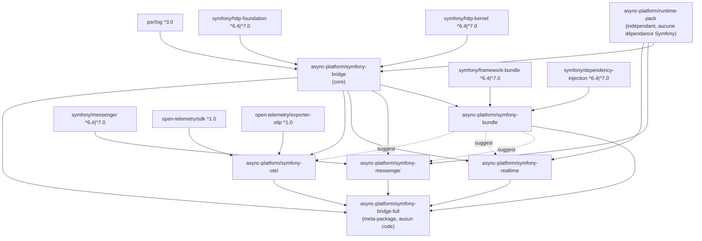
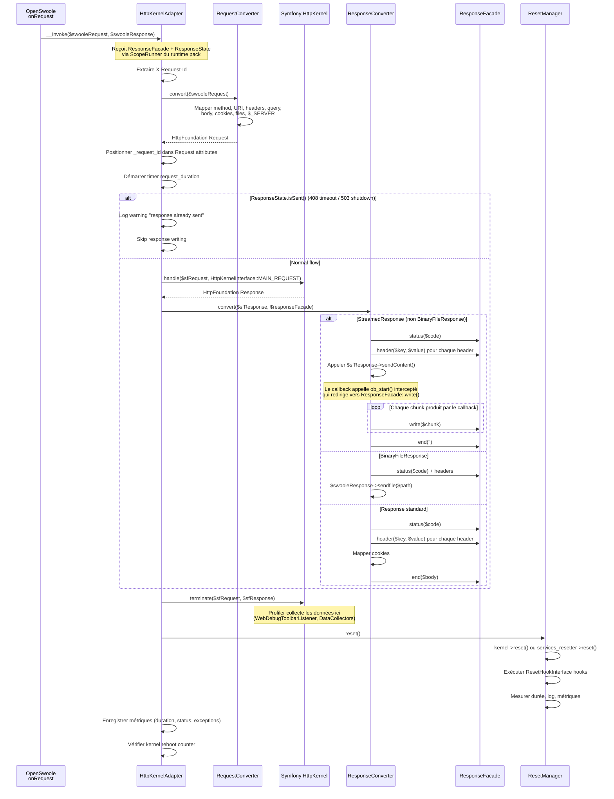
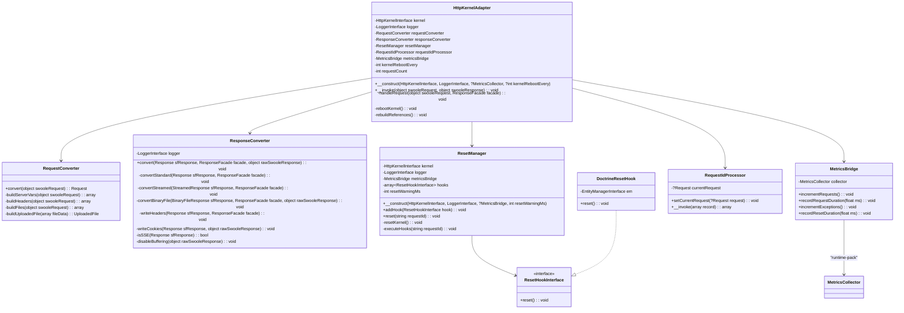
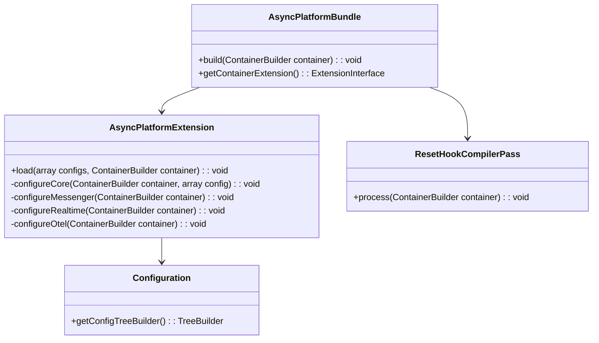
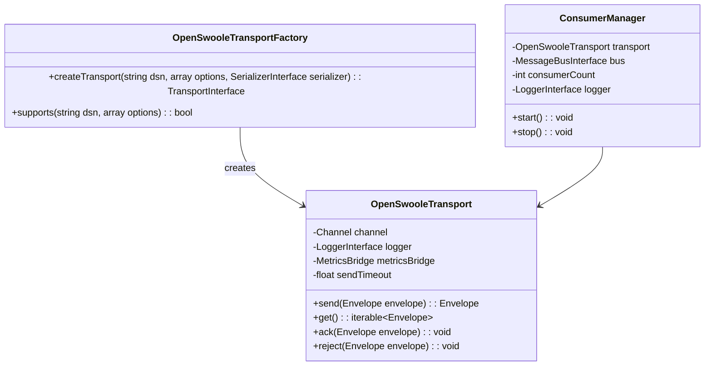
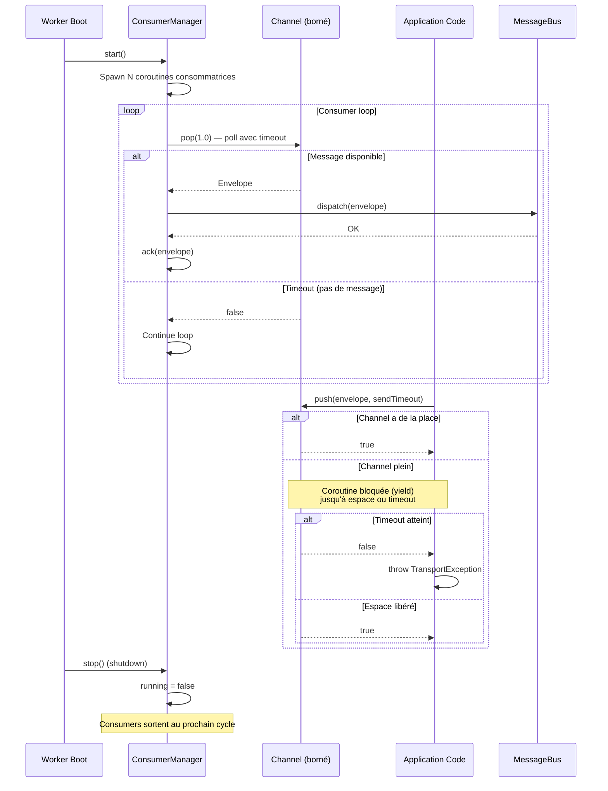
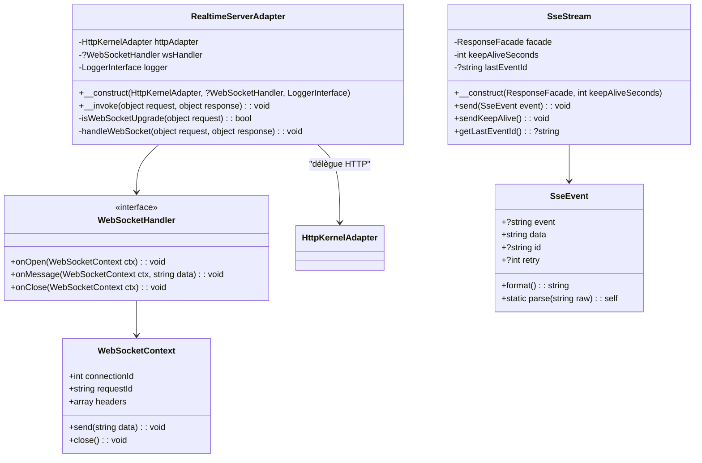
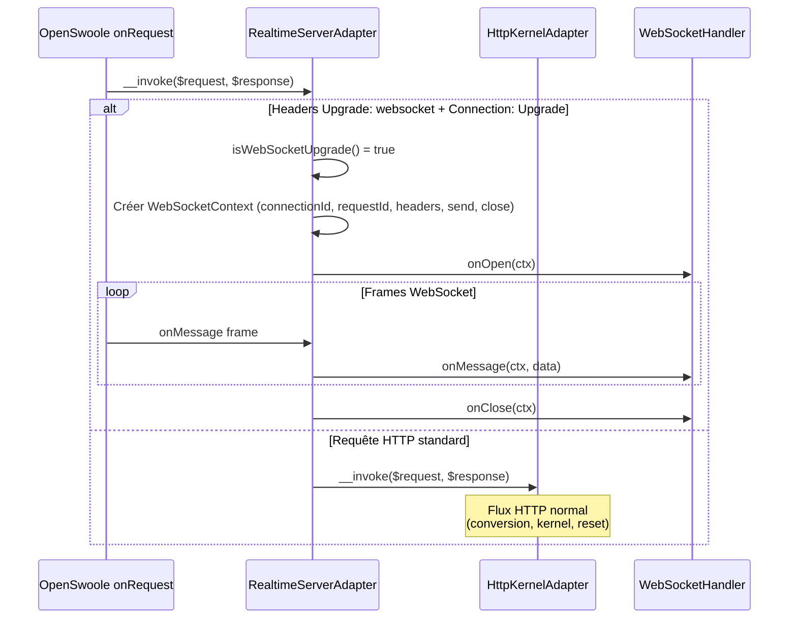
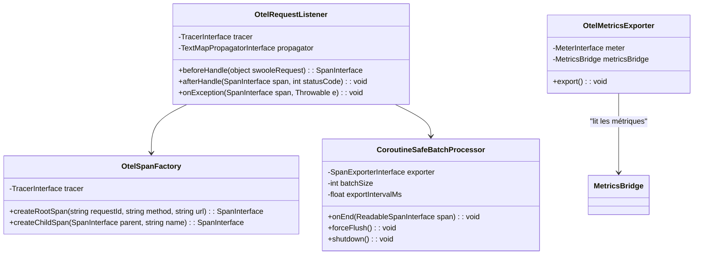
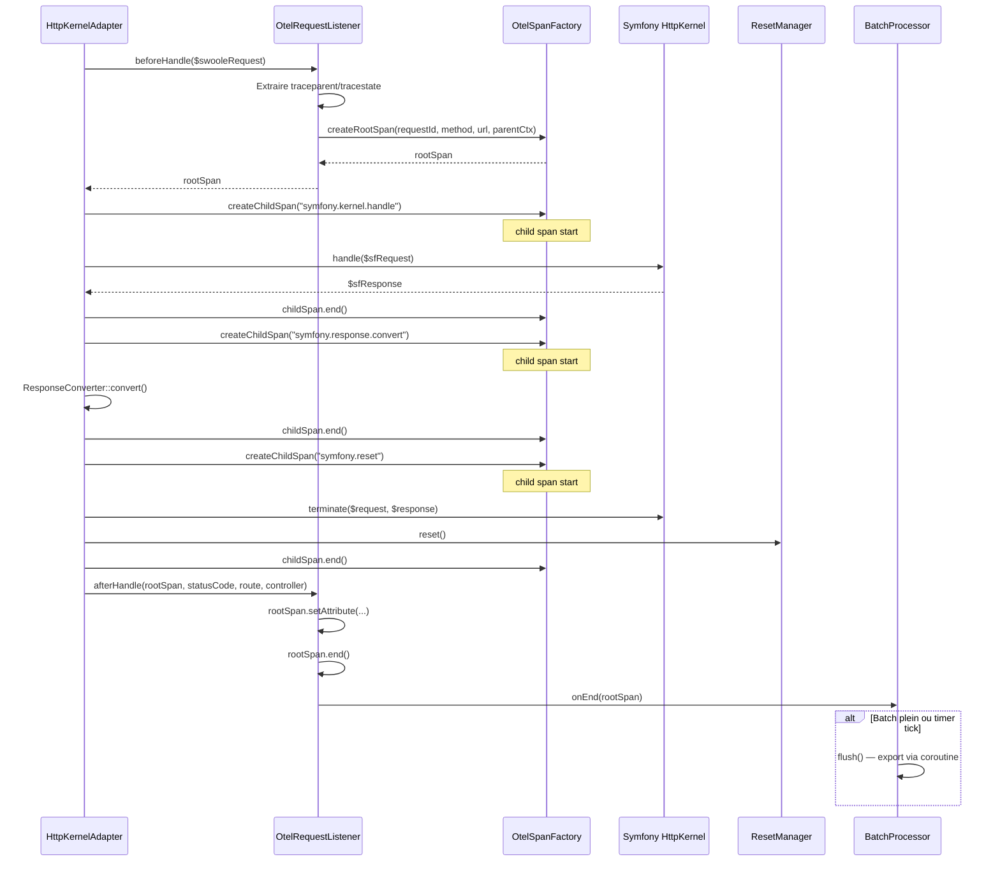

# Design Technique — Symfony Bridge Suite

## Vue d'ensemble

Ce document décrit l'architecture technique de la **Symfony Bridge Suite**, un ensemble de 6 packages Composer permettant d'exécuter une application Symfony (HttpKernel) sur le runtime OpenSwoole fourni par `async-platform/runtime-pack`.

Le design suit une architecture modulaire stricte : le core bridge (`symfony-bridge`) est un callable handler pur, sans dépendance vers un bundle ou un framework CLI. Les packages d'extension (bundle, messenger, realtime, otel) sont opt-in et s'intègrent via des interfaces bien définies.

### Décisions architecturales clés

| Décision | Choix | Justification | ADR |
|---|---|---|---|
| Conversion HTTP | HttpFoundation directe (pas PSR-7) | Zéro overhead de conversion intermédiaire, Symfony utilise nativement HttpFoundation, pas de dépendance supplémentaire (`nyholm/psr7`, `symfony/psr-http-message-bridge`) | ADR-001 |
| Stratégie de reset | `ResetInterface` prioritaire, `services_resetter` fallback, hooks custom post-reset | Couvre 100% des apps Symfony modernes (6.4+), extensible via `ResetHookInterface` pour les cas legacy (Doctrine) | ADR-002 |
| Transport Messenger | Channel OpenSwoole borné, in-process, non-durable | Simplicité maximale pour les cas simples (fire-and-forget, background jobs légers), pas de broker externe requis | ADR-003 |
| Intégration WebSocket | `RealtimeServerAdapter` comme callable routeur HTTP/WS | Réutilise `ServerBootstrap::run()` sans modification du runtime pack, séparation claire HTTP vs WS | ADR-004 |
| Architecture multi-packages | 6 packages Composer indépendants dans un monorepo | Installation minimale, arbre de dépendances réduit, testabilité isolée, versioning coordonné | ADR-005 |
| Streaming | `ResponseFacade::write()` natif pour StreamedResponse/SSE | Pas de buffering intermédiaire, flush immédiat, compatible chunked encoding OpenSwoole |
| Kernel reboot | `shutdown()` + `boot()` avec reconstruction des références | Fallback robuste pour les leaks que le reset standard ne couvre pas, sans tuer le worker |
| OTEL spans | Root span avant `handle()`, terminé après reset | Couvre l'intégralité du cycle de vie de la requête dans le bridge |

### Périmètre

Ce design couvre l'intégralité de la Symfony Bridge Suite V1 :
- Conversion HTTP bidirectionnelle (OpenSwoole ↔ HttpFoundation)
- Streaming natif (StreamedResponse, StreamedJsonResponse, SSE)
- Cycle de vie long-running (reset, terminate, reboot kernel)
- Anti-leak et surveillance mémoire
- Propagation request_id et observabilité
- Gestion des erreurs (prod vs dev)
- Bundle Symfony avec auto-configuration
- Transport Messenger in-process
- WebSocket et helpers SSE avancés
- Export OpenTelemetry (traces + métriques)
- Meta-package full

---

## Architecture

### Graphe de dépendances des packages



### Architecture par couches

```
┌─────────────────────────────────────────────────────────────────────┐
│                        Application Symfony                          │
│                   (HttpKernel, Controllers, Services)                │
├─────────────────────────────────────────────────────────────────────┤
│  symfony-bundle │ symfony-messenger │ symfony-realtime │ symfony-otel│
│  (auto-config)  │ (transport)       │ (WS + SSE)      │ (traces)   │
├─────────────────────────────────────────────────────────────────────┤
│                     symfony-bridge (core)                            │
│  HttpKernelAdapter │ RequestConverter │ ResponseConverter            │
│  ResetManager │ RequestIdProcessor │ MetricsBridge                  │
├─────────────────────────────────────────────────────────────────────┤
│                     runtime-pack (OpenSwoole)                       │
│  ServerBootstrap │ ScopeRunner │ ResponseFacade │ MetricsCollector   │
│  BlockingPool │ GracefulShutdown │ WorkerLifecycle │ JsonLogger      │
├─────────────────────────────────────────────────────────────────────┤
│                     OpenSwoole Extension                            │
│  HTTP Server │ Coroutines │ Channels │ Timer │ Process Pool         │
└─────────────────────────────────────────────────────────────────────┘
```

### Flux de requête HTTP complet (bridge)



---

## Composants et Interfaces

### Package 1 : `async-platform/symfony-bridge` (Core)

#### Diagramme de classes




#### Signatures des classes — Core Bridge

```php
<?php

namespace AsyncPlatform\SymfonyBridge;

use Psr\Log\LoggerInterface;
use Symfony\Component\HttpKernel\HttpKernelInterface;
use AsyncPlatform\RuntimePack\MetricsCollector;
use AsyncPlatform\RuntimePack\ResponseFacade;
use AsyncPlatform\RuntimePack\ResponseState;
use AsyncPlatform\RuntimePack\JsonLogger;

/**
 * Callable handler compatible avec ServerBootstrap::run($handler).
 *
 * Séquence invariante par requête :
 * 1. Extraire request_id
 * 2. Convertir OpenSwoole Request → HttpFoundation Request
 * 3. Vérifier ResponseState.isSent() (skip si 408/503 déjà envoyé)
 * 4. HttpKernel::handle()
 * 5. Convertir HttpFoundation Response → OpenSwoole Response (via ResponseFacade)
 * 6. kernel->terminate($request, $response)
 * 7. ResetManager::reset()
 * 8. Métriques + kernel reboot check
 */
final class HttpKernelAdapter
{
    private RequestConverter $requestConverter;
    private ResponseConverter $responseConverter;
    private ResetManager $resetManager;
    private RequestIdProcessor $requestIdProcessor;
    private ?MetricsBridge $metricsBridge;
    private int $kernelRebootEvery;
    private int $requestCount = 0;

    public function __construct(
        private HttpKernelInterface $kernel,
        private LoggerInterface $logger,
        ?MetricsCollector $metricsCollector = null,
        int $kernelRebootEvery = 0,
        int $resetWarningMs = 50,
    ) {
        $this->requestConverter = new RequestConverter();
        $this->responseConverter = new ResponseConverter($logger);
        $this->metricsBridge = $metricsCollector !== null
            ? new MetricsBridge($metricsCollector)
            : null;
        $this->resetManager = new ResetManager(
            $kernel,
            $logger,
            $this->metricsBridge,
            $resetWarningMs,
        );
        $this->requestIdProcessor = new RequestIdProcessor();

        // Si le logger est un JsonLogger du runtime pack, positionner le component
        if ($logger instanceof JsonLogger) {
            $this->logger = $logger->withComponent('symfony_bridge');
        }
    }

    /**
     * Point d'entrée appelé par le runtime pack pour chaque requête.
     *
     * @param object $swooleRequest  OpenSwoole\Http\Request
     * @param object $swooleResponse OpenSwoole\Http\Response (ou ResponseFacade)
     */
    public function __invoke(object $swooleRequest, object $swooleResponse): void
    {
        // Implémentation : voir séquence dans le diagramme ci-dessus
    }

    /**
     * Reboot le kernel Symfony et reconstruit les références internes.
     * Appelé quand kernelRebootEvery > 0 et requestCount atteint le seuil.
     */
    private function rebootKernel(): void
    {
        $this->kernel->shutdown();
        $this->kernel->boot();
        $this->rebuildReferences();
    }

    /**
     * Reconstruit les références internes après un reboot du kernel.
     * Le ResetManager, RequestIdProcessor et hooks doivent pointer
     * vers le nouveau container.
     */
    private function rebuildReferences(): void
    {
        $this->resetManager = new ResetManager(
            $this->kernel,
            $this->logger,
            $this->metricsBridge,
            $this->resetManager->getResetWarningMs(),
        );
        // Re-enregistrer les hooks depuis le nouveau container si disponible
    }
}
```

```php
<?php

namespace AsyncPlatform\SymfonyBridge;

use Symfony\Component\HttpFoundation\Request;
use Symfony\Component\HttpFoundation\File\UploadedFile;

/**
 * Convertit une OpenSwoole\Http\Request en Symfony HttpFoundation\Request.
 *
 * Invariants :
 * - Ne lit JAMAIS les superglobales PHP ($_SERVER, $_GET, $_POST, $_COOKIE, $_FILES)
 * - Ne modifie JAMAIS les superglobales PHP
 * - Toutes les données proviennent exclusivement de l'objet OpenSwoole Request
 * - Les headers multi-valués sont préservés
 * - L'encodage UTF-8 des URI est préservé
 * - Le X-Request-Id est propagé dans les headers ET les attributs
 */
final class RequestConverter
{
    /**
     * @param object $swooleRequest OpenSwoole\Http\Request
     */
    public function convert(object $swooleRequest): Request
    {
        $server = $this->buildServerVars($swooleRequest);
        $headers = $swooleRequest->header ?? [];
        $query = $swooleRequest->get ?? [];
        $post = $swooleRequest->post ?? [];
        $cookies = $swooleRequest->cookie ?? [];
        $files = $this->buildFiles($swooleRequest->files ?? []);
        $content = $swooleRequest->rawContent() ?: null;

        $request = new Request(
            query: $query,
            request: $post,
            attributes: [],
            cookies: $cookies,
            files: $files,
            server: $server,
            content: $content,
        );

        // Propager X-Request-Id dans les attributs
        $requestId = $headers['x-request-id'] ?? null;
        if ($requestId !== null) {
            $request->attributes->set('_request_id', $requestId);
        }

        return $request;
    }

    /**
     * Reconstruit le tableau $_SERVER équivalent à partir des données OpenSwoole.
     *
     * @return array<string, mixed>
     */
    private function buildServerVars(object $swooleRequest): array
    {
        $server = $swooleRequest->server ?? [];
        $headers = $swooleRequest->header ?? [];

        $result = [
            'REQUEST_METHOD'  => strtoupper($server['request_method'] ?? 'GET'),
            'REQUEST_URI'     => $server['request_uri'] ?? '/',
            'QUERY_STRING'    => $server['query_string'] ?? '',
            'SERVER_PROTOCOL' => $server['server_protocol'] ?? 'HTTP/1.1',
            'SERVER_NAME'     => $headers['host'] ?? '0.0.0.0',
            'SERVER_PORT'     => (int) ($server['server_port'] ?? 8080),
            'REMOTE_ADDR'     => $server['remote_addr'] ?? '127.0.0.1',
            'REMOTE_PORT'     => (int) ($server['remote_port'] ?? 0),
            'REQUEST_TIME'    => $server['request_time'] ?? time(),
            'REQUEST_TIME_FLOAT' => $server['request_time_float'] ?? microtime(true),
        ];

        // Content-Type et Content-Length (pas de préfixe HTTP_)
        if (isset($headers['content-type'])) {
            $result['CONTENT_TYPE'] = $headers['content-type'];
        }
        if (isset($headers['content-length'])) {
            $result['CONTENT_LENGTH'] = $headers['content-length'];
        }

        // Mapper les headers HTTP vers HTTP_* (convention CGI)
        foreach ($headers as $name => $value) {
            $key = 'HTTP_' . strtoupper(str_replace('-', '_', $name));
            $result[$key] = $value;
        }

        return $result;
    }

    /**
     * Convertit les fichiers uploadés OpenSwoole en objets UploadedFile HttpFoundation.
     *
     * @param array $swooleFiles Tableau de fichiers OpenSwoole
     * @return array<string, UploadedFile|array>
     */
    private function buildFiles(array $swooleFiles): array
    {
        $result = [];
        foreach ($swooleFiles as $key => $file) {
            if (is_array($file) && isset($file['tmp_name'])) {
                $result[$key] = $this->buildUploadedFile($file);
            } elseif (is_array($file)) {
                // Fichiers multiples (input name="files[]")
                $result[$key] = $this->buildFiles($file);
            }
        }
        return $result;
    }

    private function buildUploadedFile(array $fileData): UploadedFile
    {
        return new UploadedFile(
            path: $fileData['tmp_name'],
            originalName: $fileData['name'] ?? '',
            mimeType: $fileData['type'] ?? null,
            error: $fileData['error'] ?? \UPLOAD_ERR_OK,
            test: false,
        );
    }
}
```

```php
<?php

namespace AsyncPlatform\SymfonyBridge;

use Psr\Log\LoggerInterface;
use Symfony\Component\HttpFoundation\Response;
use Symfony\Component\HttpFoundation\StreamedResponse;
use Symfony\Component\HttpFoundation\BinaryFileResponse;
use Symfony\Component\HttpFoundation\StreamedJsonResponse;
use AsyncPlatform\RuntimePack\ResponseFacade;

/**
 * Convertit une HttpFoundation Response en réponse OpenSwoole via ResponseFacade.
 *
 * Gère 4 cas :
 * 1. Response standard → status + headers + cookies + end($body)
 * 2. StreamedResponse → status + headers + write() par chunk + end('')
 * 3. BinaryFileResponse → status + headers + sendfile()
 * 4. SSE (StreamedResponse + text/event-stream) → désactiver buffering + write() immédiat
 *
 * Invariants :
 * - Les headers Server et X-Powered-By sont supprimés
 * - Les cookies sont mappés avec tous les attributs (secure, httpOnly, sameSite)
 * - Les headers multi-valués sont préservés (ex: Set-Cookie)
 * - Le Content-Length est préservé s'il est présent
 * - En mode SSE, la compression HTTP et le buffering sont désactivés
 */
final class ResponseConverter
{
    public function __construct(
        private readonly LoggerInterface $logger,
    ) {}

    /**
     * @param Response $sfResponse     Réponse Symfony
     * @param ResponseFacade $facade   Facade du runtime pack
     * @param object $rawSwooleResponse OpenSwoole\Http\Response brute (pour sendfile/cookie)
     */
    public function convert(
        Response $sfResponse,
        ResponseFacade $facade,
        object $rawSwooleResponse,
    ): void {
        // Supprimer les headers sensibles
        $sfResponse->headers->remove('Server');
        $sfResponse->headers->remove('X-Powered-By');

        if ($sfResponse instanceof BinaryFileResponse) {
            $this->convertBinaryFile($sfResponse, $facade, $rawSwooleResponse);
        } elseif ($sfResponse instanceof StreamedResponse || $sfResponse instanceof StreamedJsonResponse) {
            $this->convertStreamed($sfResponse, $facade, $rawSwooleResponse);
        } else {
            $this->convertStandard($sfResponse, $facade, $rawSwooleResponse);
        }
    }

    private function convertStandard(
        Response $sfResponse,
        ResponseFacade $facade,
        object $rawSwooleResponse,
    ): void {
        $facade->status($sfResponse->getStatusCode());
        $this->writeHeaders($sfResponse, $facade);
        $this->writeCookies($sfResponse, $rawSwooleResponse);
        $facade->end($sfResponse->getContent() ?: '');
    }

    private function convertStreamed(
        StreamedResponse $sfResponse,
        ResponseFacade $facade,
        object $rawSwooleResponse,
    ): void {
        $facade->status($sfResponse->getStatusCode());
        $this->writeHeaders($sfResponse, $facade);
        $this->writeCookies($sfResponse, $rawSwooleResponse);

        // SSE : désactiver compression et buffering
        if ($this->isSSE($sfResponse)) {
            $this->disableBuffering($rawSwooleResponse);
        }

        // Intercepter la sortie du callback via ob_start
        // et rediriger vers ResponseFacade::write()
        try {
            ob_start(function (string $chunk) use ($facade): string {
                if ($chunk !== '') {
                    $facade->write($chunk);
                }
                return '';
            }, 1); // chunk_size=1 pour flush immédiat

            $sfResponse->sendContent();

            ob_end_clean();
        } catch (\Throwable $e) {
            if (ob_get_level() > 0) {
                ob_end_clean();
            }
            $this->logger->error('StreamedResponse callback exception', [
                'error' => $e->getMessage(),
                'exception_class' => get_class($e),
            ]);
        }

        $facade->end('');
    }

    private function convertBinaryFile(
        BinaryFileResponse $sfResponse,
        ResponseFacade $facade,
        object $rawSwooleResponse,
    ): void {
        $facade->status($sfResponse->getStatusCode());
        $this->writeHeaders($sfResponse, $facade);
        $this->writeCookies($sfResponse, $rawSwooleResponse);

        $file = $sfResponse->getFile();
        $rawSwooleResponse->sendfile($file->getPathname());
    }

    private function writeHeaders(Response $sfResponse, ResponseFacade $facade): void
    {
        foreach ($sfResponse->headers->allPreserveCaseWithoutCookies() as $name => $values) {
            foreach ($values as $value) {
                $facade->header($name, $value);
            }
        }
    }

    private function writeCookies(Response $sfResponse, object $rawSwooleResponse): void
    {
        foreach ($sfResponse->headers->getCookies() as $cookie) {
            $rawSwooleResponse->cookie(
                $cookie->getName(),
                $cookie->getValue() ?? '',
                $cookie->getExpiresTime(),
                $cookie->getPath(),
                $cookie->getDomain() ?? '',
                $cookie->isSecure(),
                $cookie->isHttpOnly(),
                $cookie->getSameSite() ?? '',
            );
        }
    }

    private function isSSE(Response $sfResponse): bool
    {
        return str_contains(
            $sfResponse->headers->get('Content-Type', ''),
            'text/event-stream',
        );
    }

    private function disableBuffering(object $rawSwooleResponse): void
    {
        // Désactiver la compression HTTP pour SSE
        // OpenSwoole supporte la désactivation par réponse
        // via un header spécifique ou la configuration
        $rawSwooleResponse->header('X-Accel-Buffering', 'no');
        $rawSwooleResponse->header('Cache-Control', 'no-cache');
    }
}
```

```php
<?php

namespace AsyncPlatform\SymfonyBridge;

use Psr\Log\LoggerInterface;
use Symfony\Component\HttpKernel\HttpKernelInterface;
use Symfony\Contracts\Service\ResetInterface;

/**
 * Gère le reset d'état entre requêtes dans un processus long-running.
 *
 * Stratégie de reset (ordre de priorité) :
 * 1. Si le Kernel implémente ResetInterface → $kernel->reset()
 * 2. Sinon si le service 'services_resetter' existe → $container->get('services_resetter')->reset()
 * 3. Sinon → reset best-effort + log warning
 *
 * Après le reset Symfony, les ResetHookInterface hooks sont exécutés.
 * Le reset est TOUJOURS exécuté dans un bloc finally (même si le handler a levé une exception).
 *
 * Métriques : symfony_reset_duration_ms
 * Logs : debug après chaque reset, warning si durée > seuil
 */
final class ResetManager
{
    /** @var ResetHookInterface[] */
    private array $hooks = [];

    public function __construct(
        private HttpKernelInterface $kernel,
        private readonly LoggerInterface $logger,
        private readonly ?MetricsBridge $metricsBridge,
        private readonly int $resetWarningMs = 50,
    ) {}

    public function addHook(ResetHookInterface $hook): void
    {
        $this->hooks[] = $hook;
    }

    public function reset(string $requestId): void
    {
        $start = microtime(true);

        try {
            $this->resetKernel();
            $this->executeHooks($requestId);
        } catch (\Throwable $e) {
            $this->logger->error('Reset failed', [
                'request_id' => $requestId,
                'error' => $e->getMessage(),
            ]);
        }

        $durationMs = (microtime(true) - $start) * 1000;

        $this->metricsBridge?->recordResetDuration($durationMs);

        $this->logger->debug('Reset completed', [
            'request_id' => $requestId,
            'reset_duration_ms' => round($durationMs, 2),
        ]);

        if ($durationMs > $this->resetWarningMs) {
            $this->logger->warning('Reset duration exceeded threshold', [
                'request_id' => $requestId,
                'reset_duration_ms' => round($durationMs, 2),
                'threshold_ms' => $this->resetWarningMs,
            ]);
        }
    }

    public function getResetWarningMs(): int
    {
        return $this->resetWarningMs;
    }

    private function resetKernel(): void
    {
        // Stratégie 1 : ResetInterface
        if ($this->kernel instanceof ResetInterface) {
            $this->kernel->reset();
            return;
        }

        // Stratégie 2 : services_resetter
        if (method_exists($this->kernel, 'getContainer')) {
            $container = $this->kernel->getContainer();
            if ($container->has('services_resetter')) {
                $container->get('services_resetter')->reset();
                return;
            }
        }

        // Stratégie 3 : best-effort
        $this->logger->warning('No complete reset strategy found — best-effort reset only');
    }

    private function executeHooks(string $requestId): void
    {
        foreach ($this->hooks as $hook) {
            try {
                $hook->reset();
            } catch (\Throwable $e) {
                $this->logger->error('ResetHook failed', [
                    'request_id' => $requestId,
                    'hook' => get_class($hook),
                    'error' => $e->getMessage(),
                ]);
            }
        }
    }
}
```

```php
<?php

namespace AsyncPlatform\SymfonyBridge;

/**
 * Interface pour les hooks de reset custom exécutés après le reset Symfony principal.
 * Chaque hook est exécuté dans un try/catch : un hook qui échoue ne bloque pas les suivants.
 */
interface ResetHookInterface
{
    public function reset(): void;
}
```

```php
<?php

namespace AsyncPlatform\SymfonyBridge;

use Doctrine\ORM\EntityManagerInterface;

/**
 * Hook de reset optionnel pour Doctrine.
 * Fourni comme implémentation suggérée — le bridge ne dépend PAS de Doctrine.
 *
 * Actions :
 * - $em->clear() pour détacher toutes les entités
 * - Vérifier qu'aucune transaction n'est ouverte
 * - Si transaction ouverte → rollback + log warning
 */
final class DoctrineResetHook implements ResetHookInterface
{
    public function __construct(
        private readonly EntityManagerInterface $em,
        private readonly \Psr\Log\LoggerInterface $logger,
    ) {}

    public function reset(): void
    {
        // Vérifier les transactions orphelines
        $connection = $this->em->getConnection();
        if ($connection->isTransactionActive()) {
            $connection->rollBack();
            $this->logger->warning('Orphaned transaction rolled back during reset');
        }

        $this->em->clear();
    }
}
```

```php
<?php

namespace AsyncPlatform\SymfonyBridge;

use Monolog\LogRecord;
use Monolog\Processor\ProcessorInterface;
use Symfony\Component\HttpFoundation\Request;

/**
 * Processeur Monolog qui ajoute le request_id à tous les enregistrements de log.
 * Lit _request_id depuis les attributs de la requête courante.
 *
 * Usage : enregistrer comme service taggé monolog.processor dans Symfony.
 */
final class RequestIdProcessor implements ProcessorInterface
{
    private ?Request $currentRequest = null;

    public function setCurrentRequest(?Request $request): void
    {
        $this->currentRequest = $request;
    }

    public function __invoke(LogRecord $record): LogRecord
    {
        $requestId = $this->currentRequest?->attributes->get('_request_id');
        if ($requestId !== null) {
            $record->extra['request_id'] = $requestId;
        }
        return $record;
    }
}
```

```php
<?php

namespace AsyncPlatform\SymfonyBridge;

use AsyncPlatform\RuntimePack\MetricsCollector;

/**
 * Pont entre le bridge Symfony et le MetricsCollector du runtime pack.
 * Expose les métriques spécifiques au bridge :
 * - symfony_requests_total
 * - symfony_request_duration_ms
 * - symfony_exceptions_total
 * - symfony_reset_duration_ms
 *
 * Note : le MetricsCollector du runtime pack est un collecteur interne.
 * Le bridge étend ses compteurs via des méthodes dédiées.
 * En V1, les métriques Symfony sont exposées via le même snapshot.
 */
final class MetricsBridge
{
    private int $requestsTotal = 0;
    private int $exceptionsTotal = 0;
    private float $requestDurationSumMs = 0.0;
    private float $resetDurationSumMs = 0.0;

    public function __construct(
        private readonly MetricsCollector $collector,
    ) {}

    public function incrementRequests(): void
    {
        $this->requestsTotal++;
    }

    public function recordRequestDuration(float $ms): void
    {
        $this->requestDurationSumMs += $ms;
    }

    public function incrementExceptions(): void
    {
        $this->exceptionsTotal++;
    }

    public function recordResetDuration(float $ms): void
    {
        $this->resetDurationSumMs += $ms;
    }

    /** @return array<string, mixed> */
    public function snapshot(): array
    {
        return [
            'symfony_requests_total' => $this->requestsTotal,
            'symfony_request_duration_sum_ms' => $this->requestDurationSumMs,
            'symfony_exceptions_total' => $this->exceptionsTotal,
            'symfony_reset_duration_sum_ms' => $this->resetDurationSumMs,
        ];
    }
}
```

### Package 2 : `async-platform/symfony-bundle`

#### Diagramme de classes



#### Signatures — Bundle

```php
<?php

namespace AsyncPlatform\SymfonyBundle;

use Symfony\Component\DependencyInjection\ContainerBuilder;
use Symfony\Component\HttpKernel\Bundle\Bundle;

/**
 * Bundle Symfony pour l'auto-configuration de la Symfony Bridge Suite.
 *
 * Responsabilités :
 * - Enregistrer les services du core bridge (HttpKernelAdapter, ResetManager, etc.)
 * - Auto-tagger les services implémentant ResetHookInterface
 * - Auto-détecter les packages optionnels (messenger, realtime, otel)
 * - Fournir la configuration async_platform
 */
final class AsyncPlatformBundle extends Bundle
{
    public function build(ContainerBuilder $container): void
    {
        $container->addCompilerPass(new ResetHookCompilerPass());
    }
}
```

```php
<?php

namespace AsyncPlatform\SymfonyBundle\DependencyInjection;

use Symfony\Component\Config\Definition\Builder\TreeBuilder;
use Symfony\Component\Config\Definition\ConfigurationInterface;

/**
 * Configuration YAML : async_platform
 *
 * async_platform:
 *   memory_warning_threshold: 104857600  # 100 Mo (défaut)
 *   reset_warning_ms: 50                 # seuil warning reset (défaut)
 *   kernel_reboot_every: 0               # 0 = désactivé (défaut)
 *   messenger:                            # auto-détecté si symfony-messenger installé
 *     channel_capacity: 100
 *     consumers: 1
 *     send_timeout: 5.0
 *   realtime:                             # auto-détecté si symfony-realtime installé
 *     ws_max_lifetime_seconds: 3600
 *   otel:                                 # auto-détecté si symfony-otel installé
 *     enabled: true
 */
final class Configuration implements ConfigurationInterface
{
    public function getConfigTreeBuilder(): TreeBuilder
    {
        $treeBuilder = new TreeBuilder('async_platform');
        // Configuration tree definition
        return $treeBuilder;
    }
}
```

```php
<?php

namespace AsyncPlatform\SymfonyBundle\DependencyInjection\Compiler;

use AsyncPlatform\SymfonyBridge\ResetHookInterface;
use AsyncPlatform\SymfonyBridge\ResetManager;
use Symfony\Component\DependencyInjection\Compiler\CompilerPassInterface;
use Symfony\Component\DependencyInjection\ContainerBuilder;
use Symfony\Component\DependencyInjection\Reference;

/**
 * Compiler pass qui auto-tag les services implémentant ResetHookInterface
 * et les injecte dans le ResetManager.
 */
final class ResetHookCompilerPass implements CompilerPassInterface
{
    public function process(ContainerBuilder $container): void
    {
        if (!$container->hasDefinition(ResetManager::class)) {
            return;
        }

        $resetManager = $container->getDefinition(ResetManager::class);

        foreach ($container->findTaggedServiceIds('async_platform.reset_hook') as $id => $tags) {
            $resetManager->addMethodCall('addHook', [new Reference($id)]);
        }
    }
}
```

#### Auto-détection des packages optionnels

Le bundle détecte la présence des packages d'extension via `class_exists()` :

| Package | Classe de détection | Action |
|---------|-------------------|--------|
| `symfony-messenger` | `AsyncPlatform\SymfonyMessenger\OpenSwooleTransport` | Enregistrer le transport + factory |
| `symfony-realtime` | `AsyncPlatform\SymfonyRealtime\RealtimeServerAdapter` | Enregistrer WebSocketHandler + SSE helpers |
| `symfony-otel` | `AsyncPlatform\SymfonyOtel\OtelSpanFactory` | Configurer span processor + metrics exporter |

#### Recipe Flex

La recipe Flex crée les fichiers suivants :

```
config/packages/async_platform.yaml    # Configuration par défaut
bin/async-server.php                    # Script de bootstrap
.env                                    # Variables ASYNC_PLATFORM_*
```

Script de bootstrap `bin/async-server.php` :

```php
<?php
// bin/async-server.php

use App\Kernel;
use AsyncPlatform\RuntimePack\ServerBootstrap;
use AsyncPlatform\SymfonyBridge\HttpKernelAdapter;

require_once dirname(__DIR__) . '/vendor/autoload_runtime.php';

$env = $_SERVER['APP_ENV'] ?? 'prod';
$debug = (bool) ($_SERVER['APP_DEBUG'] ?? ($env !== 'prod'));

$kernel = new Kernel($env, $debug);
$kernel->boot();

$handler = new HttpKernelAdapter(
    kernel: $kernel,
    logger: $kernel->getContainer()->get('logger'),
);

ServerBootstrap::run(
    appHandler: $handler,
    production: $env === 'prod',
);
```

### Package 3 : `async-platform/symfony-messenger`

#### Diagramme de classes



#### Signatures — Messenger

```php
<?php

namespace AsyncPlatform\SymfonyMessenger;

use Symfony\Component\Messenger\Envelope;
use Symfony\Component\Messenger\Transport\TransportInterface;
use Psr\Log\LoggerInterface;

/**
 * Transport Messenger in-process via channel OpenSwoole borné.
 *
 * DSN : openswoole://default
 *
 * Le channel est isolé par worker : chaque worker possède son propre channel.
 * Les messages ne sont PAS partagés entre workers.
 * Les messages sont perdus au restart du worker (non-durable).
 *
 * Backpressure : si le channel est plein, send() bloque la coroutine
 * jusqu'à ce qu'un espace soit disponible ou que le timeout soit atteint.
 */
final class OpenSwooleTransport implements TransportInterface
{
    /** @var \OpenSwoole\Coroutine\Channel */
    private object $channel;

    public function __construct(
        int $channelCapacity = 100,
        private readonly float $sendTimeout = 5.0,
        private readonly ?LoggerInterface $logger = null,
    ) {
        $this->channel = new \OpenSwoole\Coroutine\Channel($channelCapacity);
    }

    public function send(Envelope $envelope): Envelope
    {
        $pushed = $this->channel->push($envelope, $this->sendTimeout);
        if ($pushed === false) {
            throw new \Symfony\Component\Messenger\Exception\TransportException(
                sprintf(
                    'OpenSwoole channel full (capacity: %d). Send timeout after %.1fs.',
                    $this->channel->capacity,
                    $this->sendTimeout,
                ),
            );
        }
        return $envelope;
    }

    /** @return iterable<Envelope> */
    public function get(): iterable
    {
        $envelope = $this->channel->pop(1.0); // 1s poll timeout
        if ($envelope === false) {
            return [];
        }
        return [$envelope];
    }

    public function ack(Envelope $envelope): void
    {
        // In-process : ack est un no-op (message déjà consommé)
    }

    public function reject(Envelope $envelope): void
    {
        $this->logger?->warning('Message rejected', [
            'message_class' => get_class($envelope->getMessage()),
        ]);
    }
}
```

```php
<?php

namespace AsyncPlatform\SymfonyMessenger;

/**
 * Gère les coroutines consommatrices du transport.
 *
 * Les consumers sont spawnés via TaskGroup avec structured concurrency.
 * Ils respectent les deadlines et la cancellation via ScopeRunner.
 * Ils sont démarrés au boot du worker et annulés au shutdown.
 *
 * Lifecycle :
 * - start() : spawn N coroutines consommatrices dans un TaskGroup
 * - stop() : cancel le TaskGroup → les consumers s'arrêtent proprement
 */
final class ConsumerManager
{
    /** @var int[] Coroutine IDs des consumers */
    private array $consumerCids = [];
    private bool $running = false;

    public function __construct(
        private readonly OpenSwooleTransport $transport,
        private readonly object $bus, // MessageBusInterface
        private readonly int $consumerCount = 1,
        private readonly ?\Psr\Log\LoggerInterface $logger = null,
    ) {}

    public function start(): void
    {
        $this->running = true;
        for ($i = 0; $i < $this->consumerCount; $i++) {
            $this->consumerCids[] = \OpenSwoole\Coroutine::create(
                fn() => $this->consumeLoop($i),
            );
        }
    }

    public function stop(): void
    {
        $this->running = false;
        // Les coroutines sortiront de la boucle au prochain cycle
    }

    private function consumeLoop(int $consumerId): void
    {
        while ($this->running) {
            foreach ($this->transport->get() as $envelope) {
                try {
                    $this->bus->dispatch($envelope);
                    $this->transport->ack($envelope);
                } catch (\Throwable $e) {
                    $this->transport->reject($envelope);
                    $this->logger?->error('Consumer failed to process message', [
                        'consumer_id' => $consumerId,
                        'error' => $e->getMessage(),
                    ]);
                }
            }
        }
    }
}
```

#### Diagramme de séquence — Messenger lifecycle



### Package 4 : `async-platform/symfony-realtime`

#### Diagramme de classes



#### Signatures — Realtime

```php
<?php

namespace AsyncPlatform\SymfonyRealtime;

/**
 * Interface pour gérer les connexions WebSocket.
 * Implémentée par l'application pour définir la logique WS.
 */
interface WebSocketHandler
{
    public function onOpen(WebSocketContext $ctx): void;
    public function onMessage(WebSocketContext $ctx, string $data): void;
    public function onClose(WebSocketContext $ctx): void;
}
```

```php
<?php

namespace AsyncPlatform\SymfonyRealtime;

/**
 * DTO contenant les informations de connexion WebSocket.
 * Immutable après construction.
 */
final readonly class WebSocketContext
{
    public function __construct(
        public int $connectionId,
        public string $requestId,
        /** @var array<string, string> */
        public array $headers,
        /** @var callable(string): void */
        private \Closure $sendFn,
        /** @var callable(): void */
        private \Closure $closeFn,
    ) {}

    public function send(string $data): void
    {
        ($this->sendFn)($data);
    }

    public function close(): void
    {
        ($this->closeFn)();
    }
}
```

```php
<?php

namespace AsyncPlatform\SymfonyRealtime;

use AsyncPlatform\SymfonyBridge\HttpKernelAdapter;
use Psr\Log\LoggerInterface;

/**
 * Callable compatible avec ServerBootstrap::run($handler).
 * Route les requêtes HTTP vers HttpKernelAdapter et les WebSocket upgrades
 * vers le WebSocketHandler enregistré.
 *
 * Détection de l'upgrade WebSocket via les headers :
 * - Upgrade: websocket
 * - Connection: Upgrade
 */
final class RealtimeServerAdapter
{
    public function __construct(
        private readonly HttpKernelAdapter $httpAdapter,
        private readonly ?WebSocketHandler $wsHandler,
        private readonly LoggerInterface $logger,
    ) {}

    public function __invoke(object $request, object $response): void
    {
        if ($this->wsHandler !== null && $this->isWebSocketUpgrade($request)) {
            $this->handleWebSocket($request, $response);
        } else {
            ($this->httpAdapter)($request, $response);
        }
    }

    private function isWebSocketUpgrade(object $request): bool
    {
        $headers = $request->header ?? [];
        $upgrade = strtolower($headers['upgrade'] ?? '');
        $connection = strtolower($headers['connection'] ?? '');

        return $upgrade === 'websocket' && str_contains($connection, 'upgrade');
    }

    private function handleWebSocket(object $request, object $response): void
    {
        // Délégation au WebSocketHandler avec WebSocketContext
        // Le max lifetime est géré via un Timer::after()
    }
}
```

```php
<?php

namespace AsyncPlatform\SymfonyRealtime;

/**
 * Helper pour formater un événement SSE conforme à la spécification W3C.
 *
 * Format de sortie :
 *   event: {event}\n
 *   data: {data}\n
 *   id: {id}\n
 *   retry: {retry}\n
 *   \n
 *
 * Propriété round-trip : format() puis parse() restitue les champs originaux.
 */
final readonly class SseEvent
{
    public function __construct(
        public string $data,
        public ?string $event = null,
        public ?string $id = null,
        public ?int $retry = null,
    ) {}

    /**
     * Formate l'événement SSE en texte conforme W3C.
     */
    public function format(): string
    {
        $lines = [];

        if ($this->event !== null) {
            $lines[] = 'event: ' . $this->event;
        }

        // data peut contenir des \n — chaque ligne doit être préfixée par "data: "
        foreach (explode("\n", $this->data) as $dataLine) {
            $lines[] = 'data: ' . $dataLine;
        }

        if ($this->id !== null) {
            $lines[] = 'id: ' . $this->id;
        }

        if ($this->retry !== null) {
            $lines[] = 'retry: ' . $this->retry;
        }

        return implode("\n", $lines) . "\n\n";
    }

    /**
     * Parse un bloc SSE texte en SseEvent.
     * Utilisé pour la propriété round-trip dans les tests.
     */
    public static function parse(string $raw): self
    {
        $event = null;
        $dataLines = [];
        $id = null;
        $retry = null;

        foreach (explode("\n", rtrim($raw, "\n")) as $line) {
            if (str_starts_with($line, 'event: ')) {
                $event = substr($line, 7);
            } elseif (str_starts_with($line, 'data: ')) {
                $dataLines[] = substr($line, 6);
            } elseif (str_starts_with($line, 'id: ')) {
                $id = substr($line, 4);
            } elseif (str_starts_with($line, 'retry: ')) {
                $retry = (int) substr($line, 7);
            }
        }

        return new self(
            data: implode("\n", $dataLines),
            event: $event,
            id: $id,
            retry: $retry,
        );
    }
}
```

```php
<?php

namespace AsyncPlatform\SymfonyRealtime;

use AsyncPlatform\RuntimePack\ResponseFacade;

/**
 * Encapsule l'envoi d'événements SSE via ResponseFacade::write().
 *
 * Fonctionnalités :
 * - Envoi de keep-alive périodique (commentaire SSE `: keep-alive\n\n`)
 * - Support du champ Last-Event-ID pour la reconnexion client
 */
final class SseStream
{
    private float $lastKeepAliveAt;

    public function __construct(
        private readonly ResponseFacade $facade,
        private readonly int $keepAliveSeconds = 15,
    ) {
        $this->lastKeepAliveAt = microtime(true);
    }

    public function send(SseEvent $event): void
    {
        $this->facade->write($event->format());
        $this->lastKeepAliveAt = microtime(true);
    }

    public function sendKeepAlive(): void
    {
        $this->facade->write(": keep-alive\n\n");
        $this->lastKeepAliveAt = microtime(true);
    }

    public function shouldSendKeepAlive(): bool
    {
        return (microtime(true) - $this->lastKeepAliveAt) >= $this->keepAliveSeconds;
    }
}
```

#### Diagramme de séquence — Routage HTTP/WS par RealtimeServerAdapter



### Package 5 : `async-platform/symfony-otel`

#### Diagramme de classes



#### Signatures — OTEL

```php
<?php

namespace AsyncPlatform\SymfonyOtel;

use OpenTelemetry\API\Trace\TracerInterface;
use OpenTelemetry\API\Trace\SpanInterface;
use OpenTelemetry\API\Trace\SpanKind;
use OpenTelemetry\Context\Propagation\TextMapPropagatorInterface;

/**
 * Listener OTEL intégré au cycle de vie du HttpKernelAdapter.
 *
 * Lifecycle du root span :
 * 1. beforeHandle() : créer le root span AVANT HttpKernel::handle()
 *    - Propager le trace context entrant (W3C traceparent/tracestate)
 *    - Attributs : http.method, http.url, http.request_id
 * 2. afterHandle() : enrichir le root span APRÈS reset/terminate
 *    - Attributs : http.status_code, symfony.route, symfony.controller
 *    - Terminer le root span
 * 3. onException() : capturer l'exception dans le root span
 *
 * Child spans créés pour :
 * - "symfony.kernel.handle" : durée du HttpKernel::handle()
 * - "symfony.response.convert" : durée de la conversion Response
 * - "symfony.reset" : durée de la phase terminate + reset
 */
final class OtelRequestListener
{
    public function __construct(
        private readonly OtelSpanFactory $spanFactory,
        private readonly TextMapPropagatorInterface $propagator,
    ) {}

    /**
     * Crée le root span et extrait le trace context entrant.
     *
     * @param object $swooleRequest OpenSwoole Request (pour les headers W3C)
     * @return SpanInterface Le root span actif
     */
    public function beforeHandle(object $swooleRequest): SpanInterface
    {
        // Extraire traceparent/tracestate depuis les headers OpenSwoole
        $headers = $swooleRequest->header ?? [];
        $parentContext = $this->propagator->extract($headers);

        return $this->spanFactory->createRootSpan(
            requestId: $headers['x-request-id'] ?? 'unknown',
            method: strtoupper($swooleRequest->server['request_method'] ?? 'GET'),
            url: $swooleRequest->server['request_uri'] ?? '/',
            parentContext: $parentContext,
        );
    }

    public function afterHandle(
        SpanInterface $rootSpan,
        int $statusCode,
        ?string $route = null,
        ?string $controller = null,
    ): void {
        $rootSpan->setAttribute('http.status_code', $statusCode);
        if ($route !== null) {
            $rootSpan->setAttribute('symfony.route', $route);
        }
        if ($controller !== null) {
            $rootSpan->setAttribute('symfony.controller', $controller);
        }
        $rootSpan->end();
    }

    public function onException(SpanInterface $rootSpan, \Throwable $e): void
    {
        $rootSpan->recordException($e);
        $rootSpan->setStatus(\OpenTelemetry\API\Trace\StatusCode::STATUS_ERROR, $e->getMessage());
    }
}
```

```php
<?php

namespace AsyncPlatform\SymfonyOtel;

use OpenTelemetry\API\Trace\TracerInterface;
use OpenTelemetry\API\Trace\SpanInterface;
use OpenTelemetry\API\Trace\SpanKind;
use OpenTelemetry\Context\Context;

/**
 * Factory pour créer les spans OTEL du bridge.
 */
final class OtelSpanFactory
{
    public function __construct(
        private readonly TracerInterface $tracer,
    ) {}

    public function createRootSpan(
        string $requestId,
        string $method,
        string $url,
        ?Context $parentContext = null,
    ): SpanInterface {
        $builder = $this->tracer->spanBuilder("HTTP {$method} {$url}")
            ->setSpanKind(SpanKind::KIND_SERVER)
            ->setAttribute('http.method', $method)
            ->setAttribute('http.url', $url)
            ->setAttribute('http.request_id', $requestId);

        if ($parentContext !== null) {
            $builder->setParent($parentContext);
        }

        return $builder->startSpan();
    }

    public function createChildSpan(string $name): SpanInterface
    {
        return $this->tracer->spanBuilder($name)
            ->setSpanKind(SpanKind::KIND_INTERNAL)
            ->startSpan();
    }
}
```

```php
<?php

namespace AsyncPlatform\SymfonyOtel;

use OpenTelemetry\SDK\Trace\SpanProcessor\BatchSpanProcessorBuilder;
use OpenTelemetry\SDK\Trace\SpanProcessorInterface;
use OpenTelemetry\SDK\Trace\ReadableSpanInterface;

/**
 * Batch span processor coroutine-safe.
 *
 * Utilise un Timer OpenSwoole pour l'export périodique au lieu d'un thread.
 * L'export est effectué via une coroutine OpenSwoole (non-bloquant).
 *
 * Configuration via OTEL_EXPORTER_OTLP_ENDPOINT (standard OTEL).
 * Pas de variables d'environnement custom.
 */
final class CoroutineSafeBatchProcessor implements SpanProcessorInterface
{
    /** @var ReadableSpanInterface[] */
    private array $batch = [];
    private ?int $timerId = null;

    public function __construct(
        private readonly \OpenTelemetry\SDK\Trace\SpanExporterInterface $exporter,
        private readonly int $batchSize = 512,
        private readonly int $exportIntervalMs = 5000,
    ) {}

    public function onStart(ReadableSpanInterface $span, ?Context $parentContext = null): void
    {
        // No-op pour le batch processor
    }

    public function onEnd(ReadableSpanInterface $span): void
    {
        $this->batch[] = $span;

        if (count($this->batch) >= $this->batchSize) {
            $this->flush();
        }
    }

    public function forceFlush(): bool
    {
        return $this->flush();
    }

    public function shutdown(): bool
    {
        if ($this->timerId !== null) {
            \OpenSwoole\Timer::clear($this->timerId);
            $this->timerId = null;
        }
        return $this->flush() && $this->exporter->shutdown();
    }

    /**
     * Démarre le timer d'export périodique.
     * Appelé au boot du worker.
     */
    public function startPeriodicExport(): void
    {
        $this->timerId = \OpenSwoole\Timer::tick(
            $this->exportIntervalMs,
            fn() => $this->flush(),
        );
    }

    private function flush(): bool
    {
        if (empty($this->batch)) {
            return true;
        }

        $spans = $this->batch;
        $this->batch = [];

        // Export dans une coroutine pour ne pas bloquer l'event loop
        return $this->exporter->export($spans)->await() === 0;
    }
}
```

#### Diagramme de séquence — OTEL span lifecycle



### Package 6 : `async-platform/symfony-bridge-full` (Meta-package)

Aucun code source. Uniquement un `composer.json` :

```json
{
    "name": "async-platform/symfony-bridge-full",
    "description": "Meta-package installing the complete Symfony Bridge Suite for OpenSwoole",
    "type": "metapackage",
    "require": {
        "async-platform/symfony-bridge": "1.0.0",
        "async-platform/symfony-bundle": "1.0.0",
        "async-platform/symfony-messenger": "1.0.0",
        "async-platform/symfony-realtime": "1.0.0",
        "async-platform/symfony-otel": "1.0.0"
    },
    "license": "MIT"
}
```

---

## Data Models

### Schéma de configuration — Variables d'environnement

| Variable | Type | Défaut | Package | Description |
|----------|------|--------|---------|-------------|
| `ASYNC_PLATFORM_SYMFONY_MEMORY_WARNING_THRESHOLD` | int (bytes) | `104857600` (100 Mo) | Core | Seuil RSS pour log warning |
| `ASYNC_PLATFORM_SYMFONY_RESET_WARNING_MS` | int (ms) | `50` | Core | Seuil durée reset pour log warning |
| `ASYNC_PLATFORM_SYMFONY_KERNEL_REBOOT_EVERY` | int | `0` (désactivé) | Core | Nombre de requêtes entre reboots kernel |
| `ASYNC_PLATFORM_SYMFONY_MESSENGER_CHANNEL_CAPACITY` | int | `100` | Messenger | Capacité du channel borné |
| `ASYNC_PLATFORM_SYMFONY_MESSENGER_CONSUMERS` | int | `1` | Messenger | Nombre de coroutines consommatrices |
| `ASYNC_PLATFORM_SYMFONY_MESSENGER_SEND_TIMEOUT` | float (s) | `5.0` | Messenger | Timeout send quand channel plein |
| `ASYNC_PLATFORM_SYMFONY_WS_MAX_LIFETIME_SECONDS` | int (s) | `3600` | Realtime | Max lifetime connexion WebSocket |
| `OTEL_EXPORTER_OTLP_ENDPOINT` | string | — | OTEL | Endpoint OTEL (standard, pas custom) |

### Schéma de configuration YAML — Bundle

```yaml
# config/packages/async_platform.yaml
async_platform:
    # Core bridge
    memory_warning_threshold: 104857600  # bytes, défaut 100 Mo
    reset_warning_ms: 50                 # ms, défaut 50
    kernel_reboot_every: 0               # 0 = désactivé

    # Messenger (auto-détecté si installé)
    messenger:
        channel_capacity: 100
        consumers: 1
        send_timeout: 5.0

    # Realtime (auto-détecté si installé)
    realtime:
        ws_max_lifetime_seconds: 3600

    # OTEL (auto-détecté si installé)
    otel:
        enabled: true  # false pour désactiver même si le package est installé
```

### Métriques exposées par package

| Métrique | Type | Package | Description |
|----------|------|---------|-------------|
| `symfony_requests_total` | counter | Core | Requêtes traitées par le bridge |
| `symfony_request_duration_ms` | histogram | Core | Durée HttpKernel::handle() |
| `symfony_exceptions_total` | counter | Core | Exceptions levées par HttpKernel |
| `symfony_reset_duration_ms` | histogram | Core | Durée du reset entre requêtes |
| `memory_rss_after_reset_bytes` | gauge | Core | RSS après chaque reset |
| `messenger_messages_sent_total` | counter | Messenger | Messages envoyés |
| `messenger_messages_consumed_total` | counter | Messenger | Messages consommés |
| `messenger_channel_size` | gauge | Messenger | Taille courante du channel |
| `ws_connections_active` | gauge | Realtime | Connexions WS actives |
| `ws_messages_received_total` | counter | Realtime | Messages WS reçus |
| `ws_messages_sent_total` | counter | Realtime | Messages WS envoyés |

### Structure du monorepo

```
packages/
├── symfony-bridge/           # Core
│   ├── src/
│   │   ├── HttpKernelAdapter.php
│   │   ├── RequestConverter.php
│   │   ├── ResponseConverter.php
│   │   ├── ResetManager.php
│   │   ├── ResetHookInterface.php
│   │   ├── DoctrineResetHook.php
│   │   ├── RequestIdProcessor.php
│   │   └── MetricsBridge.php
│   ├── tests/
│   ├── docs/
│   │   ├── adr-001-httpfoundation-vs-psr7.md
│   │   └── adr-002-reset-strategy.md
│   ├── composer.json
│   └── README.md
├── symfony-bundle/
│   ├── src/
│   │   ├── AsyncPlatformBundle.php
│   │   ├── DependencyInjection/
│   │   │   ├── AsyncPlatformExtension.php
│   │   │   ├── Configuration.php
│   │   │   └── Compiler/
│   │   │       └── ResetHookCompilerPass.php
│   │   └── Resources/
│   │       └── config/
│   │           └── services.yaml
│   ├── tests/
│   ├── composer.json
│   └── README.md
├── symfony-messenger/
│   ├── src/
│   │   ├── OpenSwooleTransport.php
│   │   ├── OpenSwooleTransportFactory.php
│   │   └── ConsumerManager.php
│   ├── tests/
│   ├── docs/
│   │   └── adr-003-messenger-transport.md
│   ├── composer.json
│   └── README.md
├── symfony-realtime/
│   ├── src/
│   │   ├── WebSocketHandler.php
│   │   ├── WebSocketContext.php
│   │   ├── RealtimeServerAdapter.php
│   │   ├── SseEvent.php
│   │   └── SseStream.php
│   ├── tests/
│   ├── docs/
│   │   └── adr-004-websocket-integration.md
│   ├── composer.json
│   └── README.md
├── symfony-realtime/
├── symfony-otel/
│   ├── src/
│   │   ├── OtelRequestListener.php
│   │   ├── OtelSpanFactory.php
│   │   ├── OtelMetricsExporter.php
│   │   └── CoroutineSafeBatchProcessor.php
│   ├── tests/
│   ├── composer.json
│   └── README.md
└── symfony-bridge-full/
    ├── composer.json
    └── README.md
```

---

## Correctness Properties

*A property is a characteristic or behavior that should hold true across all valid executions of a system — essentially, a formal statement about what the system should do. Properties serve as the bridge between human-readable specifications and machine-verifiable correctness guarantees.*

### Property 1: Request conversion round-trip

*For any* OpenSwoole request with arbitrary method, URI, query string, headers (simples et multi-valués), body, cookies, et fichiers uploadés, la conversion via `RequestConverter::convert()` vers une HttpFoundation Request puis la relecture des champs (method, URI, headers, query, cookies, body, files, request_id) SHALL produire des valeurs équivalentes aux données OpenSwoole originales.

**Validates: Requirements 2.1, 2.2, 2.3, 2.4, 2.5, 2.6, 2.7, 2.9, 6.1**

### Property 2: Superglobals invariant

*For any* OpenSwoole request traitée par le bridge, les superglobales PHP (`$_SERVER`, `$_GET`, `$_POST`, `$_COOKIE`, `$_FILES`) SHALL rester inchangées avant et après la conversion. Le bridge ne lit ni ne modifie les superglobales.

**Validates: Requirements 2.10, 2.11**

### Property 3: Response metadata round-trip

*For any* HttpFoundation Response valide avec un status code, des headers (simples et multi-valués), des cookies, et un body, la conversion via `ResponseConverter::convert()` vers une OpenSwoole Response puis la relecture du status code et des headers SHALL produire des valeurs équivalentes aux originales, avec les headers `Server` et `X-Powered-By` supprimés et le `Content-Length` préservé s'il était présent.

**Validates: Requirements 3.1, 3.2, 3.3, 3.4, 3.5, 3.7, 3.8**

### Property 4: Streaming invariant

*For any* StreamedResponse (incluant StreamedJsonResponse et SSE), le `ResponseConverter` SHALL appeler `ResponseFacade::write()` pour chaque chunk produit par le callback, avec les headers (status code, Content-Type) positionnés avant le premier `write()`. Pour les réponses SSE (`Content-Type: text/event-stream`), la compression HTTP et le buffering SHALL être désactivés avant le stream.

**Validates: Requirements 3.9, 3.10, 3.12, 3.13, 3.14**

### Property 5: Lifecycle ordering invariant

*For any* requête traitée par le `HttpKernelAdapter`, l'ordre d'exécution SHALL être strictement : `HttpKernel::handle()` → écriture de la réponse via ResponseFacade → `kernel->terminate()` → `ResetManager::reset()`. Si la réponse a déjà été envoyée par le runtime pack (408/503), l'écriture de la réponse est skippée mais terminate et reset sont toujours exécutés.

**Validates: Requirements 4.1, 4.2, 4.3, 9.4**

### Property 6: Reset always executes with correct strategy

*For any* kernel Symfony (implémentant ou non `ResetInterface`, avec ou sans `services_resetter`), le `ResetManager` SHALL sélectionner la stratégie de reset correcte selon la priorité définie (ResetInterface > services_resetter > best-effort), exécuter le reset dans un bloc `finally` (même si le handler a levé une exception), et exécuter tous les `ResetHookInterface` hooks enregistrés après le reset principal.

**Validates: Requirements 4.4, 4.5, 4.6**

### Property 7: Reset duration measured and logged

*For any* reset exécuté par le `ResetManager`, la durée SHALL être mesurée et enregistrée comme métrique (`symfony_reset_duration_ms`), un log debug SHALL être émis avec le request_id et la durée, et si la durée dépasse le seuil configurable (`ASYNC_PLATFORM_SYMFONY_RESET_WARNING_MS`), un log warning SHALL être émis.

**Validates: Requirements 4.11, 4.12, 4.14**

### Property 8: Kernel reboot reconstructs references

*For any* configuration avec `ASYNC_PLATFORM_SYMFONY_KERNEL_REBOOT_EVERY > 0`, quand le compteur de requêtes atteint la valeur configurée, le `HttpKernelAdapter` SHALL rebooter le kernel (`shutdown()` + `boot()`) et reconstruire ses références internes (ResetManager, RequestIdProcessor, hooks) vers le nouveau container. Le worker ne SHALL PAS être tué.

**Validates: Requirements 4.15, 4.16, 4.17, 4.18**

### Property 9: Exception handling produces valid HTTP response

*For any* exception levée par le HttpKernel, le `HttpKernelAdapter` SHALL intercepter l'exception, retourner une réponse HTTP 500 (JSON générique en prod, page Symfony en dev), incrémenter le compteur `symfony_exceptions_total`, et ne jamais laisser l'exception remonter au runtime pack.

**Validates: Requirements 7.1, 7.3, 7.4, 7.5**

### Property 10: Messenger send/get round-trip

*For any* Envelope Symfony Messenger envoyé via `OpenSwooleTransport::send()`, un appel à `get()` SHALL retourner un Envelope équivalent (même message, mêmes stamps). L'ordre FIFO du channel est préservé.

**Validates: Requirements 11.3**

### Property 11: Messenger backpressure

*For any* `OpenSwooleTransport` avec un channel de capacité N, après N appels `send()` sans `get()`, le (N+1)ème appel `send()` SHALL bloquer la coroutine (yield) jusqu'à ce qu'un espace soit disponible ou que le timeout soit atteint, auquel cas une `TransportException` est levée.

**Validates: Requirements 11.4**

### Property 12: WebSocket upgrade detection

*For any* requête HTTP, le `RealtimeServerAdapter` SHALL router vers le `WebSocketHandler` si et seulement si les headers contiennent `Upgrade: websocket` ET `Connection: Upgrade` (case-insensitive). Toutes les autres requêtes SHALL être routées vers le `HttpKernelAdapter`.

**Validates: Requirements 12.3**

### Property 13: SSE event formatting

*For any* `SseEvent` avec des champs data (incluant des données multi-lignes), event, id, et retry arbitraires, la méthode `format()` SHALL produire une chaîne conforme à la spécification W3C SSE : lignes `event:`, `data:` (une par ligne de data), `id:`, `retry:` suivies d'un double `\n` terminal.

**Validates: Requirements 13.1, 13.2**

### Property 14: SSE format/parse round-trip

*For any* `SseEvent` valide, `SseEvent::parse(event->format())` SHALL produire un `SseEvent` avec des champs data, event, id, et retry équivalents à l'original.

**Validates: Requirements 13.4**

### Property 15: OTEL span lifecycle

*For any* requête traitée par le bridge avec le package `symfony-otel` actif, un root span SHALL être créé AVANT `HttpKernel::handle()` avec les attributs `http.method`, `http.url`, `http.request_id`, et terminé APRÈS la phase reset/terminate. Trois child spans SHALL être créés : `symfony.kernel.handle`, `symfony.response.convert`, `symfony.reset`. Si des headers W3C Trace Context (`traceparent`, `tracestate`) sont présents, le trace context SHALL être propagé dans le root span.

**Validates: Requirements 14.1, 14.2, 14.3, 14.4**

### Property 16: RequestIdProcessor adds request_id to log records

*For any* `LogRecord` Monolog traité par le `RequestIdProcessor` quand une requête courante est définie avec un `_request_id`, le record SHALL contenir le champ `extra.request_id` avec la valeur du request_id.

**Validates: Requirements 6.6**

### Property 17: Bridge log content invariant

*For any* requête traitée par le bridge, tous les logs émis SHALL contenir le champ `component="symfony_bridge"`, et le log de fin de requête SHALL contenir les champs `request_id`, `status_code`, `duration_ms`, et `exception_class` (si applicable).

**Validates: Requirements 6.2, 6.3**

### Property 18: Metrics increment after each request

*For any* séquence de N requêtes traitées par le bridge, le compteur `symfony_requests_total` SHALL valoir N, et la mémoire RSS SHALL être mesurée après chaque reset.

**Validates: Requirements 5.1, 5.2**

---

## Error Handling

### Stratégie par couche

| Couche | Erreur | Comportement | Log |
|--------|--------|-------------|-----|
| **RequestConverter** | Données OpenSwoole malformées | Laisser HttpFoundation lever une exception → catchée par HttpKernelAdapter | error |
| **HttpKernel::handle()** | Exception applicative | Prod: 500 JSON générique. Dev: page Symfony. Compteur `symfony_exceptions_total` incrémenté | error |
| **ResponseConverter** | Exception dans StreamedResponse callback | Log error + terminer la réponse avec le contenu déjà envoyé | error |
| **ResponseConverter** | BinaryFileResponse fichier introuvable | Exception catchée → 500 | error |
| **ResetManager** | Exception dans kernel->reset() | Log error + continuer (le worker ne s'arrête pas) | error |
| **ResetManager** | Exception dans un ResetHookInterface | Log error + continuer avec les hooks suivants | error |
| **ResetManager** | Durée reset > seuil | Log warning avec durée et seuil | warning |
| **HttpKernelAdapter** | ResponseState.isSent() = true | Skip écriture réponse + log warning + continuer terminate/reset | warning |
| **HttpKernelAdapter** | Kernel reboot échoue | Log error + continuer sans reboot | error |
| **Messenger** | Channel plein + timeout | `TransportException` avec message explicite | warning |
| **Messenger** | Consumer exception | Log error + reject message + continuer la boucle | error |
| **Realtime** | WebSocket max lifetime atteint | Fermer la connexion proprement | info |
| **Realtime** | WebSocketHandler exception | Log error + fermer la connexion | error |
| **OTEL** | Export échoue | Log warning + continuer (pas de perte de requêtes) | warning |
| **OTEL** | Span creation échoue | Log warning + continuer sans span | warning |

### Invariants d'error handling

1. **Aucune exception ne remonte au runtime pack** : le `HttpKernelAdapter` catch toutes les exceptions du HttpKernel et les convertit en réponse HTTP.
2. **Le reset est toujours exécuté** : même si le handler ou la conversion de réponse échoue, le reset s'exécute dans un bloc `finally`.
3. **Les erreurs de reset ne tuent pas le worker** : une exception dans le reset est loguée mais le worker continue à traiter les requêtes suivantes.
4. **Les erreurs OTEL ne bloquent pas les requêtes** : l'export OTEL est best-effort, une erreur d'export n'impacte pas le traitement HTTP.
5. **Double-send protection** : si le runtime pack a déjà envoyé une réponse (408/503), le bridge ne tente pas d'en envoyer une seconde.

### Mode prod vs dev

| Aspect | Production | Développement |
|--------|-----------|---------------|
| Exception HTTP | 500 `{"error":"Internal Server Error"}` | Page Symfony avec stacktrace |
| Logs | JSON structuré (NDJSON) | JSON structuré (NDJSON) |
| Profiler | Désactivé (aucun overhead) | Actif (data collectors, toolbar) |
| OTEL | Export vers endpoint configuré | Export vers endpoint configuré (ou désactivé) |
| Reset warning | Log warning si > seuil | Log warning si > seuil |

---

## Testing Strategy

### Approche duale : tests unitaires + tests property-based

La suite de tests combine deux approches complémentaires :

- **Tests unitaires** : vérifient des exemples spécifiques, des edge cases, et des conditions d'erreur. Utiles pour les cas concrets et les intégrations.
- **Tests property-based** : vérifient des propriétés universelles sur des entrées générées aléatoirement. Couvrent un espace d'entrée beaucoup plus large que les tests unitaires.

### Bibliothèque PBT

**Choix : [PhpQuickCheck](https://github.com/steos/php-quickcheck)** ou **[Eris](https://github.com/giorgiosironi/eris)** (intégration PHPUnit).

Eris est recommandé pour sa compatibilité native avec PHPUnit et sa maturité dans l'écosystème PHP.

### Configuration PBT

- Minimum **100 itérations** par test property-based
- Chaque test property-based référence la propriété du design via un tag commentaire
- Format du tag : `/** Feature: symfony-bridge, Property {number}: {title} */`
- Chaque propriété de correctness est implémentée par **un seul** test property-based

### Plan de tests par package

#### Package `symfony-bridge` (Core)

**Tests property-based :**

| Property | Test | Générateur |
|----------|------|-----------|
| P1: Request conversion round-trip | Générer des OpenSwoole requests aléatoires (method, URI, headers, query, body, cookies, files) → convertir → vérifier équivalence | Générateur de requêtes HTTP valides |
| P2: Superglobals invariant | Snapshot superglobales avant → convertir requête → vérifier superglobales inchangées | Générateur de requêtes HTTP |
| P3: Response metadata round-trip | Générer des HttpFoundation Responses aléatoires (status, headers, cookies, body) → convertir → vérifier équivalence (sans Server/X-Powered-By) | Générateur de réponses HTTP valides |
| P4: Streaming invariant | Générer des StreamedResponse avec callbacks produisant N chunks → vérifier que write() est appelé N fois avec headers avant le premier write | Générateur de callbacks avec chunks aléatoires |
| P5: Lifecycle ordering | Générer des scénarios (normal, exception, response-already-sent) → vérifier l'ordre des appels via mocks | Générateur de scénarios de requête |
| P6: Reset strategy selection | Générer des kernels avec différentes capacités (ResetInterface, services_resetter, rien) → vérifier la stratégie sélectionnée | Générateur de configurations kernel |
| P7: Reset duration logging | Générer des resets avec durées variables → vérifier que les logs et métriques sont corrects | Générateur de durées |
| P8: Kernel reboot | Générer des séquences de N requêtes avec reboot_every=M → vérifier que le reboot se produit aux bons moments | Générateur de (N, M) |
| P9: Exception handling | Générer des exceptions aléatoires → vérifier que la réponse est 500 et que le compteur est incrémenté | Générateur d'exceptions |
| P16: RequestIdProcessor | Générer des LogRecords et des request_ids → vérifier que extra.request_id est ajouté | Générateur de (LogRecord, request_id) |
| P17: Log content | Générer des requêtes → vérifier que les logs contiennent component, request_id, status_code, duration_ms | Générateur de requêtes |
| P18: Metrics increment | Générer des séquences de N requêtes → vérifier que le compteur vaut N | Générateur de N |

**Tests unitaires (exemples et edge cases) :**

- Conversion request : headers vides, body vide, fichiers de taille 0, cookies avec caractères spéciaux, URI UTF-8, requête sans Content-Type
- Conversion response : BinaryFileResponse → sendfile(), Content-Length préservé
- Streaming : exception dans callback → log + fin de réponse
- Reset : DoctrineResetHook avec transaction orpheline → rollback
- Reset : exception dans un hook → log + continuer
- Mémoire RSS > seuil → log warning
- Double-send protection : ResponseState.isSent() = true → skip
- Intégration Profiler : toolbar injectée, data collectors réinitialisés
- Mode prod : exception → 500 JSON générique
- Mode dev : exception → page Symfony

#### Package `symfony-bundle`

**Tests unitaires :**

- Services auto-enregistrés (HttpKernelAdapter, ResetManager, RequestIdProcessor)
- Configuration `async_platform` chargée correctement
- Auto-tag ResetHookInterface
- Auto-détection packages optionnels (messenger installé → transport enregistré ; non installé → pas d'erreur)
- Recipe Flex : structure des fichiers générés

#### Package `symfony-messenger`

**Tests property-based :**

| Property | Test |
|----------|------|
| P10: Send/get round-trip | Générer des Envelopes aléatoires → send → get → vérifier équivalence |
| P11: Backpressure | Générer un channel de capacité N → envoyer N+1 messages → vérifier blocage/timeout |

**Tests unitaires :**

- TransportException sur timeout send
- DSN `openswoole://default` supporté par la factory
- Métriques exposées après send/get
- Consumer loop : dispatch + ack, exception → reject

#### Package `symfony-realtime`

**Tests property-based :**

| Property | Test |
|----------|------|
| P12: WebSocket upgrade detection | Générer des requêtes avec/sans headers Upgrade/Connection → vérifier routage correct |
| P13: SSE event formatting | Générer des SseEvent avec data/event/id/retry aléatoires → vérifier format W3C |
| P14: SSE round-trip | Générer des SseEvent → format() → parse() → vérifier équivalence |

**Tests unitaires :**

- WebSocketContext DTO : connectionId, requestId, headers, send, close
- SseStream : keep-alive envoyé après intervalle
- RealtimeServerAdapter : requête HTTP → HttpKernelAdapter, requête WS → WebSocketHandler

#### Package `symfony-otel`

**Tests property-based :**

| Property | Test |
|----------|------|
| P15: OTEL span lifecycle | Générer des requêtes avec/sans headers W3C → vérifier root span + child spans + attributs |

**Tests unitaires :**

- Span attributes corrects (http.method, http.url, http.request_id, symfony.route, symfony.controller)
- Propagation traceparent/tracestate
- CoroutineSafeBatchProcessor : flush quand batch plein, export périodique
- Absence du package → pas d'erreur dans le bundle

#### Package `symfony-bridge-full`

**Tests unitaires :**

- composer.json contient toutes les dépendances avec versions exactes
- Pas de répertoire src/

### Test long-running (intégration)

Un test d'intégration envoie au moins 1000 requêtes séquentielles au bridge et vérifie :
- Le reset est appelé après chaque requête
- Pas de croissance mémoire anormale (RSS après requête 1000 ≤ 2× RSS après requête 10)
- Les réponses restent correctes (status 200, body attendu)

Ce test valide la stabilité du bridge en conditions long-running et détecte les memory leaks.
